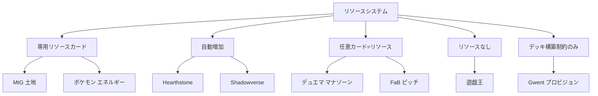

## 第5章 リソースシステムの設計

第4章でプレイヤー心理を理解し、最初のカードを設計した。次のステップは、そのカードが「いつ、どのように使えるか」を決めるリソースシステムだ。リソースシステムはゲームのテンポと分散を規定し、先手・後手の有利不利から、デッキ構築の軸、ゲームの性格まで、あらゆる側面に影響を及ぼす。TCG 設計における最初にして最大の意思決定である。

> **この章で学ぶこと:**
> - リソースシステムの 5 類型（専用リソースカード / 自動増加 / 任意カード兼用 / リソースなし / デッキ構築制約のみ）と各々の構造的帰結
> - 8 つの代表的リソースシステムの比較と設計意図
> - 先手アドバンテージの構造的原因と、各タイトルが取る補正メカニズム

MtG では土地が引けずに何もできないゲームがある。Hearthstone ではそれが起こらない。遊戯王では 1 ターン目からすべてのカードを使える。デュエル・マスターズでは強いカードをマナにするか温存するか毎ターン悩む。これらの違いは「リソースシステム」の設計に起因し、ゲームの性格——テンポ、分散、デッキ構築の奥深さ、先手有利の度合い——を根本的に規定する。

### 8 つのリソースシステム比較

| ゲーム | 方式 | 概要 | 長所 | 短所 |
|--------|------|------|------|------|
| **MtG** | 専用リソースカード（土地） | デッキに土地カードを入れ、毎ターン 1 枚プレイ | デッキ構築の奥深さ、色拘束の意味 | マナスクリュー/フラッド |
| **Hearthstone（HS）** | 自動増加 | 毎ターン最大マナが 1 ずつ増加（最大 10） | 事故がない、ゲーム展開が予測可能 | デッキ構築の軸が減る |
| **デュエル・マスターズ** | マナゾーン | 手札から任意のカードを裏向きでマナゾーンに置く | 全カードがリソースになる、事故が少ない | 強いカードをマナに置く葛藤が常に発生 |
| **ポケモンカード** | エネルギーカード | 専用エネルギーカードを毎ターン 1 枚つける | テンポ管理、属性の重み | エネルギー事故、テンポの遅さ |
| **遊戯王** | リソースなし | コスト制約がない（一部カードにコスト条件あり） | 初手からフルパワー、スピーディ | パワーインフレが止まらない |
| **LoR** | 自動増加 + スペルマナ | HS 式 + 未使用マナを 3 まで次ターンに持ち越し | 効率的なマナ利用を報酬する | 複雑性がやや増す |
| **FaB** | ピッチシステム | 手札のカードを「投げる」ことでリソース生成 | 全カードが行動でありリソースでもある | 学習コストが高い |
| **Gwent** | プロビジョン | デッキ構築時のコスト制約のみ。ゲーム中のマナなし | ゲーム中の事故ゼロ | 毎ターン何でも出せるため別の制約が必要 |

**主要システムの設計意図**

**MtG 土地システム (Garfield の Golden Trifecta)**:
Rosewater は土地システムを「Garfield の最も優れたアイデア」と称し、TCG コンセプト・5 色体系と並ぶ「黄金の三位一体」の一つとする。分散 (マナスクリュー/フラッド) は **機能であり欠陥ではない** — 弱いプレイヤーが時々強いプレイヤーに勝つことで参入障壁を下げ、土地の枚数/色配分/ユーティリティ土地選択がデッキ構築の深い軸を提供する。

**DM マナゾーン**:
「どのカードでもマナに置ける」はマナ事故を排除するだけでなく、**毎ターン「このカードをプレイするか、マナにするか」の意味ある判断** を生む。マナに置いたカードは文明 (色) を提供するため、多色デッキでは色マネジメントも加わる。

**FaB ピッチシステム**:
赤 (ピッチ値 1) = 攻撃力最大だがリソース生産最小。青 (ピッチ値 3) = 攻撃力最小だがリソース最大。黄色は中間。この **逆相関** がデッキ構成に本質的な緊張を生む。さらにピッチしたカードはデッキ底に戻り、長期戦では「2 周目」のデッキが部分的に既知になる。

**Gwent プロビジョン**:
ゲーム中のマナがない代わりに、デッキ構築時に合計プロビジョン予算 (~165) の枠内でカードを選ぶ。強力なカード (高プロビジョン) を増やすと、残りは低プロビジョンのフィラーで埋める必要がある。0 コストカードはテスト段階で却下された (実質「無料の追加枠」になるため)。

> **出典:** [GWENT'S DESIGN 01: PROVISION](https://www.playgwent.com/en/news/41252/gwents-design-01-provision), [The Genius of FaB's Pitch System](https://fabrec.gg/articles/the-genius-of-flesh-and-bloods-pitch-system/), Rosewater "In Defense of Magic's Mana System"

### リソースシステムの分類学

| 分類 | 説明 | 例 |
|------|------|-----|
| **専用リソースカード** | デッキにリソース用カードを入れる | MtG（土地）、ポケモン（エネルギー） |
| **自動増加** | システムが自動でリソースを増やす | Hearthstone、Shadowverse |
| **任意カードをリソースに** | どのカードでもリソースとして使える | デュエル・マスターズ、FaB |
| **リソースなし** | ゲーム中のリソース制約がない | 遊戯王 |
| **デッキ構築のみ** | 構築時にコスト制約、ゲーム中は自由 | Gwent（プロビジョン） |

> **図: リソースシステムの分類ツリー** — 上記の 5 分類と各タイトルの対応関係を示す。

### 先手アドバンテージ

リソースシステムは先手/後手の有利不利に直接影響する。

> **注意:** 以下の先手勝率は特定の時期・フォーマット・環境における概算値であり、セットや環境の変化によって大きく変動する。単一の数値として絶対視せず、傾向を把握するための参考値として扱うこと。

| ゲーム | 先手勝率 | 補正メカニズム |
|--------|:--------:|---------------|
| **MtG** | ~53% | 後手が先にドロー（1 枚多い） |
| **Hearthstone** | ~50.4% | 後手に「コイン」（+1 マナ 1 回）+ 手札 1 枚 |
| **ポケカ** | 変動 | 先手はターン 1 で攻撃・サポーター使用不可 |
| **遊戯王** | 極めて高い | 先手ドロー制限のみ |
| **LoR** | 緩和 | 交互行動制。アタックトークンが毎ラウンド交替 |
| **FaB** | 比較的低い | 防御側がハンドブロック可能 |
| **Gwent** | 複雑 | 後手が相手のコミットメントに反応可能 |
| **Marvel Snap** | なし | 同時ターン。先手/後手の概念がない |
| **Shadowverse** | EP で補正 | 先手 2EP / 後手 3EP + エクストラ PP |

各数値の詳細条件: MtG は Frank Karsten らの分析記事や MTGO リーグの公開データに基づく概算（フォーマットにより 51〜56% の幅がある。Standard と Modern で異なり、メタによっても変動するため単一の数値は存在しない）。Hearthstone はコイン導入後の全体平均（ベータ時 52.2%、クラス・環境により変動。HSReplay.net 等の外部トラッカーが主要な情報源）。ポケカは剣盾〜のルール（2025年時点）。遊戯王はコンボ環境において構造的に先攻制圧が常態化。

> **出典:**
> - [A Re-Source of Pride](https://remptongames.com/2017/07/20/a-re-source-of-pride-designing-resource-systems-in-collectible-games/) — remptongames.com
> - [Resources and Game Design](https://topdeck.gg/articles/resources-and-game-design) — Sam Black / topdeck.gg
> - Rosewater: 「マナシステムは Garfield の最も優れたアイデア。分散は機能であり欠陥ではない」

**この章のまとめ** — リソースシステムの選択はゲームの性格を根本的に規定する。専用リソース型は構築の深さをもたらすが事故リスクを抱え、自動増加型は安定性を与えるが構築の軸を減らし、任意カード兼用型は全カードに意味を持たせるが葛藤を生む。先手アドバンテージはリソース設計と不可分であり、各タイトルが異なる補正メカニズムでこの問題に向き合っている。

**さらに学ぶために:**

- **"A Re-Source of Pride"** (remptongames.com): リソースシステムの設計空間を包括的に分類した記事。新しいリソースシステムを構想する際の出発点として最適。
- **Sam Black "Resources and Game Design"** (topdeck.gg): リソース理論を競技プレイの文脈で論じた記事。テンポとカードアドバンテージのトレードオフを深く掘り下げている。
- **GWENT'S DESIGN 01: PROVISION** (playgwent.com): プロビジョンシステムの設計意図を開発者が直接説明した記事。ゲーム中マナなしという選択の根拠が分かる。

### 演習問題

**課題 5-1（初級・目安 30 分）**: 課題 4-1 のテーマに合うリソースシステムを選ぼう。本章の 5 分類（専用リソースカード / 自動増加 / 任意カード兼用 / リソースなし / デッキ構築制約のみ）から一つ選んで、以下を書いてみよう：(a) リソースをどうやって手に入れるか、(b) カードのコストはどれくらいの幅か、(c) 先手と後手で差をどう埋めるか、(d) なぜそのシステムにしたか。

> **できたら確認:**
> - [ ] なぜこのリソースシステムを選んだか、一言で説明できる？
> - [ ] 先手と後手のどちらかが明らかに有利すぎない？
> - [ ] 課題 4-1 のテーマと合っている？（例: 海賊テーマに「コア」は不自然かも）

---
