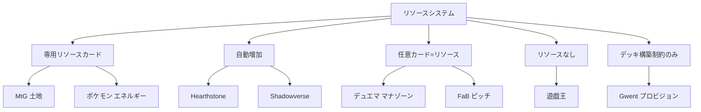

## 第5章 リソースシステムの設計

第4章でプレイヤー心理を理解し、最初のカードを設計した。次のステップは、そのカードが「いつ、どのように使えるか」を決めるリソースシステムだ。リソースシステムはゲームのテンポと分散を規定し、先手・後手の有利不利から、デッキ構築の軸、ゲームの性格まで、あらゆる側面に影響を及ぼす。TCG 設計における最初にして最大の意思決定である。

> **この章で学ぶこと:**
> - リソースシステムの 5 類型（専用リソースカード / 自動増加 / 任意カード兼用 / リソースなし / デッキ構築制約のみ）と各々の構造的帰結
> - 8 つの代表的リソースシステムの比較と設計意図
> - 先手アドバンテージの構造的原因と、各タイトルが取る補正メカニズム

MtG では土地が引けずに何もできないゲームがある。Hearthstone ではそれが起こらない。遊戯王では 1 ターン目からすべてのカードを使える。デュエル・マスターズでは強いカードをマナにするか温存するか毎ターン悩む。これらの違いは「リソースシステム」の設計に起因し、ゲームの性格——テンポ（ゲーム展開の速度感）、分散（variance: ゲーム間の結果のばらつき）、デッキ構築の奥深さ、先手有利の度合い——を根本的に規定する。

### リソースシステムの分類学

リソースシステムは大きく 5 つの類型に分けられる。具体的なタイトルの比較に入る前に、まずこの分類の全体像を押さえよう。

| 分類 | 説明 | 例 |
|------|------|-----|
| **専用リソースカード** | デッキにリソース用カードを入れる | MtG（土地）、ポケモン（エネルギー） |
| **自動増加** | システムが自動でリソースを増やす | Hearthstone、Shadowverse |
| **任意カードをリソースに** | どのカードでもリソースとして使える | デュエル・マスターズ、Flesh and Blood (FaB) |
| **リソースなし** | ゲーム中のリソース制約がない | 遊戯王 |
| **デッキ構築のみ** | 構築時にコスト制約、ゲーム中は自由 | Gwent（プロビジョン） |

> **図: リソースシステムの分類ツリー** — 上記の 5 分類と各タイトルの対応関係を示す。

> **注:** Shadowverse は分類ツリーには含まれるが、以下の 8 タイトル比較表からは割愛している。リソースシステムとしては Hearthstone と同じ「自動増加」型に属し、PP（プレイポイント）の自動増加に加え、進化ポイント（EP）による先手/後手補正が特徴である。

### 8 つのリソースシステム比較

| ゲーム | 方式 | 概要 | 長所 | 短所 |
|--------|------|------|------|------|
| **MtG** | 専用リソースカード（土地） | デッキに土地カードを入れ、毎ターン 1 枚プレイ | デッキ構築の奥深さ、色拘束の意味 | マナスクリュー/フラッド |
| **Hearthstone（HS）** | 自動増加 | 毎ターン最大マナが 1 ずつ増加（最大 10） | 事故がない、ゲーム展開が予測可能 | デッキ構築の軸が減る |
| **デュエル・マスターズ** | マナゾーン | 手札から任意のカードを表向きでマナゾーンに置く | 全カードがリソースになる、事故が少ない | 強いカードをマナに置く葛藤が常に発生 |
| **ポケモンカード** | エネルギーカード | 専用エネルギーカードを毎ターン 1 枚つける | テンポ管理、属性の重み | エネルギー事故、テンポの遅さ |
| **遊戯王** | リソースなし | コスト制約がない（一部カードにコスト条件あり） | 初手からフルパワー、スピーディ | パワーインフレが止まらない |
| **Legends of Runeterra (LoR)** | 自動増加 + スペルマナ | HS 式 + 未使用マナを 3 まで次ターンに持ち越し | 効率的なマナ利用を報酬する | 複雑性がやや増す |
| **Flesh and Blood (FaB)** | ピッチシステム | 手札のカードを「投げる」ことでリソース生成 | 全カードが行動でありリソースでもある | 学習コストが高い |
| **Gwent** | プロビジョン | デッキ構築時のコスト制約のみ。ゲーム中のマナなし | ゲーム中の事故ゼロ | 毎ターン何でも出せるため別の制約が必要 |

### 主要システムの設計意図

**MtG 土地システム (Garfield の Golden Trifecta)**:
Mark Rosewater は土地システムを「Garfield の最も優れたアイデア」と称し、TCG コンセプト・5 色体系と並ぶ「黄金の三位一体」の一つとする。分散 (マナスクリュー/フラッド) は **機能であり欠陥ではない** — 弱いプレイヤーが時々強いプレイヤーに勝つことで参入障壁を下げ、土地の枚数/色配分/ユーティリティ土地選択がデッキ構築の深い軸を提供する。

**DM マナゾーン**:
「どのカードでもマナに置ける」はマナ事故を排除するだけでなく、**毎ターン「このカードをプレイするか、マナにするか」の意味ある判断** を生む。マナに置いたカードは文明を提供するため、多色デッキでは文明のマネジメントも加わる。

**FaB ピッチシステム**:
赤 (ピッチ値 1) = 攻撃力最大だがリソース生産最小。青 (ピッチ値 3) = 攻撃力最小だがリソース最大。黄色は中間。この **逆相関** がデッキ構成に本質的な緊張を生む。さらにピッチしたカードはデッキ底に戻り、長期戦では「2 周目」のデッキが部分的に既知になる。

**Gwent プロビジョン**:
ゲーム中のマナがない代わりに、デッキ構築時に合計プロビジョン予算 (~165、2024 年時点の値。アップデートにより変動する) の枠内でカードを選ぶ。強力なカード (高プロビジョン) を増やすと、残りは低プロビジョンのフィラーで埋める必要がある。0 コストカードはテスト段階で却下された (実質「無料の追加枠」になるため)。

> **出典:** [GWENT'S DESIGN 01: PROVISION](https://www.playgwent.com/en/news/41252/gwents-design-01-provision), [The Genius of FaB's Pitch System](https://fabrec.gg/articles/the-genius-of-flesh-and-bloods-pitch-system/), Rosewater, "[In Defense of Magic's Mana System](https://magic.wizards.com/en/news/making-magic/mana-action-2021-07-22)"

### 実例: リソースシステムが生むカードの必然性

比較表だけでは抽象的なので、実際のカードまで下りよう。重要なのは、各カードが「たまたま便利だから存在する」のではないことだ。リソースシステムの構造が、特定のカードを必然的に要請する。以下では、分類軸ごとにその因果関係を対比で見ていく。

#### 任意カード兼用型: デュエル・マスターズ《フェアリー・ライフ》

**デュエル・マスターズ** では、どのカードでもマナに置ける。事故は構造的に少ない。では、なぜマナ加速カードが必要なのか。

> **《フェアリー・ライフ》**
> S・トリガー
> 自分の山札の上から1枚目を、自分のマナゾーンに置く。

答えは「テンポ差を作る手段」と「防御の受け皿」の両立にある。マナゾーン型は事故を排除する代わりに、全員が同じ速度でマナを伸ばす同質性を生みやすい。《フェアリー・ライフ》は 2 コストで差をつけつつ、S・トリガーで防御にも回る。事故がないからこそ、加速札には別の役割が求められるのだ。

#### 自動増加型: Hearthstone《The Coin》と LoR スペルマナ

**Hearthstone** はマナが毎ターン自動で 1 ずつ増える。リソース事故はシステムが根絶した。残る問題は先手後手差だけだ。だから補正もシステム配布物で済む。

> **《The Coin》**
> Gain 1 Mana Crystal this turn only.

《The Coin》は「このターンだけ 1 マナ前借り」する。デッキスロットを消費せず、後手に一度だけテンポの帳尻を合わせる。自動増加型はリソース獲得にプレイヤーの判断が介在しないため、補正もまたシステム側が一方的に配る形になる。ここに《フェアリー・ライフ》との対照がある。デュエマでは「何をマナに置くか」にプレイヤーの意思が入るから、補正もカード性能の中に埋め込まれる。Hearthstone では意思が入る余地がないから、補正もシステムが直接渡すのだ。

**Legends of Runeterra (LoR)** は、同じ自動増加型でありながら、一つの工夫でプレイヤーの判断を呼び戻した。未使用マナが最大 3 まで「スペルマナ」として次ターンに持ち越される仕組みだ。

この設計の核心は「パスする判断」に報酬を与えた点にある。Hearthstone では、使い切れなかったマナはただ消える。LoR では、あえてこのターン動かないことで、次ターンにより強い動きが可能になる。自動増加型の「判断の少なさ」という弱点を、マナの持ち越しという一手で補っている。Hearthstone がシステムで事故をゼロにした上で先後差だけを補正するのに対し、LoR はさらに「いつ使うか」という時間軸の判断をリソース設計に組み込んだわけだ。

#### 専用リソースカード型: ポケモンカード《博士の研究》

**ポケモンカード** では《基本炎エネルギー》のような専用札を毎ターン 1 枚ずつ貼る。攻撃札とリソース札が最初から分離しているのが特徴だ。

> **《博士の研究》**
> 自分の手札をすべてトラッシュし、山札を7枚引く。

専用リソース型では、エネルギーが引けなければ攻撃できない。だから大量ドローは単なる手札補充ではなく、攻撃役とエネルギーを同時に「接続」する行為になる。手札をすべて捨てるという苛烈なコストが許されるのは、7 枚引けばエネルギーと攻撃札の両方に触れる確率が高いからだ。デュエマの《フェアリー・ライフ》が「加速+防御」を一枚に同居させるのに対し、ポケカの《博士の研究》は「手札のリセット=接続の再抽選」という、専用リソース型ならではの役割を担っている。

#### リソースなし型: 遊戯王《強欲で謙虚な壺》

**遊戯王** はマナを持たない。すべてのカードが初手から使える。この自由度の代償として、強力なカードには行動権の制約が課される。

> **《強欲で謙虚な壺》**
> このカード名のカードは1ターンに1枚しか発動できず、
> このカードを発動するターン、自分はモンスターを特殊召喚できない。
> ①：自分のデッキの上からカードを3枚めくり、
> その中から1枚を選んで手札に加える。

《強欲で謙虚な壺》の肝は、コストがマナではなく展開権だという点にある。3 枚から 1 枚を選ぶ強い選別を許す代わりに、そのターンの特殊召喚を封じる。マナがないからこそ、行動そのものがコストになる。ここに 4 つのシステムの対比が浮かび上がる。

| 分類 | リソース設計の中心 | 代表カードの役割 |
|------|-------------------|-----------------|
| 任意カード兼用型 | カードそのもの | 加速と防御の両立（フェアリー・ライフ） |
| 自動増加型 | ターンテンポ | 先後差の補正（The Coin）、時間軸の判断（スペルマナ） |
| 専用リソース型 | 手札の接続力 | 攻撃とリソースの再接続（博士の研究） |
| リソースなし型 | 展開権 | 選別と爆発力のトレードオフ（強欲で謙虚な壺） |

リソースシステムの設計とは、「何を支払い、何を温存させるか」を決める作業だ。そして各タイトルの代表カードは、そのシステムが「何を支払わせるか」の答えをテキストに刻んでいる。

> **出典:**
> - [フェアリー・ライフ](https://dm.takaratomy.co.jp/card/detail/?id=dm06-110) — デュエル・マスターズ公式カード検索
> - [The Coin](https://hearthstone.blizzard.com/en-us/cards/1746) — Hearthstone Card Library
> - [基本炎エネルギー](https://www.pokemon-card.com/card-search/details.php/card/42780/regu/XY), [博士の研究](https://www.pokemon-card.com/card-search/details.php/card/46624) — ポケモンカード公式カード検索
> - [強欲で謙虚な壺](https://www.db.yugioh-card.com/yugiohdb/card_search.action?cid=8993&ope=2&request_locale=ja) — 遊戯王 OCG 公式カードデータベース

### リソースを物語にする

前節では、各システムが「何を支払わせるか」をカードに刻む様子を見た。もう一歩進めると、その支払い自体を物語として設計したカードがある。**MtG** の **《一つの指輪》**（The One Ring）は、ライフという最も根源的なリソースを、原作の「指輪の誘惑と代償」へ翻案した例だ。

> **一つの指輪** (4) 伝説のアーティファクト
> 破壊不能
> 一つの指輪が戦場に出たとき、あなたがこれを唱えていた場合、次のあなたのターンまで、あなたはプロテクション（すべて）を得る。
> あなたのアップキープの開始時に、一つの指輪の上にある重荷カウンター１個につき１点のライフを失う。
> {T}：一つの指輪の上に重荷カウンター１個を置く。その後、一つの指輪の上にある重荷カウンター１個につき１枚のカードを引く。

このカードは 4 つの節を持ち、いずれも指輪の性質の別の側面を指しているように読める。**破壊不能**は、滅ぼせぬ一つの指輪。**詠唱時のプロテクション（すべて）**は、指輪をはめた者が不可視・不可触になり戦場から消える描写。**アップキープの重荷分のライフ喪失**は、身に負う重荷と堕落の増大。そして**重荷分のドロー**は、力の誘惑——使うほど大きな見返りを得るが、そのぶん負担も増える。リソース設計の言葉に置き換えれば、「ライフを支払って手札を得る」エンジンであり、支払いが時間とともに膨らむ escalating（漸増）構造になっている。

重要なのは、このエンジンが「止まれなくなる」点だ。重荷カウンターを増やすほどドロー枚数は伸びるが、毎ターンのライフ損失も同じだけ重くなる。使えば使うほど強く、しかし確実に自分を削る——指輪の誘惑と代償が、そのままプレイの体験になっている。どこまで重荷を積むかは、アドバンテージと寿命を天秤にかける価値判断であり、この「誘惑にどこまで乗るか」という視点は第8章のカード評価の理論に接続する。

ただし、この代償が実効的に軽いというコミュニティの批判もある（[The Gamer](https://www.thegamer.com/mtg-players-lord-of-the-rings-ring-mechanic-no-downsides/)）。プロテクションで守られた数ターンのうちに手札を伸ばしきれば、ライフ損失が効く前にゲームを決められる、という指摘だ。ここには設計上の緊張がある——代償の flavor（物語としての重み）と、代償の実効性（ゲームバランス上の痛み）は必ずしも一致しない。リソースを物語にするとき、設計者は「支払いをどれだけ痛くするか」と「支払いをどれだけ物語らしく見せるか」を、別々に調整しなければならない。

《一つの指輪》がライフという「支払うリソース」を物語にしたのに対し、**デュエル・マスターズ** の **《零龍》** は正反対の角度をとる。零龍は命を持たない虚無の龍であり、「死」の 4 側面を積み重ねて降臨する。手札が尽きる、自軍が壊れる、墓地が膨れ上がる——通常なら純粋な損失でしかない事象を、降臨の推進力へ反転させた設計だ。

> **滅亡の起源 零無（ぜろむ）** — 零龍の儀
> ゲーム開始時、このカードと、異なる4種類の零龍星雲を、リンクせずにバトルゾーンに置く。（略）
> 零龍卍誕：自分の4枚目の零龍星雲をこのカードとリンクした時、5枚全部を裏返して、1体のリンクしたクリーチャーにする。
>
> **手札の儀** — 自分のターンの終わりに、手札が1枚もないプレイヤーがいれば、この零龍星雲を自分の《滅亡の起源 零無》にリンクしてもよい。（略）
> **破壊の儀** — クリーチャーが破壊された時、このターン中、他に2体以上破壊されていたら、リンクしてもよい。（略）
> **墓地の儀** — カードを自分の墓地に置いた時、自分の墓地にカードが8枚以上あれば、リンクしてもよい。（略）
> **復活の儀** — カードを自分の墓地からバトルゾーンに出した時、リンクしてもよい。（略）

機構の全容は複雑だが、ここで見たいのは一点だけだ。零龍は 4 つの「儀」を達成すると降臨（零龍卍誕）する。その達成条件は「失うこと」とその裏返しでできている。**手札の儀** は手札が 0 枚になること。**破壊の儀** は自分のクリーチャーが複数壊れること。**墓地の儀** は墓地が 8 枚まで膨らむこと。どれも通常のカードゲームでは避けたい状況だ。残る **復活の儀** は墓地からクリーチャーを出すこと——積み上がった喪失を、今度は資源として使う側である。

つまり零龍は、リソースの喪失そのものを起動条件へ組み替えている。手札切れも自軍の全滅も墓地の肥大も、零龍にとっては降臨へ近づく前進になる。卍誕した零龍は相手の盤面を制圧する強力な龍だが、本節で重要なのはフィニッシュ性能ではない。「失う」を「進む」へ読み替えた起動側の発想である。

**《一つの指輪》** は、自ら差し出す「支払い」を物語にした。**《零龍》** は、本来なら避けたい「喪失そのもの」を物語にしている。どちらもリソースへ読み替えている点は同じだが、着眼点が逆だ——リソース設計が扱う対象は支払いだけではないことを示す一対である。

### 先手アドバンテージ

リソースシステムは先手/後手の有利不利に直接影響する。

> **注意:** 以下の先手勝率は特定の時期・フォーマット・環境における概算値であり、セットや環境の変化によって大きく変動する。単一の数値として絶対視せず、傾向を把握するための参考値として扱うこと。

| ゲーム | 先手勝率 | 補正メカニズム |
|--------|:--------:|---------------|
| **MtG** | ~53% | 後手が先にドロー（1 枚多い） |
| **Hearthstone** | ~50.4% | 後手に「コイン」（+1 マナ 1 回）+ 手札 1 枚 |
| **ポケカ** | 変動 | 先手はターン 1 で攻撃・サポーター使用不可 |
| **遊戯王** | 極めて高い | 先手ドロー制限のみ |
| **LoR** | 緩和 | 交互行動制。アタックトークンが毎ラウンド交替 |
| **FaB** | 比較的低い | 防御側がハンドブロック可能 |
| **Gwent** | 複雑 | 後手が相手のコミットメントに反応可能 |
| **Marvel Snap** | なし | 同時ターン。先手/後手の概念がない |
| **Shadowverse** | EP で補正 | 先手 2EP / 後手 3EP + エクストラ PP |

各数値の詳細条件: MtG は Frank Karsten らの分析記事や MTGO リーグの公開データに基づく概算（フォーマットにより 51〜56% の幅がある。Standard と Modern で異なり、メタによっても変動するため単一の数値は存在しない）。Hearthstone はコイン導入後の全体平均（ベータ時 52.2%、クラス・環境により変動。HSReplay.net 等の外部トラッカーが主要な情報源）。ポケカは剣盾〜のルール（2025年時点）。遊戯王は大会環境では先攻勝率が高い傾向があり、特にコンボ環境において顕著である。

> **出典:**
> - [A Re-Source of Pride](https://remptongames.com/2017/07/20/a-re-source-of-pride-designing-resource-systems-in-collectible-games/) — remptongames.com
> - [Resources and Game Design](https://topdeck.gg/articles/resources-and-game-design) — Sam Black / topdeck.gg
> - Rosewater: 「マナシステムは Garfield の最も優れたアイデア。分散は機能であり欠陥ではない」

**この章のまとめ** — リソースシステムの選択はゲームの性格を根本的に規定する。専用リソース型は構築の深さをもたらすが事故リスクを抱え、自動増加型は安定性を与えるが構築の軸を減らし、任意カード兼用型は全カードに意味を持たせるが葛藤を生む。先手アドバンテージはリソース設計と不可分であり、各タイトルが異なる補正メカニズムでこの問題に向き合っている。

**さらに学ぶために:**

- **"A Re-Source of Pride"** (remptongames.com): リソースシステムの設計空間を包括的に分類した記事。新しいリソースシステムを構想する際の出発点として最適。
- **Sam Black "Resources and Game Design"** (topdeck.gg): リソース理論を競技プレイの文脈で論じた記事。テンポとカードアドバンテージのトレードオフを深く掘り下げている。
- **GWENT'S DESIGN 01: PROVISION** (playgwent.com): プロビジョンシステムの設計意図を開発者が直接説明した記事。ゲーム中マナなしという選択の根拠が分かる。

> **事例研究への案内:** 各リソースシステムの実際の運用と教訓については、第16章 LoR（スペルマナ）・Gwent（プロビジョン）、第17章 ポケモンカード（エネルギー）・遊戯王（リソース不在）・デュエル・マスターズ（マナゾーン）・Flesh and Blood（ピッチ）を参照。

### 演習問題

**課題 5-1（初級・目安 30 分）**: 課題 4-1 のテーマに合うリソースシステムを選ぼう。本章の 5 分類（専用リソースカード / 自動増加 / 任意カード兼用 / リソースなし / デッキ構築制約のみ）から一つ選んで、以下を書いてみよう：(a) リソースをどうやって手に入れるか、(b) カードのコストはどれくらいの幅か、(c) 先手と後手で差をどう埋めるか、(d) なぜそのシステムにしたか。

> **できたら確認:**
> - [ ] なぜこのリソースシステムを選んだか、一言で説明できる？
> - [ ] 先手と後手のどちらかが明らかに有利すぎない？
> - [ ] 課題 4-1 のテーマと合っている？ （例: 海賊テーマに「コア」は不自然かも）

---

#### 解答例:『芽吹』の場合

第 5 章の 5 分類「専用リソースカード / 自動増加 / 任意カード兼用 / リソースなし / デッキ構築制約のみ」から一つ選ぶ。

**選択: 自動増加型。** リソースは「陽 (ひ)」。

- **(a) 入手方法:** 各プレイヤーのターン開始時、使える陽の上限が 1 増える (上限 10)。庭が日光を浴びて育つ世界観に、自動増加はそのまま合致する。
- **(b) コスト幅:** 陽 1〜6 を主軸とし、フィニッシャーのみ 6。
- **(c) 先後補正:** 後手は初期に **《朝露》トークン** (1 回だけ陽を 1 多く使える) を 1 個持つ。
- **(d) 選定理由:** 「育てる」テーマは、リソースが時間とともに自然に増える自動増加と一枚岩になるから。

課題 4-1 の解答例で作った《大輪のヒマワリ》(陽 5) も、課題 4-2 の解答例で作った《双葉》(陽 1) も、この幅にそのまま収まる。

**意図的な粗さと自己批評:** 自動増加 + 後手補正トークンは、Hearthstone のマナクリスタル + コインと機構がほぼ同型で、独自性が薄い。業界の先行事例と被っている点は認めざるを得ない。差別化は「成長カウンター」という盤面リソースを主役に据えることで図る (陽は脇役に留める) が、陽の供給そのものは既視感が残る。この引っかかりは最後まで完全には消せないかもしれない。何か別の切り口で薄められないか、宿題として残しておく。

---
