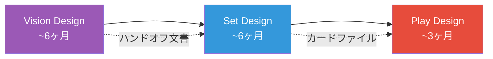

## 第6章 カード設計のプロセス

「素晴らしいカードを思いつく」ことと「250 枚のカードを含むセットを出荷する」ことの間には、膨大な工程が横たわっている。Rosewater は 2009 年から 18 回にわたって "Nuts & Bolts"（ねじとボルト）シリーズを執筆し、セット制作の実務——デザインスケルトン、レアリティ配分、クリーチャーカーブ、メカニクスの重ね方——を丸裸にした。カードゲームの設計を「芸術」から「工程管理を伴う工芸」へ転換した資料群である。

> **この章で学ぶこと:**
> - Vision Design / Set Design / Play Design の三段階パイプラインと各段階の責務
> - デザインスケルトンの構造、As-Fan の計算、クリーチャーカーブの設計
> - 複数メカニクスを 1 つのセットに統合する手法（Layering Mechanics）

Rosewater の "Nuts & Bolts" シリーズに基づく、セット制作の実務的手法。

### 三段階の開発プロセス

MtG のセット開発は当初「Design」と「Development」の二段階で行われていたが、2017 年に「Vision Design → Set Design → Play Design」の三段階パイプラインへ再編された。Design 時代に創造性とバランスの両立が一部署に集中しすぎた反省から、ビジョン策定・カード設計・バランス調整をそれぞれ専門チームに分離し、ハンドオフ文書で成果物を受け渡す体制となった。

| 段階 | 担当 | 目的 | 期間（MtG の場合） |
|------|------|------|-------------------|
| **Vision Design** | ビジョンチーム | セットのコンセプト・テーマ・主要メカニクスの決定 | 約 6 ヶ月 |
| **Set Design** | セットチーム | 個別カードの設計・メカニクスの肉付け・構造の確定 | 約 6 ヶ月 |
| **Play Design** | プレイデザインチーム | バランス調整・コスト設定・環境への影響予測 | 約 3 ヶ月（Set Design と並行して計 6 ヶ月） |

### ボトムアップデザインの手順

第4章で触れたトップダウンデザイン (フレイバーからメカニクスを導く) に対し、ボトムアップデザインはメカニクス上の面白さから出発してカードを作る手法である。Nuts & Bolts のプロセス全体がボトムアップの体系化と言ってよい。

**ステップ 1: メカニクス的な「問い」から始める（第4章で紹介した手順の詳細版）。** 「もし両プレイヤーが同時にカードを出すなら？」「もしカードをプレイするほど相手のリソースが増えるなら？」——Marvel Snap の同時ターン制やデジモンカードゲームのメモリーゲージは、こうした問いから生まれたメカニクスである。出発点はフレイバーではなく「ゲームプレイ上の緊張」だ。

ワンピースカードゲームのライフシステムも好例だ。「もしダメージを受けることがリソース獲得になるなら？」という問いから出発している。このゲームでは、リーダーがダメージを受けるとライフからカードが 1 枚手札に加わる。そのカードがトリガーを持っていれば、手札に加える代わりに公開してコストなしで効果を発動できる。つまり手札補充かトリガー発動かの二択であり、両方を同時に得るわけではない。

> **トリガー**（ワンピースカードゲーム総合ルール）
> リーダーがダメージを受けた時、ライフから引いたカードを公開し、トリガー効果を発動できる。発動したカードはトラッシュに置く。発動しなければ手札に加える。

> **出典:** [ONE PIECE カードゲーム 総合ルール（公式 PDF）](https://www.onepiece-cardgame.com/pdf/rule_comprehensive.pdf) — onepiece-cardgame.com

攻撃側は相手のライフを削るたびに、手札を与えるかトリガーの反撃を受けるかのリスクを背負う。この構造が生んだ戦略的帰結は興味深い。コミュニティでは「相手のライフをあえて攻撃しない」プレイが議論されている（[Managing Risk When Attacking Life, onepiece.gg](https://onepiece.gg/managing-risk-when-attacking-life-in-the-one-piece-card-game)）。ダメージを与えることが不利になりうるという逆説は、まさにメカニクス的な問いがゲーム全体の駆け引きを定義した証拠だ。

**ステップ 2: 最小限のカードでプロトタイプする。** 紙のカードに手書きで数値を書き、10-20枚でテストする。Marvel Snap の Brode は物理カードで 2 日間でプロトタイプを完成させた（Ben Brode, GDC 2023 "Making Marvel Snap"）。この段階ではアートもフレイバーも不要——メカニクスの手触りだけを検証する。Shadowverse チームもデジタル実装前に必ず物理カードでテストを行う（Cygames, CEDEC 講演）。

**ステップ 3: メカニクスがどんな感情を生むか検証する。** Dodds の言う「プレイヤーの感情状態にフォーカスせよ」(GDC 2014) がここで適用される。Timmy の興奮を生むか？ Johnny の自己表現を促すか？ Spike のスキル差を生むか？ メカニクスが面白い判断を生まなければ、ステップ 1 に戻る。

**ステップ 4: フレイバーを後付けする。** メカニクスが確認できたら、初めてテーマ・世界観・カード名を考える。「手札を犠牲にしてリソースを得る」仕組みに「マナゾーン」という名前を与え、カードを表向きに置く演出を加えたのがデュエマの例だ。メカニクスの挙動と矛盾しないフレイバーを選ぶことが重要である。

**ステップ 5: デザインスケルトンに配置する。** 個別メカニクスが固まったら、セット全体の構造に埋め込む。ここからは後述する Nuts & Bolts の工程に合流する。

**トップダウンとの使い分け:** 実践的には両者を混合する。看板カードはトップダウンでフレイバーとの共鳴を最大化し、セットの大部分はボトムアップでメカニクスの健全性を優先する。最良のセットは両アプローチが自然に融合している。

IP 連携 TCG ではトップダウンデザインが特に威力を発揮する。バトルスピリッツの《フリーダムガンダム》（SD52-X02）はその好例だ。設計の起点は『機動戦士ガンダムSEED』第 35 話「舞い降りる剣」——キラ・ヤマトの駆るフリーダムが大気圏を越えて戦場へ降下し、フルバーストで敵機の武装とメインカメラだけを撃ち抜いて戦闘そのものを止める、シリーズを代表する場面である。

> **フリーダムガンダム** コスト 7(4) / 白 / MS・オーブ
> Lv1 BP6000 / Lv2 BP9000 / Lv3 BP13000
> フラッシュ《煌臨：白＆コスト 5 以上》
> ※煌臨：お互いのアタックステップで、自分のソウルコアをトラッシュに置くことで、対象の自分のスピリットに手札から重ねる。
> Lv1・Lv2・Lv3『このスピリットの召喚/煌臨時』
> 相手のスピリットすべての効果を無効にし、相手のスピリット 2 体を好きな順番でデッキの下に戻す。
> 【PS装甲：コスト 7 以下】このスピリットはコスト 7 以下の相手の効果を受けない。
> Lv2・Lv3『このスピリットのアタック時』バトル終了時、相手のライフのコア 1 個を相手のトラッシュに置く。

まず煌臨に注目してほしい。手札のカードを盤面のスピリットの上に重ねて出す——物理的に「上から下へ」カードが置かれる動作そのものが、大気圏を突破して戦場に降り立つフリーダムの姿を再現している。

効果面では、まず相手スピリット**すべて**の効果を無効にする。原作でキラがやったのは「戦闘を止める」ことだ。フルバーストで戦場全体を制圧し、これ以上の殺し合いを許さない。効果無効化は「もう戦うな」というキラの意思そのものである。続いて **2 体**をデッキの下へ送る。全体を無力化したうえで、さらに 2 体を決定的に退場させる。この数字は、フリーダムの全武装中で最大火力を誇る背面のバラエーナ 2 門による制圧を想起させる。そして「破壊」ではなくデッキバウンスである点が、バトスピにおける白の陣営特性であると同時に、キラの不殺——殺さず戦場から退場させる——の翻訳になっている。

こうした読み解きは開発者の公式見解ではなく、プレイヤーとしての分析だ。しかし煌臨の物理動作が降臨を、効果無効化が「戦闘を止める意志」を、デッキバウンスが不殺の哲学を想起させるという多層的な一致は、意図的であれ結果的であれ、トップダウンデザインの効果を示している。プレイヤーが「あのシーンを再現できた」と感じるのは、カードを置く動作から効果の解決順序まで、原作の物語と重なる層が複数あるからだ。

同じトップダウンでも、翻案の源が「特定の名場面」ではなく「伝承そのもの」である場合がある。**MtG** のイニストラードに登場する**狼男**（両面カード）は、フリーダムガンダムのちょうど対になる例だ。フリーダムガンダムが一本の作品の一シーンを機構化したのに対し、狼男は特定の物語を持たない「狼男という伝承の二面性」を機構化している。代表として **《クルーインの無法者》** を見よう。

> **クルーインの無法者** (1)(赤)(赤) クリーチャー — 人間・ならず者・狼男 2/2
> 先制攻撃
> 各アップキープの開始時に、直前のターンに呪文が唱えられていなかった場合、クルーインの無法者を変身させる。
>
> **// クルーイン峡の恐怖** クリーチャー — 狼男 3/3
> 二段攻撃
> あなたがコントロールする各狼男は、２体以上のクリーチャーによってしかブロックされない。
> 各アップキープの開始時に、直前のターンにいずれかのプレイヤーが２つ以上の呪文を唱えていた場合、クルーイン峡の恐怖を変身させる。

このカードは、狼男の「二面性」が少なくとも 3 つの層で機構化されているように読める。第一に**変身条件**だ。誰も呪文を唱えなかった静かなターンに獣化し、誰かが 2 つ以上唱えた騒がしいターンに人へ戻る。夜の静寂で獣になり、人の営みが騒げば鎮まる、という月夜の伝承がそのまま条件になっている。第二に**両面カードという物理形態**である。カードを裏返す動作が、人と獣という二重の本性を手触りで表す。第三に**裏面の凶暴化**だ。二段攻撃と、複数体でしかブロックされない性質（後に「威迫」としてキーワード化される能力）が、獣性の高まりを数値で示す。

設計者の **Mark Rosewater** は、狼男の最も本質的な点を「常時モンスターであることではなく、普段は人間だという二面性」だと述べ、月そのものは機構化せず「プレイヤーの想像が月の flavor を埋める」設計にしたと明かしている（[Were the Wild Things Are](https://magic.wizards.com/en/news/making-magic/were-wild-things-are-2011-09-30)）。ここがフリーダムガンダムとの対照を鮮明にする。フリーダムガンダムはプレイヤーが知る名場面を再現させるが、狼男は特定のシーンを持たず、伝承の型だけを渡してプレイヤーの想像に委ねる。手を止めれば変身が進み、相手が慌てて呪文を連打すれば戻る——この駆け引き自体が、いつ獣に転じるか分からない月夜の緊張の再演になっている。IP の名場面を再演するデザインと、伝承の型を再演させるデザイン。トップダウンの共鳴には、この二つの源泉がある。

> **出典:** [クルーインの無法者 // クルーイン峡の恐怖（Kruin Outlaw // Terror of Kruin Pass）](https://scryfall.com/card/inr/161/kruin-outlaw-terror-of-kruin-pass) — Scryfall

### デザインスケルトン

セットの骨格を先に設計する手法。各レアリティ・各色にどのようなカードが必要かを先に定義し、そこにカードを埋めていく。

例（60 枚セットの場合）:
- コモン: 各色 6 枚 x 5 色 = 30 枚（シンプルなカード中心）
- アンコモン: 各色 3 枚 x 5 色 = 15 枚（メカニクスの中核）
- レア: 各色 2 枚 x 5 色 + 多色 5 枚 = 15 枚（Timmy/Johnny 向け）

標準的な MtG のラージセット（約 261 枚）のデザインスケルトンは以下の構成を取る:

| レアリティ | 枚数 | 内訳 |
|-----------|------|------|
| **コモン** | 101 枚 | 各色 19 枚 × 5 色 = 95 枚 + アーティファクト/土地 6 枚 |
| **アンコモン** | 80 枚 | 各色 13 枚 × 5 色 = 65 枚 + サインポスト 10 枚（2 色の組み合わせ各 1 枚）+ 無色 5 枚 |
| **レア** | 60 枚 | 各色に均等配分 + 多色・無色枠 |
| **神話レア** | 20 枚 | セットの目玉カード |

#### 主要タイトルのセット/パック構成比較

セット構成はタイトルごとに大きく異なる。以下は各タイトルの標準的なセットとパックの構成を比較したものである。

| タイトル | セット総枚数 | レアリティ段階 | パック封入数 | パック構成 |
|---------|------------|-------------|:----------:|----------|
| **MtG** (Play Booster) | 約270〜290種 | C / U / R / M | 14枚 | C×6〜7, U×3, R/M×1, 土地×1, ワイルドカード枠×2 |
| **ポケモンカード** (日本版) | 約100〜230種 | C / U / R / RR / SR / SAR / UR | 5枚 | C×3, U×1〜2, R以上×1 |
| **遊戯王OCG** | 約80種 | N / R / SR / UR / SE | 5枚 | N×4, R以上×1 |
| **デュエル・マスターズ** | 約84〜170種 | C / U / R / VR / SR | 5枚 | C/U×4, R以上×1確定 |
| **Hearthstone** | 約145種 | Common / Rare / Epic / Legendary | 5枚 (デジタル) | Rare以上×1確定 + Common/Rare×4 |
| **Shadowverse: WB** | 約76〜142種 | Bronze / Silver / Gold / Legendary | 8枚 (デジタル) | Silver以上×1確定 |
| **Flesh and Blood** | 約200〜300種 | C / R / Majestic / Legendary / Fabled | 16枚 | C×11, R×1〜2, Rainbow Foil×1 |
| **ワンピースカード** | 約121種 | C / UC / R / SR / SEC | 6枚 | C/UC中心 + R以上枠 |

注目すべき設計上の差異:
- **パック封入数**: 5枚（ポケカ・遊戯王・デュエマ・HS）から16枚（FaB）まで幅がある。封入数が多いほどリミテッド環境の設計自由度が高まるが、パック単価も上がる。
- **セット総枚数**: 遊戯王の約80種（コンパクト）からFaBの約300種（大規模）まで。MtGは約280種で安定しており、Rosewater の Nuts & Bolts シリーズはこの規模を前提に書かれている。
- **レアリティ段階**: 物理TCGは4〜6段階が標準。デジタルTCGは4段階（C/R/E/L相当）が多い。段階数が多いほどコレクション要素が増すが、複雑性も増す。
- **最高レアリティの出現率**: 遊戯王は1BOX（30パック）にUR確定1枚と比較的高い。FaBのFabledは約960パックに1枚と極めて低く、コレクターズアイテムとしての位置づけが明確。

### As-Fan（アズファン）

**As-Fan** = ブースターパック 1 つを開封したときに、特定の特徴を持つカードが平均何枚含まれているかを表す指標。リミテッド環境の設計において最も重要な定量指標であり、メカニクスの体験頻度を直接制御する。

計算式: As-Fan = (該当カードのコモン枚数/コモン総数 × パック内コモン枚数) + (該当カードのアンコモン枚数/アンコモン総数 × パック内アンコモン枚数) + ...

- メインメカニクス: As-Fan 2.0 以上（頻繁に出会う）
- サブメカニクス: As-Fan 1.0 前後（時々出会う）
- 特殊メカニクス: As-Fan 0.5 以下（稀に出会う）

### サインポストカード

アンコモンに配置される「この色の組み合わせでこういうデッキを組みましょう」と示すカード。リミテッドでプレイヤーのデッキ構築を誘導する標識の役割を果たす。

### 複雑性予算（Complexity Budget）

セット全体で許容される複雑性の総量には上限がある。新メカニクスを 1 つ追加するなら、他の複雑性を削る必要がある。これは第9章で扱う New World Order（NWO）——コモンの複雑性に上限を設け、レアリティを複雑性の配送システムとして機能させる設計原則——と直結する概念。

**数値設計の実例: ゲートルーラーの評価値体系**

池っち店長はゲートルーラーの数値設計において、レベルごとの評価値（レベル0=9点、レベル1=12点）を基盤に、各パラメータに重みを設定した。ATK・HPは1点あたり評価値1だが、STK（勝敗に直結する打点）は1点あたり2と高く評価。エナジー1個の評価値は3（テストプレイで決定）、「盤面に1点 or 顔面に1点」の柔軟な効果は腐りにくさを評価して4点とした。このような評価値体系は、カードパワーの定量的な基準となる（[池っち店長「TCGのつくりかたセミナー」](https://oyazirk.jugem.jp/?eid=10)）。

### カードコードシステム

MtG の内部管理では、各カードに体系的なコードが割り当てられる。

- **第 1 文字 = レアリティ**: C（コモン）/ U（アンコモン）/ R（レア）/ M（神話レア）
- **第 2 文字 = 色**: W（白）/ U（青）/ B（黒）/ R（赤）/ G（緑）/ Z（多色）/ A（アーティファクト）/ L（土地）
- **数字 = コレクター番号上の位置**: 色内での通し番号

例: `CW03` = コモン・白・3 番目のカード。このコードにより、デザインスケルトン上でカードの位置を一意に特定できる。

### クリーチャー/非クリーチャー比率（色別）

各色はメカニクス的アイデンティティに応じて、クリーチャーと非クリーチャーの比率が異なる（以下の数値は Nuts & Bolts #13 (2021) のデザインスケルトンから算出した概算であり、セットにより変動する）。

| 色 | クリーチャー比率 | 傾向 |
|----|-----------------|------|
| **白** | 約 62% | 軍隊・トークン生成を重視。盤面に並べる色 |
| **緑** | 約 59% | 大型クリーチャー中心。自然の力 |
| **黒** | 約 56% | クリーチャーと除去のバランス |
| **赤** | 約 53% | 直接ダメージ呪文が多い分やや低め |
| **青** | 約 50% | カウンター・ドローなど非クリーチャー呪文が最も多い |

### コモンのクリーチャーカーブ

色ごとの詳細なマナ値配分は付録 B を参照。ここでは原則のみ述べる：**白が最もクリーチャー比率が高く (62%)、青が最も低い (50%)**。各色 3% ずつ減少する (白→緑→黒→赤→青)。スムーズなマナカーブをコモンに組み込むことは、リミテッド環境の健全性の基盤である。

### スケルトンの埋め方（Filling Order）

デザインスケルトンにカードを埋めていく順序（N&B #3, 2011）:

1. **コモンから始める** — コモンがプレイ環境を定義する
2. **クリーチャーを先に** — ゲームプレイの背骨
3. **バニラ（テキストなし）→ フレンチバニラ（キーワード能力のみ）** — 基準線の確立
4. **メカニクス搭載クリーチャー** — セットの新メカニクスを見せるカード
5. **非クリーチャー呪文** — 除去、コンバットトリック等
6. **アンコモン** — 同様のロジックで
7. **高レアリティは最後**

**鍵となる助言**: 「最も重要なデザインスキルの一つは、利用可能な穴に合わせてデザインする能力である」——クールなカードを作ってから場所を探すのではなく、必要なスロットに合うカードを作ること。

### 高レアリティの役割（Higher Rarities）

| レアリティ | 主な責務 | 設計指針 |
|-----------|---------|---------|
| **コモン** | 構造の提供。プレイ環境の基盤 | シンプルで即座に理解可能。低い複雑性 |
| **アンコモン** | 2 カードコンボやビルドアラウンド戦略の起点。サインポストの配置 | コモンより複雑性を許容。理解しにくいカードや盤面の選択肢を増やすカードはここに |
| **レア** | 構造より**興奮の提供**。デッキに入れたくなるカード | 派手で強力。セットのテーマに沿ったサイクル + テーマから離れた派手なサイクルの最低 2 つ |
| **神話レア** | 最もインパクトがあり特別感のあるカード | 「強いカード」ではなく「特別に感じるカード」。物語を生むカード |

この差は、実際のカードを見ると理解しやすい。低レアリティや基礎セットの役割は、まずゲームの骨格を支えることにある。**Shadowverse** の《エンジェルスナイプ》は、相手リーダーか相手フォロワー 1 体に 1 ダメージを与えるだけの単純なカードだが、こうした基準線があるからこそ、除去・打点・顔面圧力の最小単位をプレイヤーが学べる。

> **《エンジェルスナイプ》**
> 相手のリーダーか相手のフォロワー1体に1ダメージ。

一方で、高レアリティやビルドアラウンド枠は、骨格ではなく方向性を示す。**Shadowverse** の《次元の超越》は、単体で盤面に触らないにもかかわらず、「スペルブーストで軽くして追加ターンを取る」（スペルブースト = 手札にある間、自分が呪文を唱えるたびに強化・軽減される能力）というデッキ全体の目的そのものになる。

> **《次元の超越》**
> スペルブースト コスト-1
> このターンのあと、自分の追加ターンを行う。

同じことは、物理 TCG の構築パーツにも言える。**ポケモンカード** の《なかよしポフィン》は、派手さではなく初動の安定を支えるカードであり、こうした下支えがあるからこそ、高レアの切り札が機能する。

> **《なかよしポフィン》**
> 自分の山札から、HPが「70」以下のたねポケモンを2枚まで選び、
> ベンチに出す。そして山札を切る。

デザインスケルトンで重要なのは、すべてのカードに同じ役割を背負わせないことだ。基礎カードは理解と安定を、高レアは興奮と志向性を担う。セット制作は、強いカードを集める作業ではなく、異なる責務を持つカードを所定の位置へ配置する作業なのである。

> **出典:**
> - [エンジェルスナイプ](https://shadowverse-portal.com/card/101024010)、[次元の超越](https://shadowverse-portal.com/card/101334020) — Shadowverse Portal
> - [なかよしポフィン](https://www.pokemon-card.com/card-search/details.php/card/45875/regu/all) — ポケモンカード公式カード検索

### メカニクスの重ね方（Layering Mechanics）

N&B #17-18 (2025-2026) で解説された、複数メカニクスをセットに組み込む手法。

1. **第 1 メカニクスから始める** — 最初のメカニクスにはスペースが保証される
2. **第 2 メカニクスを第 1 と照合** — 「2 つのメカニクスが単独では機能するがシナジーしないなら、別の第 2 メカニクスを試すサインである」
3. **2 つが連携したら、各メカニクスの占有範囲を縮小検討** — 特定の色やレアリティに限定する
4. **第 3 メカニクス以降は最初の 2 つが固まってから追加**
5. 異なる構造的要求が**重なり合う**ことが重要 — メカニクスは複数の構造的役割を兼ねるべき

標準的なプレミアセットには **3-6 個の名前付きメカニクス**が含まれる。それ以上はコモンでの露出が薄くなり、複雑性が急増する。

### イテレーション

設計 → プレイテスト → フィードバック → 修正のサイクルを高速で回す。初期段階ではカードの数値よりもメカニクスの「感触」を優先してプレイテストする。プレイテストでは最低 3 人以上の新規プレイヤーを含め、デザイナーだけでは気づけない直感的な問題を洗い出すことが重要である。テスト後のフィードバックは「面白かった／つまらなかった」ではなく「どの瞬間にどう感じたか」を具体的に記録する。1 回のイテレーションで変更する変数は最小限に絞り、何が改善に寄与したかを追跡可能にする。イテレーション回数の目安として、MtG では 1 つのセットに対して数十回のプレイテストが行われる（N&B #5, #6）。

池っち店長は遊宝洞でのテストプレイ体制について、「会議室貸切で40人規模」で行い、テスターの役割を3層に分けたと語っている。ヘッドデザイナー（α）、デザイン企図を理解してフィードバックできるテスター（β）、そして一般テスター（Ω）である。「アルバイトレベルのテスターだと10人に1人程度しかアイデアに口出しができる人はいない。その1人はデッキビルダーとしてデッキを作らせる」（[池っち店長「TCGのつくりかたセミナー」](https://oyazirk.jugem.jp/?eid=10)）。

> **出典:**
> - magic.wizards.com — [Nuts & Bolts シリーズ #1–18](https://magic.wizards.com/en/news/making-magic/nuts-bolts-card-codes-2009-01-12)
> - Ben Brode, GDC 2023 "Making Marvel Snap" — Marvel Snap のプロトタイプ手法に関する講演
> - Cygames, CEDEC 講演 — Shadowverse における物理カードを用いたプレイテスト手法の解説

**この章のまとめ** — Nuts & Bolts が教える最も重要な教訓は「デザインスケルトンを先に作り、そこにカードを埋めよ」ということだ。クールなカードを先に作って後から場所を探すのではなく、必要なスロットに合うカードを作る。この逆転の発想こそが、250 枚のセットを一貫性のある体験として成立させる鍵である。

### Nuts & Bolts シリーズ全記事索引

| # | タイトル | URL |
|---|---------|-----|
| 1 | Card Codes | https://magic.wizards.com/en/news/making-magic/nuts-bolts-card-codes-2009-01-12 |
| 2 | Design Skeleton | https://magic.wizards.com/en/news/making-magic/nuts-bolts-design-skeleton-2010-02-15 |
| 3 | Filling in the Design Skeleton | https://magic.wizards.com/en/news/making-magic/nuts-bolts-filling-design-skeleton-2011-02-28 |
| 4 | Higher Rarities | https://magic.wizards.com/en/news/making-magic/nuts-bolts-higher-rarities-2012-02-27 |
| 5 | Initial Playtesting | https://magic.wizards.com/en/news/making-magic/nuts-bolts-initial-playtesting-2013-02-11 |
| 6 | Iteration | https://magic.wizards.com/en/news/making-magic/nuts-bolts-iteration-2014-02-03 |
| 7 | Three Stages of Design | https://magic.wizards.com/en/news/making-magic/nuts-bolts-three-stages-design-2015-03-02 |
| 8 | Troubleshooting | https://magic.wizards.com/en/news/making-magic/nuts-bolts-troubleshooting-2016-02-15 |
| 9 | Evaluation | https://magic.wizards.com/en/news/making-magic/nuts-bolts-evaluation-2017-02-20 |
| 10 | Creative Elements | https://magic.wizards.com/en/news/making-magic/nuts-bolts-creative-elements-2018-03-26 |
| 11 | Art | https://magic.wizards.com/en/news/making-magic/nuts-bolts-art-2019-02-18 |
| 12a | Limited (Mechanics) | https://magic.wizards.com/en/news/making-magic/nuts-bolts-12-part-1-limited-mechanics-2020-03-09 |
| 12b | Limited (Themes) | https://magic.wizards.com/en/news/making-magic/nuts-bolts-12-part-2-limited-themes-2020-03-16 |
| 13 | Design Skeleton Revisited | https://magic.wizards.com/en/news/making-magic/nuts-bolts-13-design-skeleton-revisited-2021-03-22 |
| 14 | Initial Ideation | https://magic.wizards.com/en/news/making-magic/nuts-bolts-14-initial-ideation-2022-03-07 |
| 15 | Structural Support | https://magic.wizards.com/en/news/making-magic/nuts-and-bolts-15-structural-support |
| 16 | Play Boosters | https://magic.wizards.com/en/news/making-magic/nuts-and-bolts-16-play-boosters |
| 17 | Finding Your Mechanics (Part 1 & 2) | https://magic.wizards.com/en/news/making-magic/nuts-and-bolts-17-finding-your-mechanics-part-1 |
| 18 | Layering Your Mechanics | https://magic.wizards.com/en/news/making-magic/nuts-and-bolts-18-layering-your-mechanics |

**さらに学ぶために:**

- **Nuts & Bolts シリーズ #1-18** (magic.wizards.com): 全 18 回の記事索引が本章に含まれている。小規模ゲームなら #1-3 と #13 を読めば十分。
- **Rosewater "Vision Design, Set Design, and Play Design"** (2017): 三段階パイプラインの導入を発表した記事。なぜ分業が必要になったかの歴史的背景が分かる。
- **Ben Brode, GDC 2023 "Making Marvel Snap"**: 物理カードによる高速プロトタイピングの実例。2 日間でコアループを検証した過程が詳述されている。
- **Cygames, CEDEC 講演**: Shadowverse におけるデジタル実装前の物理カードテスト手法。デジタル TCG でもアナログプロトタイプが有効であることを示す事例。

> **事例研究への案内:** カード設計プロセスの異なるアプローチについては、第16章 Marvel Snap（12枚デッキという極限の設計制約）・KeyForge（手続き的デッキ生成）・Slay the Spire（ゲーム内デッキ構築）を参照。

### 演習問題

**課題 7-1（初級・目安 1〜2 時間）**: 課題 4〜6 で作ったものをまとめて、自作 TCG のカードを 20 枚作ってみよう。以下を意識すること：(a) 各陣営に最低 3 枚ずつ、(b) コスト 1〜5 まで幅を持たせる、(c) クリーチャーと呪文の枚数バランスを決める、(d) カード同士の相性が良い組み合わせを 1 つ以上入れる。各カードにはカード名・コスト・効果テキスト・陣営を書こう。

---

#### 解答例:『芽吹』の場合

課題 4〜6 の解答例を統合し、20 枚を作る。条件: 各陣営 3 枚以上 / コスト 1〜5 に幅 / 株と手入れ (呪文) のバランス / 相性の良い組合せを 1 つ以上。既出 5 枚を含む。

**花壇 (6 枚) — 速攻・横並べ**

> **《たんぽぽの綿毛》** 陽 1 / 株 / 攻 1・耐 1 — 登場時: 攻 1・耐 1 の「綿毛」トークンを 1 体作る。/ Timmy
> **《双葉》** 陽 1 / 株 / 攻 1・耐 1 — 成長 (毎ターン +1/+1)。/ Timmy 〔課題 4-2 の解答例〕
> **《みつばちの応援》** 陽 1 / 手入れ — このターン、あなたの株すべてを +1/+0。/ Spike
> **《早咲きのチューリップ》** 陽 2 / 株 / 攻 3・耐 1 — 速攻 (登場ターンに攻撃できる)。/ Spike
> **《みずやりジョウロ》** 陽 2 / 手入れ — 株 2 体に成長カウンターを 1 個ずつ置く。/ Johnny
> **《大輪のヒマワリ》** 陽 5 / 株 / 攻 6・耐 5 — 登場時: あなたの株すべてを +1/+1。/ Timmy 〔課題 4-1 の解答例〕

**菜園 (5 枚) — リソース総量**

> **《ねっこの貯え》** 陽 1 / 手入れ — このターン、使える陽を 2 増やす。/ Spike
> **《みのりのトマト》** 陽 2 / 株 / 攻 2・耐 3 — 陽の上限 +1 (最大 +2)。/ Spike 〔課題 6-1 の解答例〕
> **《しゅうかく祭》** 陽 3 / 手入れ — 成長カウンターを持つあなたの株 1 体につきカードを 1 枚引く (最大 3)。/ Spike
> **《どっしりカボチャ》** 陽 4 / 株 / 攻 4・耐 6 — 防衛 (攻撃できない)。/ Spike
> **《おおきなクスノキ》** 陽 6 / 株 / 攻 7・耐 8 — 防衛。登場時: カードを 2 枚引く。/ Spike (フィニッシャー) 〔課題 12-1 の解答例で改訂〕

**野草 (4 枚) — 妨害・復活**

> **《かれ葉の罠》** 陽 2 / 手入れ — 相手の株 1 体を選ぶ。次の相手ターン、それは攻撃も成長もできない。/ Spike
> **《しぶといススキ》** 陽 2 / 株 / 攻 2・耐 2 — 枯れ強し (破壊時、耐久 1 で残る・1 回)。/ Spike 〔課題 6-1 の解答例〕
> **《のばら》** 陽 3 / 株 / 攻 3・耐 3 — 相手の株が登場するたび、その株に 1 ダメージ。/ Johnny
> **《かれても根は》** 陽 4 / 手入れ — 枯れた (破壊された) あなたの株 1 体を場に戻す。/ Johnny

**温室 (5 枚) — 成長操作・コンボ**

> **《芽吹きの朝》** 陽 1 / 手入れ — 株 1 体に成長カウンターを 1 個置く。/ Johnny
> **《接ぎ木の妙》** 陽 2 / 手入れ — あなたの株 1 体の成長カウンターを、別の株 1 体にすべて移す。/ Johnny
> **《温室の設計士》** 陽 3 / 株 / 攻 2・耐 2 — 登場時: 成長株 1 体につきカード 1 枚 (最大 2)。/ Johnny 〔課題 6-1 の解答例〕
> **《じっくり育てる園丁》** 陽 3 / 株 / 攻 3・耐 3 — あなたの株が成長するたび、相手に 1 ダメージ。/ Johnny
> **《ガラスの温室》** 陽 4 / 手入れ (設置) — 以降、あなたの成長は毎回 +2 個ずつになる。/ Johnny

**相性の良い組合せ (条件を満たす例):** 《ガラスの温室》で双葉を高速に育て、《温室の設計士》で成長株の枚数だけドローし、《じっくり育てる園丁》が成長のたびに相手を焼く。成長カウンターを軸にした温室エンジンが 3 枚で完成する。《接ぎ木の妙》は育った成長を《大輪のヒマワリ》に載せ替える裏コンボにもなる。

内訳: 株 11 枚 / 手入れ 9 枚。コストは陽 1〜6。各陣営 4 枚以上。

**意図的な粗さと自己批評:** コスト 4〜6 の重量級が菜園・温室に偏り、花壇には陽 5 の《大輪》しか上振れフィニッシャーがない。第 7 章の言うデザインスケルトンで見ると、花壇アグロは中盤で息切れして「押し切れない Losing」に沈みやすい配分だ。第 12 章のプレイテストで確認し、必要なら補う。

---
