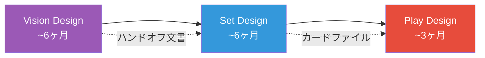

## 第7章 カード設計のプロセス

「素晴らしいカードを思いつく」ことと「250 枚のカードを含むセットを出荷する」ことの間には、膨大な工程が横たわっている。Rosewater は 2009 年から 18 回にわたって "Nuts & Bolts"（ねじとボルト）シリーズを執筆し、セット制作の実務——デザインスケルトン、レアリティ配分、クリーチャーカーブ、メカニクスの重ね方——を丸裸にした。カードゲームの設計を「芸術」から「工程管理を伴う工芸」に引き上げた資料群である。

> **この章で学ぶこと:**
> - Vision Design / Set Design / Play Design の三段階パイプラインと各段階の責務
> - デザインスケルトンの構造、As-Fan の計算、クリーチャーカーブの設計
> - 複数メカニクスを 1 つのセットに統合する手法（Layering Mechanics）

Rosewater の "Nuts & Bolts" シリーズに基づく、セット制作の実務的手法。

**三段階の開発プロセス**

| 段階 | 担当 | 目的 | 期間（MtG の場合） |
|------|------|------|-------------------|
| **Vision Design** | ビジョンチーム | セットのコンセプト・テーマ・主要メカニクスの決定 | 約 6 ヶ月 |
| **Set Design** | セットチーム | 個別カードの設計・メカニクスの肉付け・構造の確定 | 約 6 ヶ月 |
| **Play Design** | プレイデザインチーム | バランス調整・コスト設定・環境への影響予測 | 約 6 ヶ月（並行） |

### ボトムアップデザインの手順

第4章で触れたトップダウンデザイン (フレイバーからメカニクスを導く) に対し、ボトムアップデザインはメカニクス上の面白さから出発してカードを作る手法である。Nuts & Bolts のプロセス全体がボトムアップの体系化と言ってよい。

**ステップ 1: メカニクス的な「問い」から始める（第4章で紹介した手順の詳細版）。** 「もし両プレイヤーが同時にカードを出すなら？」「もしカードをプレイするほど相手のリソースが増えるなら？」——Marvel Snap の同時ターン制やデジモンカードゲームのメモリーゲージは、こうした問いから生まれたメカニクスである。出発点はフレイバーではなく「ゲームプレイ上の緊張」だ。

**ステップ 2: 最小限のカードでプロトタイプする。** 紙のカードに手書きで数値を書き、10-20枚でテストする。Marvel Snap の Brode は物理カードで 2 日間でプロトタイプを完成させた。この段階ではアートもフレイバーも不要——メカニクスの手触りだけを検証する。Shadowverse チームもデジタル実装前に必ず物理カードでテストを行う。

**ステップ 3: メカニクスがどんな感情を生むか検証する。** Dodds の言う「プレイヤーの感情状態にフォーカスせよ」(GDC 2014) がここで適用される。Timmy の興奮を生むか？ Johnny の自己表現を促すか？ Spike のスキル差を生むか？ メカニクスが面白い判断を生まなければ、ステップ 1 に戻る。

**ステップ 4: フレイバーを後付けする。** メカニクスが確認できたら、初めてテーマ・世界観・カード名を考える。「手札を犠牲にしてリソースを得る」仕組みに「マナゾーン」という名前を与え、カードを裏向きに置く演出を加えたのがデュエマの例だ。メカニクスの挙動と矛盾しないフレイバーを選ぶことが重要である。

**ステップ 5: デザインスケルトンに配置する。** 個別メカニクスが固まったら、セット全体の構造に埋め込む。ここからは後述する Nuts & Bolts の工程に合流する。

**トップダウンとの使い分け:** 実践的には両者を混合する。看板カードはトップダウンでフレイバーとの共鳴を最大化し、セットの大部分はボトムアップでメカニクスの健全性を優先する。最良のセットは両アプローチが自然に融合している。

**デザインスケルトン**

セットの骨格を先に設計する手法。各レアリティ・各色にどのようなカードが必要かを先に定義し、そこにカードを埋めていく。

例（60 枚セットの場合）:
- コモン: 各色 6 枚 x 5 色 = 30 枚（シンプルなカード中心）
- アンコモン: 各色 3 枚 x 5 色 = 15 枚（メカニクスの中核）
- レア: 各色 2 枚 x 5 色 + 多色 5 枚 = 15 枚（Timmy/Johnny 向け）

**As-Fan（アズファン）**

「ブースターパック 1 つを開けたとき、特定のメカニクスを持つカードが平均何枚入っているか」を表す指標。リミテッド環境の体験設計に直結する。

- メインメカニクス: As-Fan 2.0 以上（頻繁に出会う）
- サブメカニクス: As-Fan 1.0 前後（時々出会う）
- 特殊メカニクス: As-Fan 0.5 以下（稀に出会う）

**サインポストカード**

アンコモンに配置される「この色の組み合わせでこういうデッキを組みましょう」と示すカード。リミテッドでプレイヤーのデッキ構築を誘導する標識の役割を果たす。

**複雑性予算（Complexity Budget）**

セット全体で許容される複雑性の総量には上限がある。新メカニクスを 1 つ追加するなら、他の複雑性を削る必要がある。後述の New World Order と直結する概念。

**カードコードシステム**

MtG の内部管理では、各カードに体系的なコードが割り当てられる。

- **第 1 文字 = レアリティ**: C（コモン）/ U（アンコモン）/ R（レア）/ M（神話レア）
- **第 2 文字 = 色**: W（白）/ U（青）/ B（黒）/ R（赤）/ G（緑）/ Z（多色）/ A（アーティファクト）/ L（土地）
- **数字 = コレクター番号上の位置**: 色内での通し番号

例: `CW03` = コモン・白・3 番目のカード。このコードにより、デザインスケルトン上でカードの位置を一意に特定できる。

**デザインスケルトンの詳細構造**

標準的な MtG のラージセット（約 261 枚）のデザインスケルトンは以下の構成を取る:

| レアリティ | 枚数 | 内訳 |
|-----------|------|------|
| **コモン** | 101 枚 | 各色 19 枚 × 5 色 = 95 枚 + アーティファクト/土地 6 枚 |
| **アンコモン** | 80 枚 | 各色 13 枚 × 5 色 = 65 枚 + サインポスト 10 枚（2 色の組み合わせ各 1 枚）+ 無色 5 枚 |
| **レア** | 60 枚 | 各色に均等配分 + 多色・無色枠 |
| **神話レア** | 20 枚 | セットの目玉カード |

**クリーチャー/非クリーチャー比率（色別）**

各色はメカニクス的アイデンティティに応じて、クリーチャーと非クリーチャーの比率が異なる（以下の数値は Nuts & Bolts #13 (2021) のデザインスケルトンから算出した概算であり、セットにより変動する）。

| 色 | クリーチャー比率 | 傾向 |
|----|-----------------|------|
| **白** | 約 62% | 軍隊・トークン生成を重視。盤面に並べる色 |
| **緑** | 約 59% | 大型クリーチャー中心。自然の力 |
| **黒** | 約 56% | クリーチャーと除去のバランス |
| **赤** | 約 53% | 直接ダメージ呪文が多い分やや低め |
| **青** | 約 50% | カウンター・ドローなど非クリーチャー呪文が最も多い |

**コモンのクリーチャーカーブ**

色ごとの詳細なマナ値配分は付録 B を参照。ここでは原則のみ述べる：**白が最もクリーチャー比率が高く (62%)、青が最も低い (50%)**。各色 3% ずつ減少する (白→緑→黒→赤→青)。スムーズなマナカーブをコモンに組み込むことは、リミテッド環境の健全性の基盤である。

**スケルトンの埋め方（Filling Order）**

デザインスケルトンにカードを埋めていく順序（N&B #3, 2011）:

1. **コモンから始める** — コモンがプレイ環境を定義する
2. **クリーチャーを先に** — ゲームプレイの背骨
3. **バニラ（テキストなし）→ フレンチバニラ（キーワード能力のみ）** — 基準線の確立
4. **メカニクス搭載クリーチャー** — セットの新メカニクスを見せるカード
5. **非クリーチャー呪文** — 除去、コンバットトリック等
6. **アンコモン** — 同様のロジックで
7. **高レアリティは最後**

**鍵となる助言**: 「最も重要なデザインスキルの一つは、利用可能な穴に合わせてデザインする能力である」——クールなカードを作ってから場所を探すのではなく、必要なスロットに合うカードを作ること。

**高レアリティの役割（Higher Rarities）**

| レアリティ | 主な責務 | 設計指針 |
|-----------|---------|---------|
| **コモン** | 構造の提供。プレイ環境の基盤 | シンプルで即座に理解可能。低い複雑性 |
| **アンコモン** | 2 カードコンボやビルドアラウンド戦略の起点。サインポストの配置 | コモンより複雑性を許容。理解しにくいカードや盤面の選択肢を増やすカードはここに |
| **レア** | 構造より**興奮の提供**。デッキに入れたくなるカード | 派手で強力。セットのテーマに沿ったサイクル + テーマから離れた派手なサイクルの最低 2 つ |
| **神話レア** | 最もインパクトがあり特別感のあるカード | 「強いカード」ではなく「特別に感じるカード」。物語を生むカード |

**メカニクスの重ね方（Layering Mechanics）**

N&B #17-18 (2025-2026) で解説された、複数メカニクスをセットに組み込む手法。

1. **第 1 メカニクスから始める** — 最初のメカニクスにはスペースが保証される
2. **第 2 メカニクスを第 1 と照合** — 「2 つのメカニクスが単独では機能するがシナジーしないなら、別の第 2 メカニクスを試すサインである」
3. **2 つが連携したら、各メカニクスの占有範囲を縮小検討** — 特定の色やレアリティに限定する
4. **第 3 メカニクス以降は最初の 2 つが固まってから追加**
5. 異なる構造的要求が**重なり合う**ことが重要 — メカニクスは複数の構造的役割を兼ねるべき

標準的なプレミアセットには **3-6 個の名前付きメカニクス**が含まれる。それ以上はコモンでの露出が薄くなり、複雑性が急増する。

**As-Fan の定義**

**As-Fan（アズファン）** = ブースターパック 1 つを開封したときに、特定の特徴を持つカードが平均何枚含まれているかを表す指標。

計算式: As-Fan = (該当カードのコモン枚数/コモン総数 × パック内コモン枚数) + (該当カードのアンコモン枚数/アンコモン総数 × パック内アンコモン枚数) + ...

リミテッド環境の設計において最も重要な定量指標であり、メカニクスの体験頻度を直接制御する。

### Nuts & Bolts シリーズ全記事索引

| # | タイトル | URL |
|---|---------|-----|
| 1 | Card Codes | https://magic.wizards.com/en/news/making-magic/nuts-bolts-card-codes-2009-01-12 |
| 2 | Design Skeleton | https://magic.wizards.com/en/news/making-magic/nuts-bolts-design-skeleton-2010-02-15 |
| 3 | Filling in the Design Skeleton | https://magic.wizards.com/en/news/making-magic/nuts-bolts-filling-design-skeleton-2011-02-28 |
| 4 | Higher Rarities | https://magic.wizards.com/en/news/making-magic/nuts-bolts-higher-rarities-2012-02-27 |
| 5 | Initial Playtesting | https://magic.wizards.com/en/news/making-magic/nuts-bolts-initial-playtesting-2013-02-11 |
| 6 | Iteration | https://magic.wizards.com/en/news/making-magic/nuts-bolts-iteration-2014-02-03 |
| 7 | Three Stages of Design | https://magic.wizards.com/en/news/making-magic/nuts-bolts-three-stages-design-2015-03-02 |
| 8 | Troubleshooting | https://magic.wizards.com/en/news/making-magic/nuts-bolts-troubleshooting-2016-02-15 |
| 9 | Evaluation | https://magic.wizards.com/en/news/making-magic/nuts-bolts-evaluation-2017-02-20 |
| 10 | Creative Elements | https://magic.wizards.com/en/news/making-magic/nuts-bolts-creative-elements-2018-03-26 |
| 11 | Art | https://magic.wizards.com/en/news/making-magic/nuts-bolts-art-2019-02-18 |
| 12a | Limited (Mechanics) | https://magic.wizards.com/en/news/making-magic/nuts-bolts-12-part-1-limited-mechanics-2020-03-09 |
| 12b | Limited (Themes) | https://magic.wizards.com/en/news/making-magic/nuts-bolts-12-part-2-limited-themes-2020-03-16 |
| 13 | Design Skeleton Revisited | https://magic.wizards.com/en/news/making-magic/nuts-bolts-13-design-skeleton-revisited-2021-03-22 |
| 14 | Initial Ideation | https://magic.wizards.com/en/news/making-magic/nuts-bolts-14-initial-ideation-2022-03-07 |
| 15 | Structural Support | https://magic.wizards.com/en/news/making-magic/nuts-and-bolts-15-structural-support |
| 16 | Play Boosters | https://magic.wizards.com/en/news/making-magic/nuts-and-bolts-16-play-boosters |
| 17 | Finding Your Mechanics (Part 1 & 2) | https://magic.wizards.com/en/news/making-magic/nuts-and-bolts-17-finding-your-mechanics-part-1 |
| 18 | Layering Your Mechanics | https://magic.wizards.com/en/news/making-magic/nuts-and-bolts-18-layering-your-mechanics |

**イテレーション**

設計 → プレイテスト → フィードバック → 修正のサイクルを高速で回す。初期段階ではカードの数値よりもメカニクスの「感触」を優先してテストする。

> **出典:** magic.wizards.com — [Nuts & Bolts シリーズ #1–18](https://magic.wizards.com/en/news/making-magic/nuts-bolts-card-codes-2009-01-12)

**この章のまとめ** — Nuts & Bolts が教える最も重要な教訓は「デザインスケルトンを先に作り、そこにカードを埋めよ」ということだ。クールなカードを先に作って後から場所を探すのではなく、必要なスロットに合うカードを作る。この逆転の発想こそが、250 枚のセットを一貫性のある体験として成立させる鍵である。

**さらに学ぶために:**

- **Nuts & Bolts シリーズ #1-18** (magic.wizards.com): 全 18 回の記事索引が本章に含まれている。小規模ゲームなら #1-3 と #13 を読めば十分。
- **Rosewater "Vision Design, Set Design, and Play Design"** (2017): 三段階パイプラインの導入を発表した記事。なぜ分業が必要になったかの歴史的背景が分かる。

### 演習問題

**課題 7-1（初級・目安 1〜2 時間）**: 課題 4〜6 で作ったものをまとめて、自作 TCG のカードを 20 枚作ってみよう。以下を意識すること：(a) 各陣営に最低 3 枚ずつ、(b) コスト 1〜5 まで幅を持たせる、(c) クリーチャーと呪文の枚数バランスを決める、(d) カード同士の相性が良い組み合わせを 1 つ以上入れる。各カードにはカード名・コスト・効果テキスト・陣営を書こう。

---
