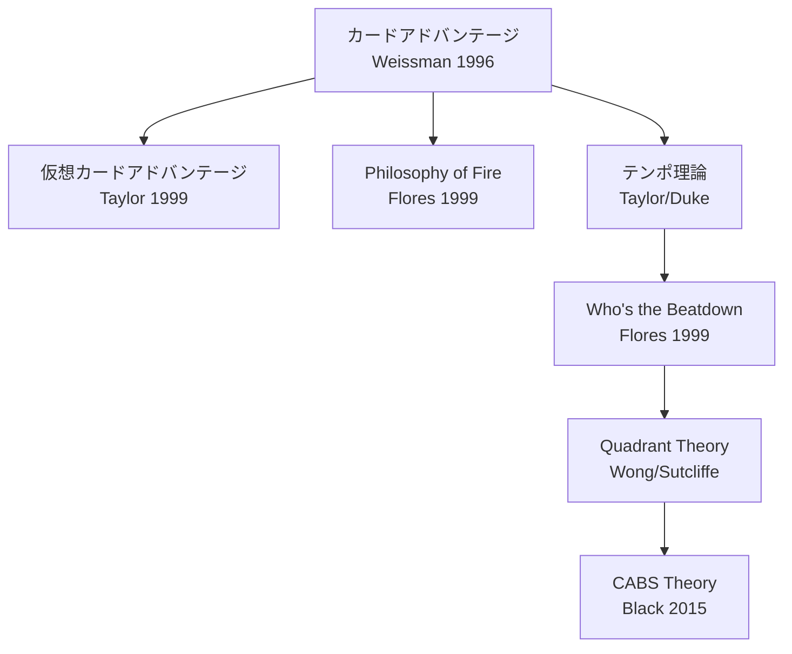

## 第7章 カード評価の理論

「このカードは強いですか？」——初心者が最も頻繁に発する問いであり、同時に最も答えにくい問いでもある。カードの「強さ」は固定された属性ではなく、ゲーム状態、デッキ構成、メタゲーム、そして対戦相手のデッキによって刻々と変化する。1996 年に Brian Weissman がカードアドバンテージを体系化して以来、プレイヤーとアナリストはカード評価の理論を層状に積み上げてきた。

> **この章で学ぶこと:**
> - カードアドバンテージ、仮想カードアドバンテージ、テンポの 3 つの基本評価軸
> - Who's the Beatdown と Quadrant Theory による状態依存の評価手法
> - これらの理論が示唆する、ゲーム AI のカード評価における設計上の考慮点

対戦プレイで個々のカードやリソースをどう評価するかに関する理論体系。主に競技プレイヤーとアナリストによって発展してきた。

以下の図は、本章で扱う理論の系譜を示す。

### Card Advantage（カードアドバンテージ）

**Brian Weissman (1996)** が体系化した最も基本的な評価軸。手札・盤面・墓地を含む「利用可能なカード総数」の差がゲームの優劣を決定するという理論。

1枚で2枚を処理するカードはカードアドバンテージを生む。Weissman は "The Deck"（MtG 最初の有名なコントロールデッキ）で、カードアドバンテージを明示的な戦略目標に据えた最初のデッキビルダーである。「毎ターン+1枚のカードアドバンテージを継続すれば、最終的にどんな相手でも圧倒できる」という**不可避性（Inevitability）**の考え方を確立した。

### Virtual Card Advantage（仮想カードアドバンテージ）

**Eric "Dinosaur" Taylor (1999)** が体系化した概念。カードアドバンテージは「任意のプロセスにより、一方のプレイヤーが実効的に相手より多くのカードを得ること」と定義される。**物理的にカードを引いたり捨てたりしなくても、相手のカードを無意味にすることで仮想的なアドバンテージが発生する。**

機能無効化の典型は、MtG の Moat（地上クリーチャーが攻撃不能になるエンチャント）だ。相手の地上 5 体を 1 枚で無力化すると、仮想的に約 5 枚分のアドバンテージが発生する。

同様の構造は他ゲームにもある。**Marvel Snap** の《Shang-Chi》を見てみよう。

> **《Shang-Chi》**（2023 年 11 月時点のテキスト） — コスト 4 / パワー 3
> On Reveal: ここにあるパワー 10 以上の敵カードを**すべて**破壊する。
> ※2025 年 9 月の更新で「1 枚のみ破壊」に変更された。以下の分析は全体破壊時代のものである。

まず注目すべきは、閾値が「10 以上」である点だ。初期には 9 以上だったが、2023 年 11 月の OTA パッチで 10 に引き上げられた。開発チームは「10 は 9 よりゲームデザイン上"良い数字"であり、覚えやすく、"大きい"パワーの直感的な基準になる。さらに Shang-Chi のテン・リングスとも特別な関係がある」と説明している（[November 9th Balance Updates](https://marvelsnap.com/november-9th-balance-updates/)）。閾値設計ひとつにも、認知的わかりやすさとフレーバーの両面が反映されている。

次に、Marvel Snap はデッキがわずか 12 枚しかない。Moat は盤面に残り続ける永続効果だが、Shang-Chi は On Reveal（場に出た瞬間）の一回限りだ。12 枚の中にこの 1 枚があるだけで、相手は「パワーを 10 以上にバフする」戦略を常に警戒しなければならない。実際にプレイされなくても、存在するだけで相手のバフ先を分散させる圧力になる。これが仮想カードアドバンテージの核心だ——カードを使わずして相手の選択肢を狭める。なお、後に 1 枚のみ破壊に変更されたのは、この圧力が強すぎたためでもある（[Balance Updates: September 25, 2025](https://marvelsnap.com/balance-updates-september-25-2025/)）。

Moat との対比も有益だ。Moat は「地上」という広いカテゴリを永続的に封じる。Shang-Chi は「パワー 10 以上」という条件を一度だけ罰する。永続型は確実だが除去されうる。一回型は出すタイミングが命だが、「いつ来るかわからない」恐怖を与え続ける。仮想カードアドバンテージの発生メカニズムは同じでも、時間軸が異なる。

仮想カードアドバンテージは、以下の 4 つの形態に分類される。

| 形態 | 説明 | 例 |
|------|------|-----|
| **カード選択（Selection）** | より多くのカードを見て最良を選ぶ | Brainstorm（3 枚引いて 2 枚戻す） |
| **反復効果（Recurring）** | 同じカードを繰り返し使う | 墓地から再利用できるカード |
| **テンポ（Tempo）** | 相手にリソースの再投資を強いる | バウンス呪文（5 マナのクリーチャーを 1 マナで手札に戻す） |
| **機能無効化（Blanking）** | 相手のカードの機能を封じる | Moat 効果、プロテクション |

> **出典:** [Virtual Card Advantage](https://magic.wizards.com/en/news/making-magic/virtual-card-advantage-2014-06-09) — magic.wizards.com

### テンポ理論

マナ（リソース）の使用効率を軸にした評価。1 ターンに使えるリソースをどれだけ効率的に活用しているかが「テンポ」である。Eric Taylor (1999) が初期理論を構築し、Reid Duke (Level One, 2014-2015) が体系的に解説した。

毎ターンすべてのマナを使い切り、インパクトのあるプレイに費やすことがテンポ優位を築く。テンポとカードアドバンテージはトレードオフ関係にあることが多い。バウンス呪文は好例だ——5 マナのクリーチャーを 1 マナで手札に戻すと、4 マナ分のテンポスイングが発生するが、カードアドバンテージは得ていない（相手は同じカードをまた使える）。

**LoR** の《Deny》はこのトレードオフを鮮明にする。

> **《Deny》** — コスト 4 / Fast スペル / 地域: アイオニア
> Fast スペル、Slow スペル、またはスキルを止める。

> **出典:** 《Deny》の効果テキストは Legends of Runeterra のゲーム内表記（LoR には公式カードデータベースの個別ページがない）

Deny がアイオニア地域の専属カードである点は重要だ。LoR では地域ごとに得意分野が明確に分かれている。アイオニアの設計思想は「調和と防御」であり、直接ダメージや大型ユニットではなく、回避や妨害で戦う。初期環境ではスペル打ち消しはアイオニアだけに許された特権であり、この 1 枚のためだけにアイオニアを採用するデッキも存在した（後にシュリーマの《Rite of Negation》など同種の効果が他地域にも登場している）。

Fast スペルであることも見逃せない。LoR のスペルには Slow、Fast、Burst の 3 速度がある。Fast は相手のアクションに対応して使える最速の「応答可能」スペルだ。つまり Deny は相手がスペルを宣言した後に割り込める。だが Burst（即時解決）ではないため、Deny 自体も相手に対応の余地を残す。

テンポ面の数値を具体的に見よう。Deny のコストは 4 マナだ（初期は 3 マナだったが、あまりに強力で引き上げられた）。カードアドバンテージは 1:1 の交換にすぎない。しかし相手が 7 マナの大型スペルを費やした直後に 4 マナで無効化すると、3 マナ分のテンポスイングが発生する。逆に、相手の 2 マナスペルに Deny を使えば 2 マナ分の損だ。テンポとカードアドバンテージの交換レートは固定ではなく、ゲーム状態に応じて動的に判断する必要がある。

初期の 3 マナ時代には、LoR の「スペルマナ」（未使用マナを最大 3 まで次ターンに持ち越せる仕組み）だけで Deny を撃てた。つまりメインのマナを一切消費せず打ち消しが可能だった。4 マナへの変更は、必ず通常マナを 1 以上使わせることでテンポコストを課す調整だ。マナコスト 1 の差が、ゲーム体験を根本から変えた好例である。

> **出典:** [Tempo](https://magic.wizards.com/en/news/feature/tempo-2014-09-22) — magic.wizards.com, [Level One Full Course](https://magic.wizards.com/en/news/feature/level-one-full-course-2015-10-05) — magic.wizards.com

### Who's the Beatdown (Mike Flores, 1999)

TCG 対戦理論の金字塔。**あらゆる対戦において、一方がビートダウン（攻撃側）、他方がコントロール（防御側）の役割を担う**という原則。

**中心的主張**: 「トーナメント MtG で私が目にする最も一般的な（しかし巧妙かつ致命的な）ミスは、似たデッキ同士の対戦でどちらがビートダウンでどちらがコントロールかを誤認することである」（Flores）。

フレームワークの核心はこうだ。あらゆるマッチアップにおいて、一方が攻撃者（ビートダウン）、他方が対応者（コントロール）の役割を担う。ミラーマッチ（同型対決）においてさえ、役割は対称ではない——不可避性（Inevitability）を持つ側がコントロール、持たない側がビートダウンを担わなければならない。そして**役割を誤認した側が「不可避的に敗者になる」**。

具体例で考えてみよう。Mono-Red Aggro と Azorius Control が対戦する場合、Mono-Red が攻撃側、Azorius が防御側であることは明白だ。しかし Mono-Red Aggro 同士のミラーマッチではどうか？ 手札にカード切れが先に来る側がコントロール（受けに回って相手のリソース切れを待つ）、まだ手札に攻め手がある側がビートダウンを担うべきだ。もしリソースが先に尽きる側が無理に攻め続ければ、息切れして負ける。役割はゲーム間（サイドボード後）で変化しうるし、1ゲーム中でも状況により逆転しうる。

**ゲーム AI への示唆**: 役割判定は個々のカードプレイ判断の**上位に位置するメタ戦略的判断**である。AI がライフトータル vs 盤面制圧 vs カードリソースのどれに重みを置くかは、役割判定に依存する。

> **出典:** [Who's the Beatdown?](https://articles.starcitygames.com/articles/whos-the-beatdown/) — Star City Games

### Philosophy of Fire (Adrian Sullivan / Mike Flores, 1999/2004)

**起源**: Adrian Sullivan がウルザブロック構築 PTQ の時期（1999）に着想し、Flores が 2004 年に形式化・普及させた。

ダメージ効率を数値化する理論。**カードとダメージの間に数学的関係が存在する**ことを示し、勝利に必要なカード枚数を計算可能にする。

ダメージクロックの公式は単純だ。基準線として Shock = 1マナ、1枚、2点ダメージを置く。10枚の Shock で20点ダメージ、すなわち相手の死。ゲーム開始時の手札は7枚だから、追加で約3枚ドローすれば10枚のダメージ源を確保できる。1枚あたり2点を超えるカードはクロックを加速し（"above rate"）、下回るカードはクロックを減速する（"below rate"）。この理論はアグロデッキの評価関数の基盤であり、「あと何ターンで勝てるか」（TTK: Turns to Kill）を具体的に算出するための枠組みを提供する。

> **出典:** [The Philosophy of Fire](https://articles.starcitygames.com/articles/the-philosophy-of-fire/) — Star City Games

### Quadrant Theory (Brian Wong / Marshall Sutcliffe)

Brian Wong が考案し、Limited Resources ポッドキャスト（Marshall Sutcliffe、Luis Scott-Vargas）で広まった評価手法。カードの強さを**静的に 1 つの数値で評価するのではなく、4 つのゲーム状態それぞれで評価する**。

| 象限 | ゲーム状態 | 問い | 高評価の例 |
|------|-----------|------|-----------|
| **Developing（展開）** | 両者がオープニングハンドからカードを展開中。序盤 | このカードは盤面を作れるか？ | 低コストクリーチャー、マナ加速 |
| **Parity（膠着）** | 両者が手札を使い果たし、盤面が拮抗。トップデッキ勝負 | このカードは均衡を破れるか？ | カードアドバンテージを生むカード、回避能力持ち |
| **Winning（優勢）** | 自分が盤面を支配。数ターン以内に勝てる見込み | このカードは勝利を確定させるか？ | トランプルなどのフィニッシャー能力 |
| **Losing（劣勢）** | 相手が盤面を支配。何かが変わらなければ負ける | このカードは逆転のきっかけになるか？ | 全体除去、ライフゲイン付きブロッカー |

評価方法としては、各カードを4象限それぞれで「良い/普通/悪い」と評価する。3〜4象限で「良い」カードはプレミアムピックであり、1象限でしか「良い」でないカードは状況限定的でドラフトでの優先度は低い。目標は「すべてで最高」のカードを見つけることではなく、「ほとんどの状況でそこそこ以上」のカードを識別することだ。

**ゲーム AI への示唆**: Quadrant Theory は**状態依存のカード評価**を直接的に示唆する。固定値ではなく、現在のゲーム状態に応じて各カードの価値を動的に変化させるべきであり、これはニューラルネットワーク評価関数が暗黙的に学習する内容を構造化した形で表現したものである。

> **出典:** [Quadrant Theory](https://magic.wizards.com/en/news/feature/quadrant-theory-2014-08-20) — magic.wizards.com

### 実例: 複数タイトルの定番札を Quadrant Theory で読む

競技人口の大きいゲームでは、汎用札の評価軸がプレイヤー間で共有されやすい。複数タイトルの定番札を並べると、同じ「強カード」でも、どの象限で強いかはかなり違う。

**具体例:** **ポケモンカード** の 《なかよしポフィン》 は、「HP70 以下のたねポケモンを 2 枚までベンチに出す」カードだ。最も強いのは Developing で、序盤の盤面形成と次ターン以降の進化先確保を 1 枚で済ませられる。一方で Parity や Losing では、場にすぐ影響しないぶん価値が大きく落ちる。典型的な「序盤は最強、終盤は弱い」カードである。

**具体例:** **ポケモンカード** の 《博士の研究》 は、「手札をすべてトラッシュし、山札を 7 枚引く」サポートだ。Developing では必要札を掘りに行け、Parity では止まった手札を一気に更新できるので強い。ただし Losing で即応札が必要な場面では、7 枚見ても盤面に触れなければ間に合わない。強力だが、盤面に直接触らないドローの限界もはっきりしている。

**具体例:** **ポケモンカード** の 《ナンジャモ》 は、「互いの手札を山札の下に戻し、残りサイド枚数ぶん引き直す」カードだ。Winning では相手の手札を削る妨害札になり、Losing では自分の手札刷新にもなる。サイドはゲーム開始時に脇へ置く 6 枚で、相手のポケモンを倒すたびに 1 枚取り、取り切れば勝ちになる——つまりリードしている側ほど残り枚数が少ない（制度の詳細は第 16 章）。相手のサイドが少ない終盤ほど強いので、単純なドロー枚数ではなく、ゲーム状態そのものに価値が依存する。

**具体例:** **Shadowverse** の 《次元の超越》 は、「このターンのあと、自分の追加ターンを行う」スペルだが、そのままでは重すぎる。スペルブーストでコストを下げる前提なので、Developing では手札で遊びやすく、Losing では間に合わないことも多い。だが Parity で十分にブーストが進んだ後は、一気にゲームを終わらせる。素のレートより、専用デッキの文脈で価値が跳ね上がる典型例だ。

**具体例:** **遊戯王 OCG** の 《灰流うらら》 は、「デッキから手札に加える」「デッキから特殊召喚する」「デッキから墓地へ送る」効果を無効にする手札誘発だ。盤面に強いカードというより、相手の Developing を手札から止めるカードである。レート評価だけでは地味だが、環境の大半が初動サーチに依存しているなら、コンテキスト評価は一気に上がる。

この 5 枚を並べると、カード評価には少なくとも 3 種類の強さがあると分かる。盤面形成に強いカード、手札を掘るカード、特定の文脈でだけ暴騰するカードである。Quadrant Theory の価値は、こうした役割差を 1 つの点数に潰さず残せるところにある。

> **出典:**
> - [なかよしポフィン](https://www.pokemon-card.com/card-search/details.php/card/45875/regu/all) — ポケモンカード公式カード検索
> - [博士の研究](https://www.pokemon-card.com/card-search/details.php/card/46624) — ポケモンカード公式カード検索
> - [ナンジャモ](https://www.pokemon-card.com/card-search/details.php/card/43664) — ポケモンカード公式カード検索
> - [次元の超越](https://shadowverse-portal.com/card/101334020) — Shadowverse Portal
> - [灰流うらら](https://www.db.yugioh-card.com/yugiohdb/card_search.action?a=202201241821&cid=12950&ope=2&request_locale=ja) — 遊戯王 OCG 公式カードデータベース

### 実例: スタッツの外側にある強さ — 遊戯王《時械神》

Quadrant Theory は「同じカードでも状態で強さが変わる」ことを示した。もう一歩進めると、そもそも**単体スタッツでは強さが測れないカード**がある。攻撃力・守備力という最も分かりやすい数値が、そのカードの価値をまったく表さない場合だ。**遊戯王 OCG** の **《時械神メタイオン》**（レベル 10・天使族・攻 0／守 0）はその極端な例である。

> **《時械神メタイオン》** レベル10／天使族／攻0／守0
> ①このカードはデッキから特殊召喚できない。自分フィールドにモンスターが存在しない場合、このカードはリリースなしで召喚できる。
> ②このカードは戦闘・効果では破壊されず、攻撃表示のこのカードの戦闘で発生する自分への戦闘ダメージは 0 になる。
> ③このカードが戦闘を行ったバトルフェイズ終了時に発動する。このカード以外のフィールドのモンスターを全て持ち主の手札に戻し、戻した数×300 ダメージを相手に与える。
> ④自分スタンバイフェイズに発動する。このカードを持ち主のデッキに戻す。

攻守 0 だけを見れば、このカードは戦闘力ゼロの最弱モンスターだ。だが挙動を読むと評価が反転する。戦闘でも効果でも破壊されず、戦闘ダメージも 0 に抑える（不滅）。戦闘後には相手の盤面を全て手札へ戻し、戻した数だけバーンを与える（全体除去）。そして自分のスタンバイフェイズに必ずデッキへ帰る（毎ターン去る）。攻撃力を介さずに盤面へ干渉するカードであり、スタッツはその価値の担い手ではない。

前節の Quadrant Theory の枠で見ると、この歪みはさらに際立つ。攻 0 という数値は Developing でも Winning でも一貫して「弱い」と告げる。しかし実際の価値は Parity や Losing で跳ね上がる——膠着や劣勢で相手の盤面をまとめて流し、しかも次の自分のターン開始前に場から消えて隙を残さない。**レートは静的なスタッツを、コンテキストは動的な挙動を測る**という本章の対比が、1 枚の中で最大化されている。

この反転は、第1章で触れた **《ヨワシ》** と鏡合わせの関係にある。ヨワシは単体スタッツでは最弱だが、群れをなす処理の束によって盤面価値を得た。時械神は単体でも、スタッツを迂回する挙動そのものが価値になる。どちらも「強いカードとは何か」を、攻撃力や HP といった目に見える数値の外側で定義し直している。カード評価の理論が繰り返し説くのは、まさにこの点だ——数値は価値の全体ではなく、その一部の代理指標にすぎない。

> **出典:** [時械神メタイオン](https://www.db.yugioh-card.com/yugiohdb/card_search.action?cid=9698&ope=2&request_locale=ja) — 遊戯王 OCG 公式カードデータベース

### BREAD（ドラフト優先順位）

リミテッド（限定構築）におけるカード選択の優先順位。

| 頭文字 | 意味 | 説明 |
|--------|------|------|
| **B** | Bombs | ゲームを支配するカード |
| **R** | Removal | 除去カード |
| **E** | Evasion | 回避能力持ち |
| **A** | Aggro / Aura | 攻撃的カード / 強化 |
| **D** | Duds | 弱いカード（最後に取る） |

### CABS Theory (Sam Black, 2015)

**Cards that Affect the Board State（盤面に影響するカード）** を優先すべきという理論。特にリミテッドで重要。

**基本原則**: リミテッドのデッキにおいて、盤面に直接影響しないカードを入れる余裕は非常に限られている。勝つデッキの基盤は**ほぼ全てが盤面に影響するカード**で構成される。

具体的には、リミテッドのデッキには15〜18体のクリーチャーを入れるべきであり、クリーチャー以外で優先するのは除去とコンバットトリックだ。カードドロー呪文、ビルドアラウンド型エンチャント、カウンター呪文、ライフゲインは例外的に優秀なもの以外避けるべきとされる。CABS はデッキ構築の強力な制約条件を提供し、AI のデッキ構築/ドラフトアルゴリズムにおいて盤面影響度を主要評価軸にすべきという強い事前分布を与える。

> **出典:** [CABS Theory](https://magic.wizards.com/en/news/feature/cabs-theory-2015-08-19) — magic.wizards.com

### Chapin のレート/コンテキスト評価

Patrick Chapin（*Next Level Magic* (2010)、*Next Level Deckbuilding* (2013)）が提唱した評価手法。カードの「レート」（基礎性能）と「コンテキスト」（メタゲーム・デッキにおける位置づけ）を分離して評価する。

評価プロセスは4段階だ。まずカードのマナコスト対効果を単体で**レート評価**する（コンテキスト不問の基礎性能）。次にこのカードを欲しがるデッキは何か、現在のメタゲームでどう変わるかを**コンテキスト評価**する。続いてそのカードがこれまで存在しなかった戦略を可能にするかの**新規性判定**を行い（最も高い潜在価値を持つ）、最後に同じ効果の既存カードと比べてレートで競争力があるかの**冗長性チェック**で締める。同じカードでも環境次第で評価が大きく変わる。AI の評価関数設計において、「レート」はコンテキスト不問の静的ヒューリスティック値、「コンテキスト」はゲーム状態・デッキ構成・対戦相手モデリングによる動的調整に対応する。

**この章のまとめ** — カード評価理論の核心は「文脈なき評価は無意味である」ということだ。カードアドバンテージは基本だが万能ではなく、テンポとのトレードオフが常に存在する。Quadrant Theory が示すように、同じカードが展開期には最高でも膠着期には最悪ということがある。AI にとっても人間にとっても、カード評価は「今この瞬間のゲーム状態において」行われなければならない。

**さらに学ぶために:**

- **Mike Flores "Who's the Beatdown?"** (Star City Games): TCG 対戦理論の金字塔。短い記事だが、四半世紀経っても色褪せない洞察が詰まっている。
- **Reid Duke "Level One Full Course"** (magic.wizards.com): テンポ、カードアドバンテージ、役割判定を体系的に解説する入門シリーズ。

> **事例研究への案内:** カード評価の枠組みが異なるゲームでの適用例については、第15章 Gwent（プロビジョンによるカード価値の定量化）、第16章 ポケモンカード（サイド枚数によるカード価値の動的変化）を参照。

### 演習問題

**課題 7-1（初級・目安 30 分）**: 課題 6-1 の 20 枚から 5 枚を選んで、Quadrant Theory（序盤 / 互角 / 優勢 / 劣勢）の 4 場面でそれぞれ強いか弱いか評価してみよう。4 場面すべてで弱いカードがあれば、どう直せばよいか考えてみよう。

---

#### 解答例:『芽吹』の場合

課題 6-1 の解答例で作った 20 枚から 5 枚を選び、序盤 / 互角 / 優勢 (Winning) / 劣勢 (Losing) の 4 場面で評価する。◎良 ○可 △弱。

| カード | 序盤 | 互角 | 優勢 | 劣勢 | 所見 |
|---|:-:|:-:|:-:|:-:|---|
| 双葉 | ○ | ○ | ◎ | △ | 育てば勝ち手、負けてると間に合わない |
| 早咲きのチューリップ | ◎ | ○ | ○ | △ | 速い盤面向け |
| かれ葉の罠 | △ | ◎ | ○ | ◎ | 妨害はどの劣勢でも腐りにくい |
| どっしりカボチャ | ○ | ◎ | ○ | ◎ | 壁はどの局面でも仕事がある優秀札 |
| **大輪のヒマワリ** | △ | ○ | ◎ | **△** | **盤面が空だと登場時が空振り = Losing で腐る** |

4 場面すべてで弱いカードはないが、《大輪のヒマワリ》が Losing でほぼ死に札になる。課題 1-1 の解答例で「なんとなく引っかかる」と書き、第 2 章の FIRE 検算で Replayable の弱さと言語化した違和感が、ここでようやく「どの場面で腐るか」という数表の形になった。**修正する。**

> **《大輪のヒマワリ》** (改訂) 陽 5 / 株 / 攻 6・耐 5
> **登場時:** あなたの株すべてを +1/+1 する。あなたの株が他にいなければ、代わりに相手の株 1 体に 3 ダメージ。
> 陣営: 花壇 / 想定類型: Timmy

**何をなぜ変えたか:** 盤面が空 (Losing) のときは全体バフが無意味なので、その場合だけ「相手の株に 3 ダメージ」という最低限の仕事 (floor) を与えた。Quadrant で見て 4 場面すべてに役割ができ、Timmy の派手さは維持したまま死に札を解消した。この改訂は課題 5-1 の解答例の花壇代表・課題 6-1 の解答例のプールにも遡って反映する。

**意図的な粗さと自己批評:** 分岐が付いてテキストがやや長くなった。第 8 章「複雑性の管理」で言う認知コストが上がっている。次の課題で読みやすさを詰める。

**もう一つの見落とし——ワンショットの上限。** Quadrant は 4 場面を均して評価するが、逆に「最も伸びた一撃」がどこまで届くかは、この表では数えていなかった。盤面例で確かめる。序盤に《双葉》(攻 1・耐 1) を出し、《ガラスの温室》を設置すると成長は毎回 +2 になる。ここから 5 ターン育てれば成長カウンターは 10 個、《芽吹きの朝》を 2 回重ねて 12 個 (攻 13) まで伸びる。そこへ《接ぎ木の妙》でこの 12 個をまるごと《大輪のヒマワリ》(攻 6) へ移すと攻 18、大輪の登場時 +1/+1 が自身にも乗って攻 19。移し終えて空いた双葉 (登場時バフで攻 2) と合わせて殴れば、1 ターンで 21 点が本体へ通る——初期ライフ 20 を、ほぼ単騎に近い一撃で割り込む計算になる。ワンショットの上限を数えていなかった。移せる成長カウンターに上限を置くか、これを温室の必殺コンボとして許すか——この判断はプレイテスト (第 11 章) に送る。

---
