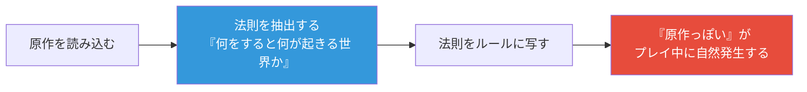

## 第7章 原作のあるカードゲームの設計

第1章の《仮面ライダーオーズ プトティラ コンボ》と、第6章の《フリーダムガンダム》を思い出してほしい。どちらも、原作の名場面や設定をカードの機構へ翻訳したトップダウンデザインの好例だった。ここまで本書は、この種の翻訳を「トップダウンの一形態」として扱ってきた。

だが、日本のカードショップの棚を眺めると、この扱いでは足りないことに気づく。ワンピース、ユニオンアリーナ、ヴァイスシュヴァルツ、ポケモンカード——売り場の主役はほぼすべて、**すでにファンがいる原作**を背負ったゲームである（第17章で見るとおり、IP 連動は日本市場の支配的パターンだ）。ところが、本書が頼りにしてきた Rosewater のコラム群には、この状況に正面から答える章がない。MtG は自社のオリジナル世界であり、Rosewater の語るトップダウンは「狼男」「吸血鬼」のような**ジャンルの伝承**から出発する。特定の作品の、特定のファンに向けてカードを作る技術は、MtG の教科書の外にある。

原作があると、設計の何が変わるのか。本章は、日本の商業デザイナーたちの証言からこの問いに答える。

> **この章で学ぶこと:**
> - ジャンル共鳴と原作共鳴の違い——「期待に乗る」設計と「答え合わせされる」設計
> - 法則のルール化——名場面の再演より一段深い、原作らしさの作り方
> - 主人公問題——いちばん人気のカードを最強にできない理由

### 原作ファンという特殊な読者

数十タイトルのキャラクターゲームを手掛けたゲームデザイナーの中村誠は、キャラクターゲームを 3 つの性質で定義する。核になるのは「そのキャラクターにはファンが存在する」という一点だ（[キャラクターゲームのゲームデザイン](https://note.com/macogame/n/n9c92b5c34bd6)）。当たり前に聞こえるが、設計上の含意は大きい。**読者が、ルールブックより先に原作を知っている**のである。

第1章で見た共鳴（Resonance、教訓 3）を思い出そう。「狼男は満月で変身する」をルールブックが説明しなくていいのは、プレイヤーが先に知っているからだった。原作ものはこの力を最大出力で使える——はずだ。だが、ジャンルの共鳴と原作の共鳴には決定的な違いがある。

| | ジャンル共鳴（狼男・吸血鬼） | 原作共鳴（特定作品のキャラ） |
|---|---|---|
| 知識の源泉 | 伝承・ジャンルの型 | 特定の作品の特定の描写 |
| 読者の期待 | 「だいたいこういうもの」 | 「あのシーンではこうだった」 |
| 設計の自由度 | 型に沿えば細部は自由 | 細部まで答えを知られている |
| 失敗の形 | 違和感（なんか変だ） | **裏切り**（キャラが違う） |

ジャンル共鳴は期待に**乗る**設計だが、原作共鳴は**答え合わせされる**設計だ。狼男の変身条件を「静かなターン」にするか「満月カード」にするかはデザイナーの裁量に委ねられる。だが特定のキャラクターの必殺技の威力や性格の解釈は、ファンの側に採点基準がある。ずれれば、それは「変なカード」ではなく「キャラが違うカード」——ファンにとっての裏切りになる。

この採点の厳しさこそ、原作もの固有の制約であり、同時に固有の武器でもある。正しく合わせたときの喜びは、ジャンル共鳴の「なるほど」を超えて「わかってるじゃん」になるからだ。

### 法則のルール化——名場面より一段深く

では「答え」にどう合わせるか。中村誠の方法論の中心にあるのは、原作世界の法則をゲームの基本システムへ写すという考え方だ。「原作はその法則に沿うようストーリーが作られているので、同じ法則に沿ったルールでゲームをすれば、原作と同じようなゲームができるはずです」——原作を読み込み、何をすると何が起きる世界なのかを抽出し、ルールに写す。個別のシーンをなぞらなくても、「原作っぽい」体験が**プレイ中に自然発生する**。本章はこの操作を**法則のルール化**と呼ぶ。

本書がすでに見てきた例を、この物差しで並べ直すと階層が見えてくる。

| 翻訳の単位 | 例 | 再現されるもの |
|---|---|---|
| **名場面**（点） | 《フリーダムガンダム》の煌臨（第6章） | あのシーンの再演 |
| **性格・性質**（キャラ） | 《ヨワシ》の群れ（第1章）、プトティラの暴走（第1章） | そのキャラらしさ |
| **法則**（系） | ワンピースカードのドン!!とライフ（第6章・第17章） | その世界の因果 |

名場面の再演は強烈だが、1 枚ごとの点の勝負だ。性格の翻訳はキャラ単位で持続する。そして法則のルール化は、ゲームシステム全体を原作の再演装置にする——ワンピースカードで「ダメージを受けるとライフが手札に加わり反撃の種になる」構造（第6章）は、特定の名場面ではなく「追い詰められた側が底力を見せる」というあの作品の法則そのものを、全プレイヤーの全試合で再演させている。

第1章のコミュニケーション理論は「カードの全要素を同じ方向に向けよ」だった。法則のルール化はその拡張である。**1 枚の全要素だけでなく、ルールシステムそのものを原作と同じ方向に向ける。**

なお中村は、原作に合った既存のシステムを見つけて当てはめることも立派なゲームデザインだとし、いい意味で「パクリをおそれるな」と言う。新しさにこだわって面白さをないがしろにするのは本末転倒——独自メカニクスの発明よりも、原作の法則に合う実績ある仕組みの目利きを優先せよ、という実務家の割り切りである。

作業手順も具体的だ。中村の記事では、まず原作を読み込んで自分がファンになること、そのうえでキャラクターや世界観の要素を表計算ソフトにリスト化し、それをカードリストの元データにすることが語られている。第6章のデザインスケルトンが「スロットを先に作ってカードを埋める」手法だったのに対し、原作ものではこのリストが**原作側のスケルトン**として先に立つ。埋めるべき穴が、ゲームの構造と原作の構造の両方から決まってくるわけだ。

### 性格を機構に変換する

法則が系の話なら、キャラクター単位の実務は性格の変換だ。WIXOSS のゲームデザイナーを務める八十岡翔太（MtG プロツアー殿堂顕彰者。競技プレイヤーとしての顔は第11章で登場する）は、キャラクターの性格をカードの設計方針に直接翻訳すると語る。「『花代』はイケイケなキャラだから、カードにする時も"攻め"よりのイメージにしています」——カードテキストを見た時に、キャラの性格があらわれていると感じてもらえるように作る、という方針だ（[WIXOSS 開発コラム: 八十岡翔太インタビュー](https://www.takaratomy.co.jp/products/wixoss/column/play_211026/)）。

ポケモンカードの開発元クリーチャーズのゲームデザイナーも、同じ手つきを証言している。カードの数値を決める起点は「そもそもそのポケモンはどのような生き物か」というイメージの掘り下げであり、ピカチュウならピカチュウらしい表現とゲームとしての面白さの両立を図る、という（[クリーチャーズ社員インタビュー](https://recruit.creatures.co.jp/cr_people/pokemoncard_game_designer_kk/)）。第1章の《かがやくゲッコウガ》——忍者ガエルというキャラクターがベンチ狙撃という機構に翻訳される——は、この実務の出力例だったわけだ。

変換は長所だけを写すのではない。第1章のプトティラ コンボは、**原作における欠点や危うさ**（制御不能の暴走）を、ゲーム上のデメリット（強制発動・自傷）として写した例だった。性格の変換とは、キャラクターを強く描くことではなく、**そのキャラの輪郭ごと写す**ことである。八十岡が「プレー中に微妙なストレスを与えるようなカード」や「落差のあるカード」を意図的に設計へ組み込むと語るのも、同じ思想の延長にある——快適さだけを最適化すると、キャラクターの、そしてゲームの輪郭が消える。

### 原作は資料であり、相手でもある

ここまで原作を「読み込む対象」として扱ってきたが、商業の現場では原作は多くの場合、**すり合わせの相手**でもある。中村の定義の 2 番目——キャラクターの著作権は他者が有している——は、法律の話であると同時に、設計プロセスの話なのだ。

デュエル・マスターズの開発会議に取材した記事は、この協業の姿を具体的に伝えている。会議は年 2 回、シアトルの Wizards of the Coast 本社で日米合同の合宿形式で行われ、新カードの能力やギミックは、原作まんが作者・松本大の練った世界観を起点に決められる。会議ではまんがと世界観の綿密な打ち合わせも行われる（[カード開発会議に潜入!! 前編](https://corocoro-news.jp/news/55648/)・[後編](https://corocoro-news.jp/news/55684/)）。ゲームデザインの起点が社外の原作者にあり、カードの調整とまんがの展開が同じテーブルで擦り合わされる——オリジナル TCG にはない工程が、開発サイクルの心臓部に組み込まれている。

品質管理にも、原作もの固有の検品軸が加わる。クリーチャーズで品質管理を担当するゲームデザイナーは、テスト業務を「そのカードがポケモンのイメージに沿っているか、過去のカードも踏まえて適切な強さになっているかなどをチェックするクリエイティブな仕事」と説明する（[クリーチャーズ社員インタビュー](https://recruit.creatures.co.jp/cr_people/pokemoncard_game_designer_is/)）。つまり原作もののテストは二重チェックである。ふつうの TCG が検品するのは強さと挙動だが、原作ものはそこに**らしさの検品**——このカードはこのキャラとして正しいか——が乗る。第6章で見たプレイテストの工程が、原作ものでは 1 レーン増えると考えればいい。

### 主人公問題——いちばん人気を最強にできない

原作ものには、オリジナル TCG に存在しない固有の難問がある。**主人公のカードをどう設計するか**だ。

素朴に考えれば、主人公は作品の顔なのだから、いちばん強く、いちばん派手にすればいい。だが中村誠の答えは逆だ——「『効果はわかりやすく、そこそこ強い』、これが主人公キャラクターの理想だと思っています」。

なぜ最強でも最複雑でもなく「そこそこ」なのか。分解すると、この理想が本書の既出の原則の交差点にあることがわかる。

第一に、**主人公はいちばん多く使われるカード**である。原作ファンの新規プレイヤーは、まず主人公のカードを使いたくてゲームを始める。つまり主人公カードは、そのゲームで最も初心者の手に触れる 1 枚だ——第9章で見る New World Order が「初心者がいちばん触るカードをシンプルに保て」と命じる、まさにその位置に主人公は立っている。複雑な切り札にした瞬間、いちばん大事な入り口が詰まる。

第二に、**最強にすると環境がひとつの顔に染まる**。主人公が常に最適解なら、大会もフリー対戦も主人公ミラーになる。それは第11章のメタゲーム多様性を殺すだけでなく、原作ものにとってはもっと直接的な損失を生む——**推しが主人公ではないファン**の居場所が消える。IP のファン層は主人公ファンだけではない。ヴァイスシュヴァルツが 150 を超える IP のカードパワーをほぼ均一に保ち「好きなキャラで戦う」体験を優先しているのは（第17章）、この損失を構造的に防ぐ判断だ。

第三に、**重コストによる調整は主人公の体験を壊す**。強くしたぶんコストを重くすれば数字上は釣り合うが、「主人公がなかなか出せない」「出る頃には試合が決まっている」というプレイ感になる。原作ファンが求めているのは主人公と**一緒に戦う時間**であって、終盤の一発芸ではない。だから「そこそこ強い」に留めて、序盤から気持ちよく使える位置に置く——強さの帳尻ではなく、体験の帳尻を合わせるのである。

まとめれば、主人公問題の解は「最強の 1 枚」ではなく「**最も信頼できる 1 枚**」だ。わかりやすく、そこそこ強く、いつでも一緒に戦ってくれる。これは弱体化の妥協ではなく、主人公という役割の翻訳そのものである。

### 原作再現とバランスの綱引き

ここまでの技術がすべて揃っても、最後にひとつ、原作ものの宿命的な綱引きが残る。**原作の描写とゲームバランスが衝突したら、どちらを取るか。**

第1章で引いた Rosewater の原則を思い出そう——フレイバーとゲームプレイが食い違ったら、ゲームプレイが優先される（[物語の時間](https://mtg-jp.com/reading/mm/0010846/)）。オリジナル世界の MtG ですらそうなのだから、答えを知っているファンを抱えた原作ものでは、この原則は何倍も強く試される。原作最強のキャラが環境で最強になれないとき、原作で瞬殺された敵が競技シーンを支配するとき、ファンの「答え合わせ」とゲームの健全性が正面から衝突する。

実務の着地点は、優先順位の使い分けである。ポケモンカードの 25 周年開発者インタビューでは、商品テーマの決定が「原作ゲームの世界がどう描かれているか」から始まり、そこへタイプや進化のバランス、対戦での活躍を織り込んでいく工程が語られている（[ポケモンカード 25 周年 開発者インタビュー](https://www.pokemon-card.com/ex/25th/interview/)）。入り口は常に原作への忠実さ、出口は常にゲームとしての成立——両端を固定して、あいだの数値で妥協点を探る。第1章のゲッコウガが示したように、1 枚の中で「らしさを担う部分」と「ゲームを担う部分」を分担させるのも、この綱引きの実務的な解のひとつだ。

そして、この綱引き以前の問題として、**原作選びそのものが設計判断である**ことも記録しておきたい。第17章で詳しく見るラクエンロジックは、合体メカニクスの独自性を持ちながら、IP 自体の求心力不足で 2 年で終了した。法則のルール化も性格の変換も、写し取る価値のある原作があって初めて機能する。原作ものの設計は、カードを作り始める前——どの原作と組むかの時点で、半分決まっている。

**この章のまとめ** — 原作ものの設計は、ジャンル共鳴と違って「答え合わせされる」。答えに合わせる技術は三層あり（名場面の再演・性格の変換・法則のルール化）、深い層ほどゲーム全体が原作の再演装置になる。主人公は最強ではなく「最も信頼できる 1 枚」に置き、原作描写とバランスが衝突したら、入り口は原作に、出口はゲームに固定して数値で妥協点を探る。

> **出典:**
> - [キャラクターゲームのゲームデザイン](https://note.com/macogame/n/n9c92b5c34bd6) — 中村誠 (note, 2023)
> - [【WIXOSS開発コラム】ウィクロスゲームデザイナー八十岡翔太にインタビュー！](https://www.takaratomy.co.jp/products/wixoss/column/play_211026/) — タカラトミー (2021)
> - [ゲーム性とポケモンの魅力を、絶妙なバランスで成り立たせる](https://recruit.creatures.co.jp/cr_people/pokemoncard_game_designer_kk/)、[すべてはポケモンカードゲームの品質を守り、より良い「遊び」をつくるため](https://recruit.creatures.co.jp/cr_people/pokemoncard_game_designer_is/) — クリーチャーズ採用サイト
> - [デュエル・マスターズ カード開発会議に潜入!! 前編](https://corocoro-news.jp/news/55648/)・[後編](https://corocoro-news.jp/news/55684/) — コロコロニュース
> - [開発者インタビュー](https://www.pokemon-card.com/ex/25th/interview/) — ポケモンカード 25 周年記念サイト
> - [物語の時間](https://mtg-jp.com/reading/mm/0010846/) — Mark Rosewater (mtg-jp, 2014)

**さらに学ぶために:**

- **中村誠「キャラクターゲームのゲームデザイン」** (note): 本章が骨子を借りた方法論の原文。原作の読み込みからカードリストの元データ化までの実務手順が具体的で、全文無料で読める。
- **クリーチャーズ社員インタビュー群** (recruit.creatures.co.jp): ポケモンカードのゲームデザイナー職 3 名+品質管理の証言。カード単位→パック単位→年間ラインナップという設計スコープの階段が語られており、第6章のプロセス論の日本側の実例になる。

### 演習問題

**課題 7-1（法則のルール化 / 初級・目安 30 分）**: パブリックドメインの物語（昔話・神話・古典）をひとつ選ぼう。その世界の「法則」——何をすると何が起きる世界か——を 3 つ書き出し、いちばん「らしい」1 つをルールまたはカード 1 枚に写してみよう。個別の名場面ではなく、法則を写すこと。

> **できたら確認:**
> - [ ] その法則は、原作を知る人なら誰でも「ある」と頷けるか？
> - [ ] ルール化した結果、名場面を知らなくても「原作っぽい」瞬間がプレイ中に起きるか？
> - [ ] 法則の「不利な側面」も一緒に写しているか？（長所だけの写しはキャラが痩せる）

---

#### 解答例:『桃太郎』の場合（課題 7-1）

> この課題は『芽吹』では解けない。芽吹には原作がないからだ。原作の有無で設計の手順がどう変わるかを体感するために、ここではパブリックドメインの『桃太郎』を原作に選んで解く。

まず法則を 3 つ書き出す。

1. **きびだんごを渡すと、仲間になる**（対価による勧誘。しかも安い対価で強い仲間が来る）
2. **仲間は 1 匹ずつ、道中で増える**（一気に集まらない。旅の進行と勧誘が同期している）
3. **鬼退治は、仲間が揃ってから**（単騎で鬼ヶ島に行く桃太郎はいない）

いちばん「らしい」のは 1 だ。これをカードに写す。

> **《きびだんご》**
> コスト: 陽 1 / タイプ: 手入れ（呪文）
> 相手の場の攻 3 以下の株 1 体のコントロールを得る。そのターン、その株は攻撃できない。
> 想定類型: **Johnny**

安い 1 コストで相手の戦力を「仲間」にする——きびだんご 1 つで犬・猿・雉が付いてくる、あの破格の勧誘の再演である。攻 3 以下という制限が「勧誘できるのは道中の動物まで（鬼は無理）」という原作の射程を写し、攻撃不可の 1 ターンが「仲間になったばかり」の間を作る。

**意図的な粗さと自己批評:** 法則 2・3（段階的な勧誘、揃ってからの決戦）はこの 1 枚には写っていない。法則を系として写すなら、本来は「仲間が 3 種類揃うと解禁される決戦カード」のような構造まで踏み込むべきで、それは 1 枚のカードではなくルールの仕事になる——名場面は 1 枚で写せるが、法則は system を要求する。本章の主張を、演習の限界がそのまま裏書きした形だ。

---
