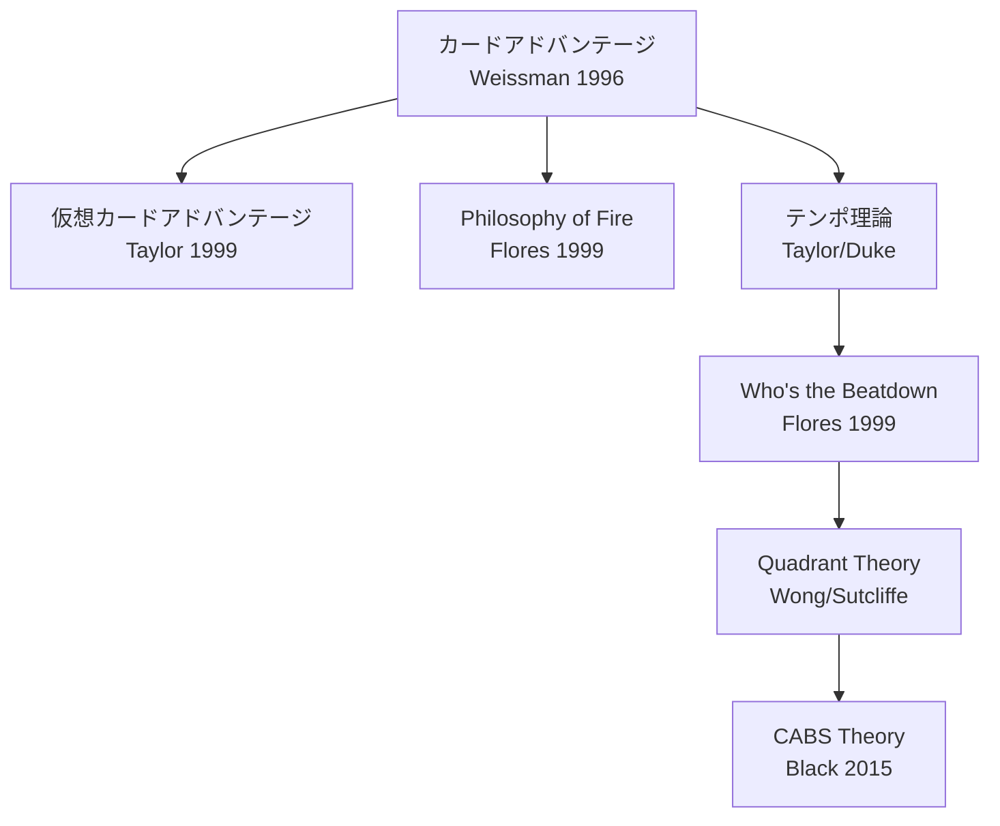

## 第8章 カード評価の理論

「このカードは強いですか？」——初心者が最も頻繁に発する問いであり、同時に最も答えにくい問いでもある。カードの「強さ」は固定された属性ではなく、ゲーム状態、デッキ構成、メタゲーム、そして対戦相手のデッキによって刻々と変化する。1996 年に Brian Weissman がカードアドバンテージを体系化して以来、プレイヤーとアナリストはカード評価の理論を層状に積み上げてきた。

> **この章で学ぶこと:**
> - カードアドバンテージ、仮想カードアドバンテージ、テンポの 3 つの基本評価軸
> - Who's the Beatdown と Quadrant Theory による状態依存の評価手法
> - これらの理論が示唆する、ゲーム AI のカード評価における設計上の考慮点

対戦プレイで個々のカードやリソースをどう評価するかに関する理論体系。主に競技プレイヤーとアナリストによって発展してきた。

以下の図は、本章で扱う理論の系譜を示す。

### Card Advantage（カードアドバンテージ）

**Brian Weissman (1996)** が体系化した最も基本的な評価軸。手札・盤面・墓地を含む「利用可能なカード総数」の差がゲームの優劣を決定するという理論。

1枚で2枚を処理するカードはカードアドバンテージを生む。Weissman は "The Deck"（MtG 最初の有名なコントロールデッキ）で、カードアドバンテージを明示的な戦略目標に据えた最初のデッキビルダーである。「毎ターン+1枚のカードアドバンテージを継続すれば、最終的にどんな相手でも圧倒できる」という**不可避性（Inevitability）**の考え方を確立した。

### Virtual Card Advantage（仮想カードアドバンテージ）

**Eric "Dinosaur" Taylor (1999)** が体系化した概念。カードアドバンテージは「任意のプロセスにより、一方のプレイヤーが実効的に相手より多くのカードを得ること」と定義される。**物理的にカードを引いたり捨てたりしなくても、相手のカードを無意味にすることで仮想的なアドバンテージが発生する。**

**Moat の例**: 相手が地上クリーチャー 5 体を展開している状態で Moat（飛行を持たないクリーチャーは攻撃できない）を出す。5 体のクリーチャーはその役割を果たせなくなり、たった 1 枚で約 5 枚分の仮想カードアドバンテージを得る。

仮想カードアドバンテージは、以下の 4 つの形態に分類される。

| 形態 | 説明 | 例 |
|------|------|-----|
| **カード選択（Selection）** | より多くのカードを見て最良を選ぶ | Brainstorm（3 枚引いて 2 枚戻す） |
| **反復効果（Recurring）** | 同じカードを繰り返し使う | 墓地から再利用できるカード |
| **テンポ（Tempo）** | 相手にリソースの再投資を強いる | バウンス呪文（5 マナのクリーチャーを 1 マナで手札に戻す） |
| **機能無効化（Blanking）** | 相手のカードの機能を封じる | Moat 効果、プロテクション |

> **出典:** [Virtual Card Advantage](https://magic.wizards.com/en/news/making-magic/virtual-card-advantage-2014-06-09) — magic.wizards.com

### テンポ理論

マナ（リソース）の使用効率を軸にした評価。1 ターンに使えるリソースをどれだけ効率的に活用しているかが「テンポ」である。Eric Taylor (1999) が初期理論を構築し、Reid Duke (Level One, 2014-2015) が体系的に解説した。

毎ターンすべてのマナを使い切り、インパクトのあるプレイに費やすことがテンポ優位を築く。テンポとカードアドバンテージはトレードオフ関係にあることが多い。バウンス呪文は好例だ——5マナのクリーチャーを1マナで手札に戻すと、4マナ分のテンポスイングが発生するが、カードアドバンテージは得ていない（相手は同じカードをまた使える）。純粋アグロはテンポを最大化しカードアドバンテージの犠牲を許容し、純粋コントロールはカードアドバンテージを最大化して序盤のテンポ損を許容する。ミッドレンジはその中間だ。テンポとカードアドバンテージの間に普遍的な交換レートは存在せず、ゲーム状態に応じて動的に判断する必要がある。

> **出典:** [Tempo](https://magic.wizards.com/en/news/feature/tempo-2014-09-22) — magic.wizards.com, [Level One Full Course](https://magic.wizards.com/en/news/feature/level-one-full-course-2015-10-05) — magic.wizards.com

### Who's the Beatdown (Mike Flores, 1999)

TCG 対戦理論の金字塔。**あらゆる対戦において、一方がビートダウン（攻撃側）、他方がコントロール（防御側）の役割を担う**という原則。

**中心的主張**: 「トーナメント MtG で私が目にする最も一般的な（しかし巧妙かつ致命的な）ミスは、似たデッキ同士の対戦でどちらがビートダウンでどちらがコントロールかを誤認することである」（Flores）。

フレームワークの核心はこうだ。あらゆるマッチアップにおいて、一方が攻撃者（ビートダウン）、他方が対応者（コントロール）の役割を担う。ミラーマッチ（同型対決）においてさえ、役割は対称ではない——不可避性（Inevitability）を持つ側がコントロール、持たない側がビートダウンを担わなければならない。そして**役割を誤認した側が「不可避的に敗者になる」**。

具体例で考えてみよう。Mono-Red Aggro と Azorius Control が対戦する場合、Mono-Red が攻撃側、Azorius が防御側であることは明白だ。しかし Mono-Red Aggro 同士のミラーマッチではどうか？ 手札にカード切れが先に来る側がコントロール（受けに回って相手のリソース切れを待つ）、まだ手札に攻め手がある側がビートダウンを担うべきだ。もしリソースが先に尽きる側が無理に攻め続ければ、息切れして負ける。役割はゲーム間（サイドボード後）で変化しうるし、1ゲーム中でも状況により逆転しうる。

**ゲーム AI への示唆**: 役割判定は個々のカードプレイ判断の**上位に位置するメタ戦略的判断**である。AI がライフトータル vs 盤面制圧 vs カードリソースのどれに重みを置くかは、役割判定に依存する。

> **出典:** [Who's the Beatdown?](https://articles.starcitygames.com/articles/whos-the-beatdown/) — Star City Games

### Philosophy of Fire (Adrian Sullivan / Mike Flores, 1999/2004)

**起源**: Adrian Sullivan がウルザブロック構築 PTQ の時期（1999）に着想し、Flores が 2004 年に形式化・普及させた。

ダメージ効率を数値化する理論。**カードとダメージの間に数学的関係が存在する**ことを示し、勝利に必要なカード枚数を計算可能にする。

ダメージクロックの公式は単純だ。基準線として Shock = 1マナ、1枚、2点ダメージを置く。10枚の Shock で20点ダメージ、すなわち相手の死。ゲーム開始時の手札は7枚だから、追加で約3枚ドローすれば10枚のダメージ源を確保できる。1枚あたり2点を超えるカードはクロックを加速し（"above rate"）、下回るカードはクロックを減速する（"below rate"）。この理論はアグロデッキの評価関数の基盤であり、「あと何ターンで勝てるか」（TTK: Turns to Kill）を具体的に算出するための枠組みを提供する。

> **出典:** [The Philosophy of Fire](https://articles.starcitygames.com/articles/the-philosophy-of-fire/) — Star City Games

### Quadrant Theory (Brian Wong / Marshall Sutcliffe)

Brian Wong が考案し、Limited Resources ポッドキャスト（Marshall Sutcliffe、Luis Scott-Vargas）で広まった評価手法。カードの強さを**静的に 1 つの数値で評価するのではなく、4 つのゲーム状態それぞれで評価する**。

| 象限 | ゲーム状態 | 問い | 高評価の例 |
|------|-----------|------|-----------|
| **Developing（展開）** | 両者がオープニングハンドからカードを展開中。序盤 | このカードは盤面を作れるか？ | 低コストクリーチャー、マナ加速 |
| **Parity（膠着）** | 両者が手札を使い果たし、盤面が拮抗。トップデッキ勝負 | このカードは均衡を破れるか？ | カードアドバンテージを生むカード、回避能力持ち |
| **Winning（優勢）** | 自分が盤面を支配。数ターン以内に勝てる見込み | このカードは勝利を確定させるか？ | トランプルなどのフィニッシャー能力 |
| **Losing（劣勢）** | 相手が盤面を支配。何かが変わらなければ負ける | このカードは逆転のきっかけになるか？ | 全体除去、ライフゲイン付きブロッカー |

評価方法としては、各カードを4象限それぞれで「良い/普通/悪い」と評価する。3〜4象限で「良い」カードはプレミアムピックであり、1象限でしか「良い」でないカードは状況限定的でドラフトでの優先度は低い。目標は「すべてで最高」のカードを見つけることではなく、「ほとんどの状況でそこそこ以上」のカードを識別することだ。

**ゲーム AI への示唆**: Quadrant Theory は**状態依存のカード評価**を直接的に示唆する。固定値ではなく、現在のゲーム状態に応じて各カードの価値を動的に変化させるべきであり、これはニューラルネットワーク評価関数が暗黙的に学習する内容を構造化した形で表現したものである。

> **出典:** [Quadrant Theory](https://magic.wizards.com/en/news/feature/quadrant-theory-2014-08-20) — magic.wizards.com

### BREAD（ドラフト優先順位）

リミテッド（限定構築）におけるカード選択の優先順位。

| 頭文字 | 意味 | 説明 |
|--------|------|------|
| **B** | Bombs | ゲームを支配するカード |
| **R** | Removal | 除去カード |
| **E** | Evasion | 回避能力持ち |
| **A** | Aggro / Aura | 攻撃的カード / 強化 |
| **D** | Duds | 弱いカード（最後に取る） |

### CABS Theory (Sam Black, 2015)

**Cards that Affect the Board State（盤面に影響するカード）** を優先すべきという理論。特にリミテッドで重要。

**基本原則**: リミテッドのデッキにおいて、盤面に直接影響しないカードを入れる余裕は非常に限られている。勝つデッキの基盤は**ほぼ全てが盤面に影響するカード**で構成される。

具体的には、リミテッドのデッキには15〜18体のクリーチャーを入れるべきであり、クリーチャー以外で優先するのは除去とコンバットトリックだ。カードドロー呪文、ビルドアラウンド型エンチャント、カウンター呪文、ライフゲインは例外的に優秀なもの以外避けるべきとされる。CABS はデッキ構築の強力な制約条件を提供し、AI のデッキ構築/ドラフトアルゴリズムにおいて盤面影響度を主要評価軸にすべきという強い事前分布を与える。

> **出典:** [CABS Theory](https://magic.wizards.com/en/news/feature/cabs-theory-2015-08-19) — magic.wizards.com

### Chapin のレート/コンテキスト評価

Patrick Chapin（*Next Level Magic* (2010)、*Next Level Deckbuilding* (2013)）が提唱した評価手法。カードの「レート」（基礎性能）と「コンテキスト」（メタゲーム・デッキにおける位置づけ）を分離して評価する。

評価プロセスは4段階だ。まずカードのマナコスト対効果を単体で**レート評価**する（コンテキスト不問の基礎性能）。次にこのカードを欲しがるデッキは何か、現在のメタゲームでどう変わるかを**コンテキスト評価**する。続いてそのカードがこれまで存在しなかった戦略を可能にするかの**新規性判定**を行い（最も高い潜在価値を持つ）、最後に同じ効果の既存カードと比べてレートで競争力があるかの**冗長性チェック**で締める。同じカードでも環境次第で評価が大きく変わる。AI の評価関数設計において、「レート」はコンテキスト不問の静的ヒューリスティック値、「コンテキスト」はゲーム状態・デッキ構成・対戦相手モデリングによる動的調整に対応する。

**この章のまとめ** — カード評価理論の核心は「文脈なき評価は無意味である」ということだ。カードアドバンテージは基本だが万能ではなく、テンポとのトレードオフが常に存在する。Quadrant Theory が示すように、同じカードが展開期には最高でも膠着期には最悪ということがある。AI にとっても人間にとっても、カード評価は「今この瞬間のゲーム状態において」行われなければならない。

**さらに学ぶために:**

- **Mike Flores "Who's the Beatdown?"** (Star City Games): TCG 対戦理論の金字塔。短い記事だが、四半世紀経っても色褪せない洞察が詰まっている。
- **Reid Duke "Level One Full Course"** (magic.wizards.com): テンポ、カードアドバンテージ、役割判定を体系的に解説する入門シリーズ。

### 演習問題

**課題 8-1（初級・目安 30 分）**: 課題 7-1 の 20 枚から 5 枚を選んで、Quadrant Theory（序盤 / 互角 / 優勢 / 劣勢）の 4 場面でそれぞれ強いか弱いか評価してみよう。4 場面すべてで弱いカードがあれば、どう直せばよいか考えてみよう。

---
