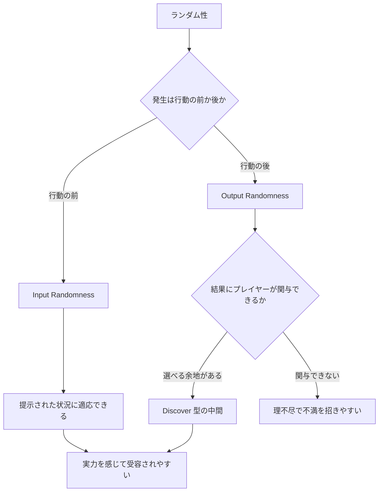

## 第10章 ランダム性の設計

ポーカーのプロは、特定のハンドで負けても動揺しない。なぜなら、長期的には実力が結果に収束することを知っているからだ。一方、スロットマシンのプレイヤーは実力を発揮する余地がない。TCG はこの二極のどこに位置するのか？　Hearthstone の「ヨグ=サロン」が爆笑と激怒を同時に引き起こした事件は、ランダム性の設計がいかに繊細な問題であるかを物語っている。運は TCG の敵ではなく、最も強力な道具である——ただし、使い方を間違えれば凶器になる。

> **この章で学ぶこと:**
> - 「運が多い AND 実力が反映される」ゲームが最も成功している理由
> - ゲーム理論に基づく不確実性の 2 軸分類（確率 × 情報）と TCG の位置づけ
> - Input Randomness と Output Randomness の違い、および Discover が「理想的ランダム性」とされる 5 つの理由
> - 「TCG は運ゲーか？」——日英コミュニティの議論と学術的な回答
> - マリガンとハンドスムージングの設計トレードオフ

### 実力と運は独立した軸

Ben Brode（元 Hearthstone ディレクター）が強調した重要な概念（Ben Brode, GDC 2023 "Making Marvel Snap" でも再論）。ゲームにおける「運の要素」と「実力の反映」は二項対立ではなく、独立した 2 つの軸である。

```
        運が多い
           |
     ポーカー | Hearthstone
           |
実力が反映 --------+---------- 実力が反映
されない     |             される
       スロット | チェス
           |
        運が少ない
```

最も成功している TCG の多くは「運が多い AND 実力が反映される」象限に位置する。

実務上の目安として、ワンピースカードゲームのデザイナー篠本社長は「運6:実力4」で設計していると語り、DCGなら「7:3ぐらいになる方が良い」とされている。また、ディメンションゼロは「なるべく運ではなく実力で決着がつくゲーム」を目指したが、初弾は売れたものの「ゲームに勝つために要求される実力の上限が低いので運ゲーに収束した」と、運の要素が少なすぎることの逆説的な問題を示した（[池っち店長「TCGのつくりかたセミナー」](https://oyazirk.jugem.jp/?eid=10)）。

### 不確実性の 2 軸: 確率と情報

Ben Brode の「運と実力は独立した軸」を、ゲーム理論の正式な枠組みに接続しよう。ゲーム AI 研究（OpenSpiel; Lanctot et al., 2019）や *Artificial Intelligence and Games*（Yannakakis & Togelius, 2018）では、ゲームの不確実性を **確率性（stochasticity）** と **観測可能性（observability）** の 2 軸で分類する。

- **確率性**: ゲームに chance node（ダイス、シャッフル、抽選）が存在するか。存在しなければ **deterministic**、存在すれば **stochastic**。
- **観測可能性**: すべてのプレイヤーがゲーム状態を完全に知っているか。知っていれば **perfect information**、知らなければ **imperfect information**。

> **用語の注意:** 日常語の「完全情報ゲーム」は厳密には **perfect information**（各意思決定時点でそれまでのプレイ履歴を完全に復元できる）を指す。**complete information**（全プレイヤーの利得関数が共通知識である）とは別概念である（MIT Game Theory lecture notes）。

この 2 軸で 4 象限が得られる。

| | **Perfect information** | **Imperfect information** |
|---|---|---|
| **Deterministic（確率なし）** | チェス、囲碁、将棋 | ガイスター、Skull、じゃんけん |
| **Stochastic（確率あり）** | バックギャモン、すごろく | **TCG、ポーカー、麻雀、ブリッジ** |

TCG は **stochastic × imperfect information** に位置する。シャッフルと初手ドローが chance を生み、手札・ライブラリーの非公開性が imperfect information を生む。ポーカーやブリッジも同じ象限にある。

**この分類が設計に与える示唆:**

1. **chance と隠し情報は別物である。** Costikyan の源泉 3（隠された情報）と源泉 4（乱数）に対応する。ガイスターは chance なしだが隠し情報があり、バックギャモンは chance ありだが隠し情報がない。TCG は両方を持つ。
2. **同時選択は imperfect information を生む。** じゃんけんは chance node を持たないが、相手の同時選択が未観測のため imperfect information game として扱われる（OpenSpiel）。Marvel Snap の同時ターン制も同様に、perfect information を崩すことで読み合いを生む。
3. **カードゲームは構造的にこの象限に偏る。** シャッフル（chance）と非公開手札（imperfect information）を同時に持つ媒体だからだ。唯一の例外は Skull のような「全カードが既知で chance なし」のブラフゲームだが、これは TCG ではなくパーティーゲームに近い。

> **出典:** [OpenSpiel: A Framework for Reinforcement Learning in Games](https://arxiv.org/abs/1908.09453) (Lanctot et al., 2019), MIT OCW Game Theory lecture notes ([Session 3](https://ocw.mit.edu/courses/14-12-economic-applications-of-game-theory-fall-2012/), [Lecture 4](https://ocw.mit.edu/courses/17-810-game-theory-spring-2021/mit17_810s21_lec4.pdf))

### 「TCG は運ゲーか？」——コミュニティの議論と学術的回答

この問いは TCG コミュニティで最も長く、最も感情的に議論されてきたテーマの一つである。日本語圏と英語圏で議論の性格が異なるため、両方を概観する。

#### 英語圏: Skill ceiling と収束の議論

英語圏では「スキルの天井」と「試合数による収束」の観点から議論されることが多い。

- **MtG プロの勝率上限は 65〜70%** 程度とされる。一見低く思えるが、これを数百試合にわたって維持すること自体がスキルの証拠であるとも主張される。フォーマットによりスキル比率は変動し、ドラフトはスキル寄り、シールドは運寄り、構築はその中間とされる。
- **Hearthstone で Legend に到達するには勝率 53% 以上が必要**。55〜58% で安定到達、60%+ は卓越したプレイヤーの証。Vicious Syndicate の Data Reaper Report が継続的にメタ分析と勝率追跡を提供しており、勝率の差は主にデッキ選択とプレイングスキルに起因するとされる。
- **ポーカーの法的判例** がこの問題に重要な先例を与えている。US v. DiCristina 判決（2012年、ニューヨーク東部地区連邦裁判所）では、Weinstein 判事が 120 ページの判決文でポーカーを「predominantly a game of skill」と認定した（ただし控訴審で覆された）。スウェーデン最高裁（2007〜2009年）は、**トーナメント形式は実力主体**（無罪）、**キャッシュゲーム（短期）は運主体**（有罪）と区別した。この「プレイ形式と期間がスキル判定を左右する」という原則は、TCG の大会形式とラダー形式の違いにも示唆を与える。

> **出典:** [NPR: Judge Rules Poker Is A Game Of Skill](https://www.npr.org/2012/08/22/159833145/judge-rules-poker-is-a-game-of-skill-not-luck) (2012), [The Local: Swedish court rules Texas Hold'em a 'game of skill'](https://www.thelocal.se/20090514/19454) (2009)

#### 日本語圏: 「先攻ゲー」と「体感の運」

日本語圏では、特に遊戯王コミュニティにおいて「先攻ゲー」問題が運ゲー議論の中心にある。

- **勝利要素の構成比として「プレイング 30%、デッキ選択/構築 30%、運 40%」** という分析が複数のブログで引用され、コミュニティの一定のコンセンサスを形成している。「大会で常に同じ人が上位に入る」ことがスキル要素の証拠として繰り返し挙げられる。
- **遊戯王 WCS 2024 本戦 270 試合の統計** によれば、後攻側が「増殖する G」を通せなかった場合の勝率はわずか 37.3% であり、通した場合は 47.0%（相対的に約 26% の改善、p=0.008 で有意）に上がる。「G は後攻のゲーム参加券」という揶揄が生まれ、**先攻制圧とそれに対する手札誘発の有無が勝敗を支配する** 構造が可視化された。
- **理想的な運と実力の比率として「5:5〜3:7」** が望ましいとされ、「1 戦なら初心者も勝てるが、10 戦すれば上級者が勝ち越す」バランスが目標とされている。

> **出典:** [note.com アプカ「WCS2024 統計」](https://note.com/apkallone/n/nabc40e57b621), [eSports World 連載「カードゲームにおける運のカラクリ」](https://esports-world.jp/column/34395)

#### 学術的回答: 長期ではスキルが支配する

学術研究は「運ゲーか実力ゲーか」を二者択一ではなく、**試合数の関数** として捉える。

- **DeDonno & Detterman (2008)** は 41 人の大学生に 200 ハンドのポーカーをプレイさせ、戦略指導を受けたグループが有意に好成績を収めたことを示し、ポーカーにスキル要素があることを実験的に証明した（*Gaming Law Review*）。
- **Levitt & Miles (2011)** は WSOP 2010 のデータを分析し、事前に高スキルと識別されたプレイヤーの平均 ROI が +30% 超であるのに対し、その他のプレイヤーは -15% であることを示した（NBER Working Paper, 後に *Journal of Sports Economics* 掲載）。
- **Potter van Loon et al. (2015)** は数億ハンドのオンラインポーカーデータを分析し、**1,500 ハンド以上のプレイでスキルが運を支配する** ことを示した（*PLOS ONE*）。

これらの研究を TCG に外挿すると、「1 試合」では chance の影響が大きいが、「シーズン全体」や「年間大会成績」ではスキルが支配的になる——これは TCG コミュニティの経験的直観（「常勝プレイヤーは存在する」）と整合する。

> **出典:** [PLOS ONE: Beyond Chance?](https://journals.plos.org/plosone/article?id=10.1371/journal.pone.0115479) (Potter van Loon et al., 2015), [NBER Working Paper 17023](https://www.nber.org/papers/w17023) (Levitt & Miles, 2011)

#### 設計者の回答: 運はスキルの場を広げる

Richard Garfield は 2006 年の *Game Developer Magazine* 寄稿 "Getting Lucky" で、この問題に対する設計者としての回答を示した。

- 「運と実力はスケールの両端ではなく独立した 2 軸である」——これは前述の stochasticity × observability の 2 軸と本質的に同じ洞察を、設計実務の言葉で表現したものだ。
- 「適切にランダム性を実装すれば、スキルの深さは減るのではなく *増す*」——ランダム性がプレイヤーにリスク計算と確率的判断を強いるからだ。
- MtG のドローは「異なる選択肢を提示する」形のランダム性（Input Randomness）であり、「成功/失敗を決めるランダム」（Output Randomness）ではない。

Ben Brode はこの講演を「史上最高のデザイン講演」として推薦している。

> **出典:** [Board Game Design Lab: Luck vs Skill with Richard Garfield](https://boardgamedesignlab.com/luck-vs-skill-with-richard-garfield/), Rosewater "[Kind Acts of Randomness](https://magic.wizards.com/en/news/making-magic/kind-acts-randomness-2009-12-14)" (2009), "[Variance, Part 2](https://magic.wizards.com/en/news/making-magic/variance-part-2-2020-03-02)" (2020)

#### まとめ: 不確実性≠運

この議論の核心は、**不確実性と運は同義ではない** という点にある。

- **運（chance）** は外部ランダム分岐——シャッフル、ドロー、コイントス
- **隠し情報（imperfect information）** は非公開状態——手札、ライブラリー、伏せカード
- **読み合い** は相手のモデリング——ブラフ、メタ読み、リソース管理

ガイスターの不確実性は「運ではなく隠し情報」、じゃんけんの不確実性は「同時選択による未観測」、TCG のトップ解決は「chance による外部ランダム」——この区別ができれば、「TCG は運ゲーか？」への回答は明確になる。**TCG は chance と imperfect information の両方を持つが、長期的にはスキルが支配的になるゲームである。** そしてそれこそが、TCG が「運ゲー」と嘲笑される一方で 30 年以上にわたってプレイヤーを魅了し続けている理由でもある。

### Input Randomness vs Output Randomness

| 種類 | タイミング | 例 | プレイヤーの感情 |
|------|-----------|-----|----------------|
| **Input Randomness** | 行動の「前」に発生 | カードドロー、初期手札、ロケーション配置 | 「この状況にどう対応するか」→ 実力を感じる |
| **Output Randomness** | 行動の「後」に発生 | コイントス、ダメージ範囲、ランダム対象 | 「やったのに外れた」→ 理不尽に感じる |

一般に **Input Randomness は受け入れられやすく、Output Randomness は不満を招きやすい**。冒頭で触れたヨグ=サロンはまさに Output Randomness の極端な例であり、ランダムな呪文を連打する結果が行動の「後」にしか判明しないため、爆笑と激怒を同時に引き起こした。TCG のドロー（デッキからカードを引く）は Input Randomness の典型であり、これこそが TCG の根源的な面白さを支えている。

実際のカードで見ると、この差はさらに直感的になる。**Hearthstone** の《Tracking》は Input Randomness の好例だ。

> **Tracking** 1 マナ / Hunter スペル
> デッキから 3 枚を提示する。1 枚を手札に加え、残りを除外する。

プレイヤーが《Tracking》を唱える**前**に、どの 3 枚が現れるかはランダムに決まっている。しかしその 3 枚を見た**後**で、どれを選ぶかはプレイヤーの判断だ。ランダム性は行動の前に発生し、プレイヤーはそれに適応する——これが Input Randomness の構造であり、「運が悪かった」ではなく「この状況にどう対応するか」という体験を生む。

対照的に、**ポケモンカード** の《ピカチュウ》の「じゅうでん」はコイン投げで成否が決まる。行動した**後**に結果が割れる典型的な Output Randomness だ。

> **《ピカチュウ》の「じゅうでん」**
> コインを1回投げオモテなら、自分の山札のエネルギーを1枚、このポケモンにつける。

成功すれば盛り上がるが、外れたときは「やったのに失敗した」と感じやすい。Tracking との決定的な違いは、プレイヤーがランダムの結果に**関与できるかどうか**だ。

**Hearthstone** の Discover が好まれやすいのは、この中間にあるからだ。候補はランダムだが、最終決定はプレイヤーに委ねられる。つまり chance を完全には消さず、agency を残す。ランダム性の設計で本当に重要なのは、乱数の有無ではなく、プレイヤーがその乱数へどう関与できるかである。

この「発生タイミング」と「関与の余地」という 2 つの分岐で、ランダム性が受容されるか不満を招くかが決まる。

> **図: ランダム性への関与フロー** — ランダムが行動の前後どちらで発生し、その結果にプレイヤーが関与できるかで、受容と不満が分かれる。



### Costikyan の 7 つの不確実性の源泉

Greg Costikyan が "Uncertainty in Games" で体系化した、ゲームにおける不確実性の 7 つの源泉。

1. **対戦相手の行動の不確実性** — 相手が何をするか分からない
2. **解法の複雑性** — 最適解を計算しきれない
3. **隠された情報** — 手札やデッキの中身
4. **乱数** — ダイスやカードのシャッフル
5. **アナログな不確実性** — 物理的な操作の精度（TCG ではほぼ関係ない）
6. **プレイヤーの認知能力の限界** — 全情報を把握できない
7. **スケジュールの不確実性** — いつ何が起こるか分からない

TCG はこのうち 1〜4 および 6 の 5 つを主要な不確実性源として活用しており、これらの組み合わせがゲームの面白さの基盤をなしている。

### 構造化されたランダム性 vs 恣意的ランダム性

Rosewater の教訓26を敷衍すると、ランダム性には**構造化されたもの**と**恣意的なもの**がある。構造化されたランダム性は範囲が限定され、ある程度の制御が可能だ。Hearthstone の「Discover」（3択から選ぶ）が好例である。恣意的ランダム性は範囲が広く制御不能で、「ランダムなミニオンを召喚」のように結果の振れ幅が大きすぎて理不尽に感じられる。

Discover メカニクスが登場時に「理想的なランダム性デザイン」と評されたのは、選択肢が3つに限定され（構造化）、プレイヤーが選べ（agency（主体感））、結果が予測の範囲内で（同クラスのカードなど）、意思決定が面白く（どれを選ぶか）、毎回異なる展開を生む（Replayability）からだ。ただし、その後 Discover は大量のカードに搭載され、「Discover カードが自身を Discover できる」無限バリュー問題が発生した。Blizzard は最終的にこの自己参照を禁止するナーフを実施している。**初期設計が理想的でも、頻度の管理を怠れば問題化する**——ランダム性の質だけでなく量も設計対象であることを示す教訓だ。

構造化ランダム性のもう一つの好例は、**防御側に逆転の可能性を埋め込む**設計だ。**デュエル・マスターズ** のシールド・トリガーは、ライフに相当するシールドが攻撃で割れた瞬間、その中のカードがトリガー効果を持っていれば無償で発動できる。厳密に分類すると、シールドの中身は攻撃を決定した**後**に判明するため Output Randomness の側面を持つ。しかし「シールドにトリガーが仕込まれているかもしれない」という情報はデッキ構築時点で構造的に存在し、攻撃する側はその確率を事前に見積もれる。つまりシールド・トリガーは、隠された情報（hidden information）と構造化された Output Randomness の組み合わせであり、攻撃判断に意思決定を生む設計だ（[Qumasu「シールドトリガーの本質」](https://note.com/qumasu/n/n8e1dd02b55d2)）。**ワンピースカードゲーム** のトリガーも同様の構造で、ダメージを受けたときにライフから手札に入るカードがトリガー効果を発動する。「負けている側にこそ逆転の種が与えられる」仕組みは、ランダム性をゲーム体験の**保険**として設計した例だ。

### ランダム性の 5 段階 (Hearthstone チーム)

Blizzard 社内でのランダム効果評価フレームワーク:

| 段階 | 例 | プレイヤーの感情 | 設計判断 |
|------|-----|-----------------|---------|
| 1. デッキシャッフル | ドロー順 | 普遍的に受容 | すべての TCG の基盤 |
| 2. **Discover 型** | 3 択から選択 | スキル感がある | **最良のランダム性** |
| 3. 対象ランダム | 「ランダムな敵に 3 ダメージ」 | 興奮/緊張 | ドラマチックだが頻度注意 |
| 4. 広い分散 | ヨグ=サロン (ランダム呪文連打) | 爆笑 or 激怒 | カジュアルのみ。競技には有害 |
| 5. 勝敗決定コイン投げ | — | 怒り | **避けるべき** |

**原則**: 賭け金が低いほど/主体感があるほどランダム性は許容される。分散はエンタメ価値に比例すべき。

> **出典:** Hearthstone Designer Insights シリーズ, [GDC 2014: 10 Bits of Design Wisdom](https://www.gdcvault.com/play/1020775/Hearthstone-10-Bits-of-Design) — Eric Dodds

### 乱数を振り切るか、乱数を捨てるか

ランダム性の設計には両極端がある。乱数を振り切って「狂気」の flavor に変えた設計と、乱数を一切使わず決定論的な緊張を作った設計だ。5 段階表の段階 4 で名前を挙げた **《ヨグ=サロン》** を掘り下げ、その対極に **《ゼットン》** を置いてみよう。

> **Yogg-Saron, Hope's End（ヨグ=サロン）** — 10マナ 7/5 レジェンダリー（中立ミニオン / Whispers of the Old Gods）
> 咆哮：このゲームでこれまでに唱えた呪文の数だけ、ランダムな呪文を唱える。対象はランダムに選ばれる。

《ヨグ=サロン》は Output Randomness の極致だ。唱える呪文もその対象も、すべてランダムに決まる。旧神ヨグ=サロンは正気を奪う混沌の神であり、設計者はこの制御不能性そのものを flavor に載せたと語っている（[The Madness of Yogg-Saron](https://www.shacknews.com/article/94385/making-a-hearthstone-card-the-madness-of-yogg-saron)）。何が起きるか誰にも分からない——その予測不能さが「狂気」の再演になっている。段階 4 の「爆笑 or 激怒」の代表例であり、後に対象の扱いなどでナーフを受けた。

対極に置くのが、**バトルスピリッツ** の **《ゼットン［シン・ウルトラマン］》** だ。こちらは乱数を一切持たない。

> **ゼットン［シン・ウルトラマン］** — 青 / コスト20(0) / 系統：星竜・動器 / Xレア / Lv1 BP30000 / シンボル青青
> 【セット時】自分はボイドからコア4個をデッキの横に置く。そのコアはこのカードの効果以外に使用できない。
> 【ミラージュ：コスト2(0)】（このカードは手札からセットできる）
> セット中、自分のスタートステップにデッキの横のコア1個をボイドに置く。0個になったとき、お互いのスピリット / ネクサス / 創界神ネクサスすべてを破壊し、破壊したそれらの効果を発揮させない。この効果はお互いの効果では防げない。そうしたとき、このミラージュをコストを支払わずに召喚する。
> 【Lv1】このスピリットは相手の効果を受けない。

ゼットンはセット後、毎ターン確実にコアが 1 個ずつ減る。0 になった瞬間、盤面のスピリット・ネクサスがすべて破壊される——例外も打ち消しもない。コスト 20(0) の「20」は極端に重い数値で（20 が必要コスト、0 が軽減シンボル数）、規格外の最終兵器を表す。原作『シン・ウルトラマン』のゼットンは天体制圧用最終兵器であり、火球発射までのカウントダウンが画面下に映る。カードはこの終末演出を、乱数ではなく決定論的なタイマーで再演している。両プレイヤーは減りゆくコアを見つめる——止められないと分かっているからこそ緊張が生まれる。初代ウルトラマンのゼットンとは演出が異なる点に注意したい。

| | 《ヨグ=サロン》 | 《ゼットン》 |
|---|---|---|
| 乱数 | 極大（呪文も対象も全ランダム） | ゼロ（毎ターン確実に減る） |
| プレイヤーの予見 | 予見できない | 予見できるが止められない |
| flavor | 混沌の神の狂気 | 決定論的なカウントダウン |

この 2 枚が示すのは、劇的な緊張を作る手段はランダムだけではない、ということだ。本章前半の Discover の節で述べたように、重要なのは乱数の有無ではなく、プレイヤーが結果へどう関与・予見できるかにある。ヨグ=サロンは「予見できない」狂気で、ゼットンは「予見できるが止められない」終末で、同じ盤面級の破壊を正反対の道から演出している。なお、ゼットンの競技採用はほぼ皆無だが、これは欠点ではない。勝つためのカードではなく体験を作るカードであり、第8章で扱った攻守 0 の **《時械神》** と同じ評価軸に属する。

### マリガンシステムの比較

初期手札の運要素を緩和するマリガンは TCG 設計の重要な一角を占める。

| ゲーム | マリガン方式 | 設計意図 |
|--------|-------------|---------|
| **MtG (ロンドン)** | 7 枚引き直し → マリガン回数分だけデッキ底に送る | マナ事故を減らしつつデッキ構築の緊張を維持 |
| **Hearthstone** | 任意枚数を 1 回だけ入れ替え | シンプル。序盤の動きを確保 |
| **LoR** | 任意枚数を 1 回入れ替え | 寛容。分散を積極的に削減 |
| **ポケカ** | たねポケモンがなければ強制引き直し (相手にドロー権) | ゲーム不成立を防止 |
| **遊戯王** | 公式にはなし | サーチ/チューター効果で代替 |
| **Marvel Snap** | なし | 12 枚デッキの高い一貫性で補完。デッキが小さいため事故自体が起きにくい |

**設計上の緊張**: マリガンが寛容すぎるとデッキ構築スキルが低下する (少ない枚数でもマリガンで引ける)。厳しすぎるとノンゲームが増える。ゲーム長が短いほど寛容なマリガンが許容される (1 試合の失敗コストが低い)。

**ハンドスムージング**

デジタル TCG 固有の手法。MtG Arena の BO1 では、2 つのサンプル手札を生成し、土地/呪文比がデッキ全体に近い方を選ぶアルゴリズムが使われている。

**利点**: マナ事故/マナ溢れが減り、ゲームの質が向上。
**問題**: プレイヤーが土地を減らしてもアルゴリズムが補完するため、隠れたメタゲーム（「ゴースト・メタゲーム」（筆者の用語））が発生。

> **教訓**: 分散を平滑化する場合は **透明にするか、最適化者が悪用することを受け入れる**。不可視の平滑化は意図しない戦略的歪みを生む。

> **出典:**
> - Greg Costikyan, "Uncertainty in Games" (MIT Press, 2013)
> - David Sirlin, "Playing to Win"
> - MtG Arena 開発者ブログ
> - [GDC 2014: Hearthstone 10 Bits of Design Wisdom](https://www.gdcvault.com/play/1020775/Hearthstone-10-Bits-of-Design) — Eric Dodds

**この章のまとめ** — ランダム性の設計は「量」ではなく「質」と「タイミング」の問題である。行動前に発生する Input Randomness はプレイヤーに適応の機会を与え、行動後に発生する Output Randomness は理不尽に感じられる。Discover メカニクスが示したように、ランダムな選択肢の中からプレイヤーに選ばせることで、興奮と agency を両立できる。そしてマリガンの寛容さはゲーム長との関数であり、短いゲームほど寛容であるべきだ。

**さらに学ぶために:**

- **Greg Costikyan "Uncertainty in Games"** (MIT Press): ゲームにおける不確実性の 7 源泉を体系的に論じた学術書。理論的な裏付けが欲しい場合に最適。
- **Hearthstone Designer Insights シリーズ**: Discover、ランダム性、マリガンに関する開発者の意思決定プロセスが詳細に語られている。
- **Richard Garfield "Getting Lucky"** (*Game Developer Magazine*, 2006): 運と実力の関係をゲームデザイナーの視点で論じた名エッセイ。Ben Brode が「史上最高のデザイン講演」と推薦。[Board Game Design Lab のインタビュー](https://boardgamedesignlab.com/luck-vs-skill-with-richard-garfield/)でも同内容が語られている。
- **Potter van Loon et al. "Beyond Chance?"** (*PLOS ONE*, 2015): 数億ハンドのオンラインポーカーデータから「1,500 ハンド以上でスキルが運を支配する」ことを定量的に示した論文。TCG にも外挿可能な知見。
- **[OpenSpiel](https://github.com/google-deepmind/open_spiel)** (Lanctot et al., 2019): Google DeepMind のゲーム AI フレームワーク。perfect/imperfect information、chance、simultaneous move の分類が明確に定義されている。

> **事例研究への案内:** ランダム性設計の多様なアプローチについては、第16章 Balatro（ポーカー役という馴染みあるランダム性基盤）・KeyForge（デッキそのものがランダム生成）、第17章 ヴァンガード（ドライブチェックによる「運を楽しむ」設計）を参照。

### 演習問題

**課題 10-1（初級・目安 15 分）**: 自作 TCG のマリガンルールを決めよう。初期手札は何枚か、引き直しはどうやるか、何回までできるかを書いて、「公平さ」「戦略の幅」「テンポの良さ」のどれを重視したか理由も添えよう。

---

#### 解答例:『芽吹』の場合（課題 10-1）

- **初期手札:** 5 枚。
- **引き直し:** 好きな枚数を選んでデッキの一番下に戻し、同じ枚数を引く (部分マリガン)。戻したカードは引き終えた後にシャッフルする。
- **回数:** 1 回のみ。後手プレイヤーは《朝露》トークンを別途 1 個得る (課題 5-1 の解答例の先後補正)。
- **重視した軸:** 3 つ (公平さ / 戦略の幅 / テンポ) のうち **戦略の幅** を最優先した。部分マリガンなら「陽が伸びる菜園は事故手だけ替える」「花壇は攻め手が薄ければ多く替える」といったデッキ性格に応じた判断が生まれる。

**意図的な粗さと自己批評:** 部分マリガンは手札を全て入れ替える方式より事故が減る一方、テンポ (第 10 章) の観点では手番前の処理が増え、対面のテンポがわずかに悪化する。重視軸のトレードオフを承知で採る。

---

**課題 10-2（初級・目安 15 分）**: 自作 TCG に含まれるランダムな要素（デッキシャッフル、ダイスロールなど）をすべて書き出そう。それぞれが「行動の前に起きるランダム」か「行動の後に起きるランダム」かを分けて、後者がある場合は「プレイヤーがモヤっとしない形」にする方法を考えてみよう。

---

#### 解答例:『芽吹』の場合（課題 10-2）

『芽吹』のランダム要素を洗い出し、「行動の前 (input)」「行動の後 (output)」に分ける (第 10 章)。

| ランダム要素 | 分類 | モヤっと対策 |
|---|---|---|
| デッキシャッフルによるドロー | 行動の前 (input) | 引いた後に考えられるので納得感が高い |
| マリガンの引き直し | 行動の前 (input) | 同上。むしろ運を均す装置 |

**現状、行動の後 (output) のランダムは意図的にゼロにしている。** 成長も攻撃も結果が確定的で、「攻撃したら 50% で外れる」類の feel-bad を作らない設計だ。

ただし設計中に、Timmy 向けの興奮を狙って《気まぐれな風》(手入れ: 相手の株 1 体をランダムに選んで飛ばす) を検討した。これは典型的な output ランダムで、狙った的が外れる不快感を生むため **不採用** とした。代わりに《かれ葉の罠》のように「対象をプレイヤーが選ぶ」確定的な妨害に置き換えている。

**意図的な粗さと自己批評:** output ランダムを完全に排すと、盤面が読み切られやすく、上級者同士では展開が硬直しがちになる。第 10 章の言う「適度な驚き」が薄い。驚きは第 14 章のデジタル拡張 (季節システム) で、ランダムでなく「予告された変化」として補う方針にする。

---
