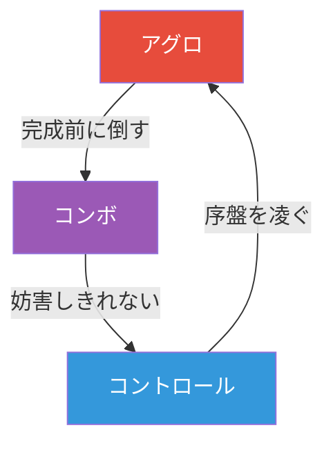

## 第11章 メタゲーム理論

メタゲームの健全性はカードの強さだけでなく、環境の多様性・流動性・逆転可能性に依存する。本章ではメタゲームの構造と動態を理論的に分析するための枠組みを扱う。バランス調整の具体的手法は次章（第12章）で論じる。

> **用語の注意:** 第0章では「メタゲーム」をデッキ構築・サイドボーディング・読み合いを含むゲーム外の戦略的駆け引き全体として定義した（Garfield の広義の用法）。本章以降では、より狭義に**環境のデッキ分布とその動態**——どのデッキがどの程度使われ、それがどう変化するか——を指す用法が主となる。文脈から明確な場合は単に「メタ」と略記する。

> **この章で学ぶこと:**
> - アーキタイプの基本分類（5 バケツ）とアグロ-コントロール-コンボの三すくみ
> - メタゲームクロックの仕組みと、クロックが「止まる」原因
> - Shannon 多様性指数によるメタゲーム健全性の定量評価
> - BO1 vs BO3 の構造的差異とサイドボード理論


カードゲームのリリース直後、プレイヤーは各自が「最強」と信じるデッキを持ち寄る。数日後、あるデッキが勝ち始める。すると翌週、そのデッキに強い「捕食者」が現れる。さらに翌週、捕食者に強い別の戦略が台頭する——こうしてメタゲームは時計のように循環する。しかし 2019 年の MtG Standard では、Oko というカードが強すぎて捕食者が存在せず、時計が止まった。メタゲーム理論は、この時計がなぜ回るのか、なぜ止まるのか、そしてどうすれば健全に回し続けられるのかを解き明かす。


> **図: メタゲームクロック** — 健全なメタゲームでは、各デッキが次のデッキに対策される循環構造が維持される。1 枚のカード（Oko 等）がこの循環を止めたとき、メタゲームは崩壊する。

### アーキタイプの基本分類

#### 5 つのバケツ（Archetype Buckets）

MtG の Play Design チーム（元は Zac Hill が提唱し、Sam Stoddard が体系化）が用いるマクロ戦略分類。TCG のデッキは大きく以下の 5 つに分けられ、健全なフォーマットでは **5 つすべてに少なくとも 1 つの競技的なデッキが存在する** ことを基準とする。

| バケツ | 戦略 | 勝利条件の本質 | 強み | 弱み | 代表例 |
|--------|------|---------------|------|------|--------|
| **アグロ** | 序盤から高速でダメージを与え、相手が態勢を整える前に勝つ | カードをダメージに変換するテンポレース | 速度、一貫性、マリガン判断がシンプル | 手札切れ、長期戦、全体除去 | MtG: Mono-Red Aggro, HS: Face Hunter |
| **ミッドレンジ** | 効率的なカードで盤面を制圧し、中盤の優位を築く | カード品質の差で勝つ | 柔軟性、個々のカードパワー | 特化デッキに対して中途半端、線形戦略に轢かれる | MtG: Jund, HS: Highlander decks |
| **ランプ/コンボ** | マナ加速またはカード間シナジーで爆発的な展開を狙う | マナ加速 or カード組み合わせによる爆発的勝利 | 爆発力、不利な盤面の一発逆転 | 妨害に弱い、安定性、手札事故 | MtG: Tron, Splinter Twin, HS: Malygos Druid |
| **コントロール** | 相手の行動を妨害・無力化し、長期戦でカードアドバンテージ差をつける | 1対1交換の蓄積と終盤の制圧 | 対応力、終盤の強さ | 複数方面からの攻撃、速度、BO1 で不利 | MtG: Azorius Control, HS: Control Warrior |
| **アグロコントロール（テンポ）** | 効率的な脅威を展開しつつ、相手の動きを遅延させる | クロック（打点源）+ 妨害で相手のプランを崩す | テンポ、効率、少ない手札で勝てる | 手札消耗が激しい、対応を引けないと崩壊 | MtG: Delver, HS: Tempo Mage |

**バランス基準**: すべてのバケツに競技的なデッキが存在し、かつ単一のバケツが他の全バケツを支配しないこと。ここで「競技的なデッキ」とは、大会やラダー上位において合理的な選択肢として成立するデッキを指す（目安として、十分な試合数において勝率 45% 以上、かつ一定の使用率を維持していること）。バケツ間にはじゃんけん的な有利不利関係が存在し、これがメタゲームクロックの原動力となる。

> **出典:**
> - [Developing Standard](https://magic.wizards.com/en/articles/archive/latest-developments/developing-standard-2013-02-12) — Stoddard (2013)
> - [Shadows Standard Midseason Retrospective](https://magic.wizards.com/en/articles/archive/latest-developments/shadows-standard-midseason-retrospective-2016-05-20) — Stoddard (2016)

#### アグロ-コントロール-コンボの三すくみ

古典的な三すくみ関係:
- **アグロ > コンボ**: コンボが成立する前に倒す
- **コンボ > コントロール**: 妨害しきれないほどの爆発力
- **コントロール > アグロ**: 序盤を凌いで長期戦に持ち込む




**三すくみの限界**: 実際のメタゲームはこの単純モデルより遥かに複雑である。Patrick Chapin は著書 "Next Level Deckbuilding" で少なくとも **10 のマクロアーキタイプ**（アグロコンボ、テンポ、Big Mana/ランプ、プリズン/ロック等）を識別している。ミッドレンジが攻守のどちらにも柔軟に対応できる場合、三すくみは「ミッドレンジ vs ミッドレンジ」のスペクトラムに退化する（MtG の Omnath 環境、Uro 環境で実際に観測された）。三すくみは教育ツールとしては有用だが、設計目標としては不十分である。なお、このアグロ-コントロール-コンボの三すくみは Rob Hahn の "Schools of Magic"（1996年頃）が原型とされる。

### メタゲームクロック

メタゲームは時計のように循環する。この循環は **4 段階のサイクル** として記述できる:

```
[ステップ 1] デッキ A が環境を支配する
        ↓
[ステップ 2] A に強い「捕食者」デッキ B が台頭する
        ↓
[ステップ 3] B の隆盛が、A には弱かったが B に強いデッキ C の居場所を作る
        ↓
[ステップ 4] C の存在が A を再び有利にし、サイクルが繰り返される
```

**健全なクロックの特徴**: 健全なメタゲームクロックでは、サイクルが 2〜4 週間程度の期間で遷移する（インターネット以前は数ヶ月単位だった）。各ステップで異なるアーキタイプにスポットライトが当たり環境に新鮮さを与えるとともに、プレイヤーは「今何が強いか」だけでなく「次に何が強くなるか」を予測する楽しみを持てる。

**クロックが「止まる」原因**: クロックが停止する原因は複数ある。最も直接的なのは捕食者の不在で、あるデッキが強すぎてそれに安定して勝てるデッキが存在しないケースだ（MtG の Oko/Uro スタンダード 2019-2020、遊戯王の征竜 (Dragon Rulers) 2013（遊戯王 OCG において 4 属性の大型征竜が相互に蘇生しあい、環境を完全に支配した事例）などが典型例）。また特定のカード（例: MtG の The One Ring）がすべてのデッキに採用される汎用カードの過剰も、デッキ間の差別化を消失させる。配信や SNS でデッキリストが即座に共有される情報伝播の高速化により、最適解への収束が速すぎてクロックが「回転」ではなく「振動」になる問題もある。さらに効率的な脅威が同時に優秀な回答でもある場合、すべてのデッキがミッドレンジ化して差異が消えるミッドレンジの肥大化も深刻な停止要因だ。

**設計上の含意**: クロックが回るためには、すべての支配的戦略に対する捕食者が存在し、かつその捕食者自体にも弱点があることが必要。回答カードが汎用的すぎるとクロックが止まる。

**クロックが回った実例**: 失敗例ばかり見ると「メタゲームは壊れるもの」と感じるかもしれないが、クロックが健全に回転した環境もある。その条件を具体例から考えてみよう。

**Hearthstone** の《Reno Jackson》登場後（2015–2016 年）の環境は好例だ。

> **《Reno Jackson》** 6 マナ 4/6 / 中立レジェンダリー
> Battlecry: デッキに重複カードがなければ、ヒーローの体力を全回復する。

まずスタッツに注目してほしい。6 マナ 4/6 は Hearthstone の基準では控えめだ。つまり Reno は盤面で勝つカードではない。全回復という派手な効果は、**デッキに重複カードを入れない**という構築制約を支払った場合にのみ発動する。この制約がすべてを動かしている。

重複なしのデッキ——ハイランダー構築——は、同じカードを 2 枚入れられないため一貫性が大幅に落ちる。毎回引く手札が違い、安定した動きが難しい。その代わりに Reno が引ければ、アグロの猛攻を一撃でリセットできる。するとアグロはハイランダーに勝ちにくくなり、ハイランダーの不安定さを突けるコンボ/OTK 系が台頭し、それを速度で圧倒するアグロが咎める——クロックに新しい回転軸が加わった。

ここで重要なのは、Reno 自体が「強すぎるカード」ではなく、**構築制約が新しい弱点を内包したデッキタイプを生んだ**点だ。6 マナ 4/6 という控えめなボディ、引けなければ発動しない不安定さ、重複禁止による一貫性の犠牲——これらの弱点があるからこそ、ハイランダーは Oko のようにクロックを止めず、むしろクロックを回す側に立った。弱点のないデッキはクロックを止めるが、弱点を持つ強いデッキはクロックを回す。ただしこの評価はスタンダード登場時のものであり、カードプールが広い Wild フォーマットでは、ハイランダーの弱点（一貫性の欠如）がカードプールの豊富さで補われ、逆に環境を支配する側に回ったという批判もある。構築制約の効果はカードプールの広さに依存する点は留意が必要だ。

同様の原理は**ポケモンカード**のローテーション制度にも見える。スタンダード環境で古いレギュレーションのカードが使えなくなると、それまで支配的だったデッキの核が消え、クロックが強制的にリセットされる。たとえば 2024 年 1 月の E レギュレーション落ちでは、長期間環境上位に君臨していたミュウ VMAX デッキがフュージョンポケモンという固有メカニクスごと消滅し、環境の主役が一新された。禁止リストに頼らずとも、カードプールの更新そのものがクロックを回す設計だ。

> **出典:**
> - [Designing a Diverse Standard Metagame (JP)](https://mtg-jp.com/reading/pd/0030090/) — mtg-jp.com
> - [Reno Jackson](https://hearthstone.blizzard.com/en-us/cards/2883-reno-jackson) — Hearthstone Card Library

### Shannon 多様性指数

C.E. Shannon, "A Mathematical Theory of Communication" (1948) に基づく指標で、生態学でも種の多様性評価に広く用いられている。これをメタゲームに応用し、多様性を定量的に測定する。**種の豊富さ**（何種類のデッキが存在するか）と**均等性**（各デッキの使用率がどれだけ均等か）の両方を一つの数値で捉える。

$$H' = -\sum_{i=1}^{S} p_i \ln(p_i)$$

- $S$ = 環境内のデッキタイプ数
- $p_i$ = デッキタイプ $i$ の使用率（$0 < p_i \leq 1$、$\sum p_i = 1$）
- $H'$ が高いほど多様な環境

具体的な数字で感覚を掴もう。10 デッキが各 10% の使用率なら $H' = \ln(10) \approx 2.30$——これは 10 種のデッキが完全均等に分布した理想的な状態であり、最大値である。1 デッキが 80%、残り 2 デッキが各 10% なら $H' \approx 0.64$——危機的な一強環境だ。本書では以下を**目安**として提案する。ただし、デッキの「種類」をどの粒度で定義するか（アーキタイプ大分類 vs サブバリアント）によって数値は大きく変動するため、確定的な基準ではない。

| $H'$ の範囲 | 解釈 | 対応 |
|-------------|------|------|
| **> 2.5** | 非常に多様（10 種以上が均等に分布） | 維持を目指す |
| **1.5 – 2.5** | 普通（上位デッキが存在するが多様性は保たれている） | 経過観察 |
| **< 1.5** | 支配的（1〜3 デッキに使用率が集中） | 介入検討 |

ただし、$H'$ が高いからといって環境が健全とは限らない。Shannon 指数は「何種類のデッキがどの程度均等に使われているか」しか測らないため、以下の**補完指標**と併せて判断する必要がある。

| 補完指標 | 測定対象 | 健全な目安 | 警告サイン |
|---------|---------|----------|-----------|
| **勝率圧縮** | 最強デッキの勝率 | 50〜55% | 60% 超で環境歪曲の兆候 |
| **マッチアップ偏り** | デッキ間の勝率分布 | 40-60 〜 55-45 | 70-30 以上が多発すると「マッチアップルーレット」化 |
| **プレイパターン多様性** | 戦略の質的違い | 複数の戦略類型が共存 | 10 デッキ存在しても全部同じミッドレンジなら体験は均質 |

最後のプレイパターン多様性だけは数値化が難しく、実際のプレイ観察や定性的評価に頼ることになる。定量と定性の両輪で環境を評価する姿勢が重要だ。

定性評価の具体的な視点として、Jey.P. は多様性が生まれる別の源泉を挙げる。多様性はカードパワーの均衡だけでなく、「プレイヤーの注意をどこに誘導するか」でも作られるという考察だ。同じ強さのカード群でも、意識を向けさせる盤面・リソース・タイミングが異なれば、プレイヤーが下す判断の種類は分かれる。使用率の分布が均等でも注意の向け先が単一なら体験は均質になりうるため、「何に注意を払わせているか」はプレイパターン多様性を読むための実用的な視点になる。

> **出典:** [Jey.P. の考察（note）](https://note.com/jey_p/n/nf049f6b22809)

#### 安全弁（Safety Valves）

特定の戦略が暴走した場合に備える「保険」カード。意図的に環境に配置しておく。

安全弁には **ヘイトカード**（墓地対策や特定タイプ破壊など、特定戦略をピンポイントで妨害するもの）と **汎用回答**（幅広い脅威に対応できる万能除去など）の 2 種類がある。各タイトルでの実装は、サイドボードの有無によって設計の難度が大きく異なる。

| タイトル | 安全弁の例 | サイドボード | 設計上のポイント |
|---------|-----------|:----------:|----------------|
| MtG | Rest in Peace、Stony Silence | あり | サイドボード採用が前提。メインには入れにくいパワーレベルが適切 |
| Hearthstone | Dirty Rat | なし | メインデッキに投入する必要があり、汎用性とのトレードオフが厳しい |
| LoR | Deny（スペル打ち消し） | なし | 陣営選択に組み込む形で実装。構築段階の選択肢として機能 |
| FaB | Arcane Barrier（装備） | あり | 装備スロットが安全弁の役割を果たし、メインデッキを圧迫しない |

安全弁の理想像はサイドボードの有無で異なる。**サイドボード型**（MtG、FaB）では、安全弁は「使われないこと」が理想だ。サイドボードに眠ったまま抑止力として機能し、実際に投入されるのは問題が発生したときだけ——これが本来の保険だ。一方 **メイン常駐型**（Hearthstone、LoR）では、サイドボードがないためメインデッキに入れるしかない。ここでは安全弁が「対策として腐らず、通常の盤面戦でも最低限の仕事をする」ことが求められる。安全弁がどちらの型であれ、強すぎればそれ自体が環境を歪める原因になる。

安全弁が機能するかどうかは、対戦形式——特にサイドボードの有無——に大きく依存する。ここで BO1（1本勝負）と BO3（3本勝負）の構造的な違いを理解しておく必要がある。

### 実例: 安全弁は人気環境でどう置かれるか

安全弁の設計は、単に「強い対策カードを刷る」ことではない。実際に支持されているタイトルでは、メイン投入できるか、汎用性があるか、対策しながら最低限の仕事をするか、という条件を満たしたときに初めて機能する。

**具体例:** **遊戯王 OCG** の 《灰流うらら》 は、「デッキから手札に加える」「特殊召喚する」「墓地へ送る」効果を手札から止める。高速展開が常態化した環境では、後出しのサイドカードよりも、最初から握れる汎用妨害の方が安全弁として機能しやすい。遊戯王の安全弁がメイン常駐型になりやすいのは、そのためだ。

**具体例:** **Hearthstone** の 《Dirty Rat》 は、「挑発を持つ 2/6 を出しつつ、相手の手札からランダムなミニオン 1 体を戦場に出させる」カードである。大会記事で《Doomsayer》を抜き出して逆転した場面が象徴的に語られるのは、コンボ対策がそのままプレイ技術になるからだ。サイドボードのない HS では、対策札も盤面要員として最低限成立していなければ採用されない。

**具体例:** **Shadowverse** の 《グランスエンジェル》 は、2/2 守護として置けるうえ、相手ターン終了まで相手リーダーの直接召喚を止め、進化時には相手フォロワー 1 体を破壊する。つまり対策札でありながら、通常の盤面戦でも腐りにくい。サイドボードのないデジタル TCG で安全弁を成立させるには、こうした二役カードに寄せる必要がある。

> **出典:**
> - [灰流うらら](https://www.db.yugioh-card.com/yugiohdb/card_search.action?a=202201241821&cid=12950&ope=2&request_locale=ja) — 遊戯王 OCG 公式カードデータベース
> - [5 Miracle Moments from the HCT Summer Championship](https://hearthstone.blizzard.com/en-gb/news/21114227/5-miracle-moments-from-the-hct-summer-championship) — Hearthstone 公式記事
> - [グランスエンジェル](https://shadowverse-portal.com/card/810031120) — Shadowverse Portal

### BO1 vs BO3

| 観点 | BO1 | BO3 |
|------|-----|-----|
| **所要時間** | 10〜15 分 | 30〜50 分 |
| **適性** | モバイル、カジュアル、ラダー | 競技、トーナメント |
| **分散** | 高い（マッチアップルーレット増大） | 低い（2〜3 ゲームで平滑化） |
| **サイドボード** | なし | あり（15 枚が MtG 標準） |
| **デッキ構築への影響** | 汎用カード偏重、能動的戦略有利 | 特化カードも許容、受動的戦略も成立 |
| **スキル反映度** | 低め（マッチアップ依存が大きい） | 高め（適応力・サイドボーディング技術） |

この表を競技プレイヤーの視点から要約した言明がある。MtG 殿堂顕彰者の八十岡翔太（ヤソ）は、カードゲームの運はルールよりも大会形式の寄与が大きいとし、「MtG もサイド無し BO1 だとかなりの運ゲーになる」と述べる。MtG のプレミアイベントは 12 勝 4 敗でも TOP8 に届く長丁場だが、他タイトルは少ないラウンド数にプレイオフからの連勝要求が重なり、運の比重が上がるという指摘だ（[@yaya3_ (X, 2025-11)](https://x.com/yaya3_/status/1988552476098736546)）。第 10 章で見た「運は試合数の関数」という学術的結論を、設計者は大会構造——ラウンド数やプレイオフの要求連勝数——という自分の管理下にある変数として運用できるわけだ。

**BO1 がカードデザインに与える影響**:

1. **アグロの支配**: コントロールがサイドボードから全体除去やライフゲインを持ち込めないため、メインデッキだけではアグロに対処しきれない。MtG Arena の BO1 ラダーではアグロが不釣り合いに強い
2. **汎用パワーカードの偏重**: 特定マッチアップで腐るカード（デッドカード）を抱えるリスクが許容できないため、どのマッチアップでもそこそこ強いカードが優先される。結果としてデッキの個性が薄まる
3. **ニッチ戦略の淘汰**: サイドボードによる適応がないため、線形なコンボデッキが環境的に抑制されず暴れるか、逆にメインデッキの妨害で完封される二極化が起きる
4. **ハンドスムージング**: MtG Arena では BO1 専用のアルゴリズム（初手を 2 回引いて土地比率がデッキに近い方を選択）が導入された。これ自体がデッキ構築を歪める（土地枚数を減らしても事故率が下がる）

**設計上の含意**: BO1 主体のゲームでは、受動的戦略にもメインデッキに組み込める安定化ツール（軽量除去、回復付きクリーチャー等）を用意し、アグロ一辺倒にならないよう設計する必要がある。

### サイドボード理論

BO3 形式における「メインデッキの弱点を補完するカード群」。MtG では 15 枚が標準。サイドボードは**フォーマットの安全弁**として機能し、メインデッキでは対処しきれない戦略をポストサイドボードで抑制する。

#### 基本原則

- **的を絞りすぎない**: 特定デッキにしか効かないカードより、複数のマッチアップで役立つカードを優先
- **プランを変えすぎない**: サイドボード後にデッキの基本戦略が崩壊しないようにする
- **何を抜くかを事前に計画**: 入れるカードだけでなく、抜くカードまで計画しておく

#### シルバーバレット（銀の弾丸）

特定の戦略に対して壊滅的に効くが、それ以外のマッチアップでは弱いカード。例:
- **墓地対策**: MtG の Rest in Peace、HS では存在しない（サイドボードがないため）
- **アーティファクト破壊**: MtG の Stony Silence
- **カラーホーサー**: 特定の色/属性を直接対策するカード

シルバーバレットが強力すぎると「サイドボードカードを引いたかどうか」で勝敗が決まり、スキルの介在余地が減る。**幅広く効くが致命的ではない回答** と **狭いが致命的な回答** のバランスが重要。

#### Wish 系カード（サーチ型サイドボードアクセス）

MtG の Burning Wish や Karn, the Great Creator のように、ゲーム中にサイドボードからカードを持ってくる効果。メインデッキとサイドボードの境界を曖昧にし、事実上のデッキサイズ拡張として機能する。コンボデッキがツールボックス的にサイドボードを使えるため、しばしば問題になる。

#### サイドボードの代替手段（他ゲームのアプローチ）

| ゲーム | 手法 | 特徴 |
|--------|------|------|
| **Hearthstone** | なし | メインデッキのみで完結。汎用的なデッキ構築を強制 |
| **Flesh and Blood** | 装備サイドボード | ゲーム前にヒーローの装備品を対戦相手に応じて選択。パッシブ効果でメタゲーム適応 |
| **一部デジタル TCG** | BO1 + BAN フェーズ | マッチング前にクラス/ヒーローを BAN する。事前のメタゲーム調整として機能 |
| **Gwent** | リーダーアビリティ選択 | デッキリスト固定だがリーダー能力で微調整 |

### この章のまとめ

健全なメタゲームとは、特定のデッキが支配的でなく、多様な戦略が競合し、環境が流動的であり、プレイヤーが自分の好みのスタイルで競争力を持てる状態である。アーキタイプバケツ、メタゲームクロック、Shannon 多様性指数はこの健全性を異なる角度から測定するツールであり、BO1/BO3 の選択とサイドボードの有無は環境の性格を構造的に規定する。次章では、この理論的枠組みに基づいてバランスを**実際に調整する**手法を扱う。

**さらに学ぶために:**

- **Alexander Jaffe "Metagame Balance" (GDC 2015)** (GDC Vault): ゲーム理論に基づくメタバランスの定量化。ナッシュ均衡と Restricted Play の概念を実践的に解説。
- **Sam Stoddard "Developing Standard"** (magic.wizards.com): 5 つのアーキタイプバケツの原典。Play Design が Standard 環境をどう設計しているかの内側が見える。
- **Stefan Engblom "Quest for the Healthy Metagame" (GDC 2017)** (GDC Vault): Clash Royale のメタバランス手法。TCG 以外のカードゲームにおけるメタ管理の実践例。
- **Patrick Chapin "Next Level Deckbuilding"** (2013): 10 のマクロアーキタイプの体系化。三すくみの限界を超えた環境分析の教科書。

### 演習問題

**課題 11-1（初級・目安 30 分）**: 自作 TCG の 20 枚（課題 7-1）を眺めて、アグロ・ミッドレンジ・コントロールの 3 デッキが成立しそうかを予測してみよう。(a) 各デッキの戦略を 1 文で書く、(b) メタゲームクロック（A が B に強く、B が C に強く、C が A に強い）が回りそうかを検討する、(c) クロックが回らない場合、カードプールに何が不足しているかを書き出す。次章の課題 12-1 で実際にデッキを組み、紙プロキシで対戦して検証するための準備となる。

> **できたら確認:**
> - [ ] 3 つの異なる戦略を言語化できた？
> - [ ] 特定の 1 デッキが残り全部に勝つ「時計が止まった」状態になっていない？
> - [ ] 不足しているカードの方向性（高速アグロパーツ、除去、フィニッシャーなど）を特定できた？

---

#### 解答例:『芽吹』の場合

課題 7-1 の解答例の 20 枚 (課題 8-1 の解答例の改訂込み) を眺め、アグロ / ミッドレンジ / コントロールの成立を予測する。

- **(a) 各デッキの戦略 (1 文):**
  - **花壇アグロ:** 綿毛・チューリップで横に並べ、《大輪》とバフで一気に押し切る。
  - **菜園ランプ (ミッドレンジ〜コントロール):** トマトで陽を伸ばし、壁で耐え、クスノキで蓋をする。
  - **温室コンボ:** 成長カウンターを貯め、設計士のドローと園丁の焼きで削り切る。
- **(b) メタゲームクロック (第 11 章):** 花壇 → 温室 → 菜園 → 花壇 で回ることを狙う。花壇は遅い温室を殴り倒し、温室は菜園のリソースを上から超え、菜園は壁で花壇を受け止める。
- **(c) 不足の検討:** 現状、菜園が花壇を受け止める手段が「壁」しかない。

**意図的な粗さと自己批評:** 花壇には《みつばちの応援》(全体 +1/+0) と《早咲き》(速攻) があり、壁を超えて本体に届く。つまり **クロックが止まり、花壇が菜園にも勝ってしまう恐れがある** (第 11 章の「時計が止まった」状態)。菜園に、盤面と別軸で耐える手段 = ライフ回復が不足している。次の課題 12-1 で回復札を足して検証する。

---
