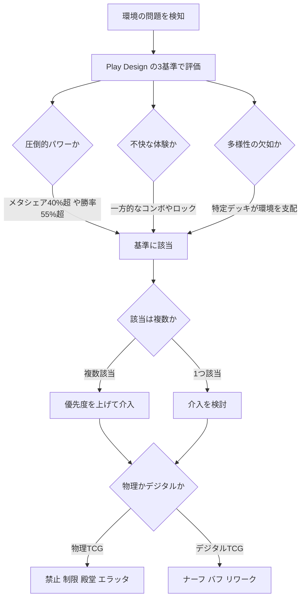

## 第13章 規制とフォーマット管理

1999 年 3 月、MtG のデザインチームは前代未聞の決断を下した。新エキスパンション *Urza's Legacy* に収録された Memory Jar を、発売からわずか 14 日で緊急禁止にしたのだ。通常の禁止告知スケジュールを無視した、MtG 史上初の「緊急措置」である（後に Felidar Guardian (2017年) でも同様の緊急禁止が行われた）。Memory Jar は、各プレイヤーが手札を脇に置き 7 枚引くという強烈な効果を持ち（ターン終了時に引いたカードを捨て、脇に置いたカードを手札に戻す）、コンボデッキが 1〜2 ターンでゲームを決めてしまう環境を生み出した。ゲームの根幹が壊れかけていた——開発チームはそう判断した。この事件は、TCG における規制がなぜ不可欠であるか、そしてその判断がいかに難しいかを象徴するエピソードとして、25 年以上語り継がれている（[Banned on the Run](https://magic.wizards.com/en/news/making-magic/banned-run-2003-02-17)）。

第 12 章ではテストプレイやコスト理論といった**リリース前**のバランス調整手法を扱った。本章では視点を移し、リリース後に顕在化した問題への**事後的な規制・フォーマット管理**——すなわち、禁止・制限・ナーフ・ローテーションといった介入手段とその運用哲学を論じる。

> **この章で学ぶこと:**
> - パワークリープ・メタゲーム固着・体験悪化という 3 つの構造的圧力が介入を要求する理由
> - ローテーション・エターナル・ノーローテーションという 3 つのカードプール管理方式の設計意図とトレードオフ
> - 禁止・制限・殿堂・ナーフ・バフ・エラッタ・リワークという個別カード規制手段の使い分け
> - 定量基準と定性基準を組み合わせた判断プロセス
> - 規制のコミュニケーションがプレイヤーの信頼に与える決定的な影響
> - パワークリープに対する構造的な対抗策

### なぜ介入が必要か

TCG は拡張し続ける宿命を持つ。新しいカードが追加されるたびにカードプール内の相互作用は指数的に増大し、設計者が意図しない組み合わせが必然的に発生する。このとき、ゲームの健全性を脅かす構造的圧力は大きく 3 つに分類できる。

第一の圧力は**パワークリープ**だ。新しいカードセットが売れるためには、プレイヤーが「欲しい」と思うカードが必要であり、それは多くの場合、既存カードの何かを上回るカードを意味する。この圧力は商業的に構造化されており、善意だけでは抑止できない。池っち店長（池田芳正）は「スタン落ち vs インフレはすべての TCG の宿命」と喝破し、ローテーションとエターナルの両フォーマット併存を解答として提案した（[僕はなぜゲートルーラーを作ったか](https://gateruler.jp/columns/)）。パワークリープが放置されれば古いカードは完全に陳腐化し、プレイヤーのコレクションは価値を失い、ゲームの歴史的蓄積が無意味になる。この加速には歴史的な転換点があったとする見方もある。中村聡（遊宝洞代表・元 MtG トッププレイヤー・デュエマ開発）は、プレインズウォーカーの登場以降、カード単体のパワーが強くなり差がつきやすくなったと指摘する。単体で複数の役割をこなす強力なパーマネントが基準を押し上げ、その後のセットが追随せざるをえなくなったという史観だ。

> **出典:** [中村聡インタビュー（晴れる屋）](https://article.hareruyamtg.com/article/71065/)

第二の圧力は**メタゲームの固着**だ。あるデッキが他のすべてを圧倒すると、メタゲームクロック（第 11 章参照）が停止する。プレイヤーは「そのデッキを使うか、そのデッキに負けるか」の二択を強いられ、構築の多様性が消滅する。具体例は事欠かない。2019 年の MtG では Oko, Thief of Crowns がミシックチャンピオンシップで約 70% のデッキに採用され、環境を完全に支配した（[November 2019 B&R Announcement](https://magic.wizards.com/en/news/announcements/november-18-2019-banned-and-restricted-announcement)）。2025 年にはプロツアーで Cori-Steel Cutter がメタゲームの 40% 以上を占め、やはり禁止に至った。また、1998〜1999 年の MtG「Combo Winter」では *Urza's Saga* ブロックの圧倒的なコンボデッキ群がトーナメント環境を壊滅させ、プレイヤー離れを引き起こした。いずれも「放置すればゲームが死ぬ」レベルの固着であり、介入を余儀なくされた事例だ。

> **出典:** [Banned and Restricted Announcement – June 30, 2025](https://magic.wizards.com/en/news/announcements/banned-and-restricted-june-30-2025)

第三の圧力は**プレイヤー体験の悪化**である。これは数値で捉えにくいが、最も根深い問題かもしれない。勝率やメタゲームシェアが均衡していても、特定のカードやデッキが「対戦していて楽しくない」と感じさせることがある。Hearthstone のデザイナー Dean Ayala は「勝率 50% のカードでも、プレイパターンが不快なら修正対象」と明言した。

> **出典:** [Dean (Iksar) Ayala Answers Questions About Balance Philosophy (Hearthstone Top Decks)](https://www.hearthstonetopdecks.com/dean-iksar-ayala-answers-questions-about-balance-philosophy-nerfs-decks-that-didnt-get-hit-dragonmaw-poacher-arena-bug/)

一方的なロック、非インタラクティブなコンボ、長すぎるターン——これらはメタゲーム統計には現れにくいが、プレイヤーのモチベーションを確実に削る。Play Design チームが掲げる禁止の 3 基準——(1) 圧倒的パワー、(2) 不快なプレイ体験、(3) 競技的多様性の欠如——はこの認識を制度化したものだ。

> **出典:** [Play Design Lessons Learned (WotC)](https://magic.wizards.com/en/news/feature/play-design-lessons-learned-2019-11-18)

### カードプール管理（マクロレベル）

個別カードの問題に介入する前に、ゲーム全体のカード群をどう構造的に管理するかという、より大きな設計判断がある。これはゲームの長期的なビジネスモデルとプレイヤー体験の両方を規定する根本的な選択だ。主要な方式は 3 つあり、それぞれ異なる設計意図とトレードオフを持つ。まず 3 方式と、それらを組み合わせた複数フォーマット並行運用の全体像を一覧で示す。

| 方式 | 設計意図 | 代表タイトル | 長所 | 構造的トレードオフ |
|------|---------|------------|------|------------------|
| **ローテーション** | パワークリープの構造的リセットと新規参入のしやすさの両立 | MtG Standard、Hearthstone Standard、ポケモンカード（レギュレーションマーク） | 覚えるカードプールが常に限定され、新規が「今から追いつける」と感じる。基本ツールは再録で維持される | 集めたカードがある日を境に使えなくなる「家賃」感覚の不満 |
| **エターナル** | コレクションの長期的な価値保全 | MtG Modern／Legacy、Hearthstone Wild | 集めたカードが永遠に使えるという安心感 | カードプール肥大で参入障壁が高騰し、バランス維持が禁止リスト頼みになる |
| **ノーローテーション＋禁止リスト駆動** | 「すべてのカードが永遠に使える」というブランド約束 | 遊戯王 OCG | 全カードが恒久的に使用可能 | 四半期の禁止リストがソフトローテーション化。パワークリープが収益エンジンとして構造的に組み込まれ加速し、投資が突然無効化されるリスクも残る |
| **複数フォーマット並行運用** | 異なるプレイヤー層の需要を同時に満たし「逃げ場」を作る | MtG（Standard／Pioneer／Modern／Legacy／Vintage／Commander） | あるフォーマットに不満があっても別のフォーマットへ移れる | —（上記各方式の弱点を相互に補完する統合戦略） |

#### ローテーション方式

ローテーションは、一定期間が経過したカードセットを公式フォーマットから除外する方式だ。設計意図は明確で、パワークリープの構造的リセットと新規参入のしやすさの両立である。覚えるべきカードプールが常に限定されるため、新しいプレイヤーが「今から始めても追いつける」と感じられる。MtG Standard は最も歴史の長いローテーション制であり、2023 年の発表で従来の約 2 年周期を 3 年へ延長した（Wilds of Eldraine 期から適用）。さらに 2027 年からは、ローテーションの時期を暦年最初のセットに揃える予定である（3 年周期は維持）。この延長は、ローテーションの「家賃」感覚——お金を出して集めたカードがある日を境に使えなくなるという不満——の軽減を意図している。Hearthstone Standard は毎年春に年 1 回のローテーションを実施し、直近 2 年分のカードセットのみが使用可能になる。

> **出典:** [Standard Rotation Extended to 3 Years (MTGGoldfish)](https://www.mtggoldfish.com/articles/announcement-standard-rotation-extended-to-3-years)、[2027 年のローテーション時期変更 (TCGplayer)](https://www.tcgplayer.com/content/article/Everything-You-Need-to-Know-About-2027-s-MTG-Standard-Rotation/20f960b6-5286-47ea-88a2-4cd1c5dd4b20/)

ポケモンカードゲームの**レギュレーションマーク方式**は、全 TCG 中で最もクリーンなローテーション実装と言える。各カードの左下に A, B, C... のアルファベットが印刷されており、ローテーション時は「マーク X 以降のカードのみ使用可」と宣言するだけで済む。プレイヤーは手持ちのカードのマークを見るだけで使用可否がわかり、複雑なセットリストを参照する必要がない。さらに重要なのは、Switch や Professor's Research といった基本トレーナーカードが新しいマークで再録される点だ。これにより、ゲームの基本ツールはローテーション後も維持され、「何もかもが使えなくなる」という喪失感が緩和される。セット名や発売日ではなくカード自体に情報が刻まれているという物理的な明快さが、このシステムの本質的な強みだ。

#### エターナル方式

エターナル方式は、過去に発売されたすべて（またはほぼすべて）のカードを使用可能にする方式だ。設計意図はコレクションの長期的な価値保全にある。プレイヤーが集めたカードは永遠に使えるという約束は、TCG の収集体験における安心感の源泉だ。MtG の Modern（2003 年の *Eighth Edition* 以降）、Legacy（ほぼ全カード）、Hearthstone の Wild がこの方式を採用する。

しかしエターナル方式には深刻なトレードオフがある。カードプールが巨大になるにつれ参入障壁は高騰し、新規プレイヤーにとって「今から始める」コストが天文学的になる。バランス維持も禁止リスト頼みにならざるを得ない。MtG が 2019 年に Pioneer（2012 年の *Return to Ravnica* 以降のカードを使用可能）を新設したのは、まさに Modern の参入障壁が高くなりすぎたためだ。Modern では高額な土地カードだけで数万円が必要であり、新規プレイヤーの参入を事実上阻んでいた。Pioneer は「Modern より新しい、手の届くエターナル」として設計された。

#### ノーローテーション + 禁止リスト駆動

遊戯王 OCG は、公式のローテーション制度を持たない独自のモデルを採用する。「すべてのカードが永遠に使える」というブランド約束がゲームのアイデンティティの一部であり、これはプレイヤーにとって強力な魅力だ。しかし、ローテーションなしにカードプールが 25 年以上蓄積された環境でバランスを保つために、四半期ごとに更新される禁止・制限リストが事実上の「ソフトローテーション」として機能している。トップデッキのキーカードが禁止されればデッキは消滅し、新パックのカードが台頭する——これはローテーションと実質的に同じ効果を、禁止リストという形で達成しているわけだ。

このモデルのトレードオフは、パワークリープが収益エンジンとして構造的に組み込まれてしまう点にある。ローテーションがない以上、新パックを売るためには既存環境を超えるパワーのカードを提供し続けなければならない。そして環境が壊れれば禁止リストで修正する——このサイクルが繰り返されることで、パワークリープは加速の一途を辿る。プレイヤーの投資が突然無効化されるリスクも常に存在し、「いつ禁止されるかわからない」という不安が高額カードの購入を躊躇させる。

#### 複数フォーマット並行運用

多くの成熟した TCG は、単一の管理方式ではなく複数フォーマットの並行運用で対応している。MtG はその最たる例で、Standard（ローテーション）/ Pioneer（新エターナル）/ Modern（エターナル）/ Legacy（レガシー）/ Vintage（ほぼ全カード使用可、一部制限）/ Commander（多人数カジュアル）という 6 つの公式フォーマットを運用する。各フォーマットが異なるプレイヤー層の需要を満たし、あるフォーマットに不満があっても別のフォーマットに「逃げ場」がある構造だ。池っち店長が述べた「両フォーマット併存が解答」は、この戦略を端的に表現している。

### 個別カード規制（ミクロレベル）

カードプールの構造的管理だけでは対処しきれない問題が生じたとき、個別のカードに対する直接的な介入が必要になる。ここでは物理 TCG とデジタル TCG で利用可能な手段が大きく異なる。物理カードは印刷後に変更できないが、デジタルカードはサーバー側で自在に修正できるからだ。

**物理 TCG の手段**

最も強力な手段は**禁止（Ban）**——カードをフォーマットから完全に排除する措置だ。問題を即座に解消できる反面、プレイヤーの金銭的・感情的投資を無効化する代償がある。MtG と遊戯王が主に使用する。前述の Memory Jar 緊急禁止（14 日）は異例の速さだが、通常でも問題が深刻であれば比較的迅速に禁止される。Oko, Thief of Crowns は Standard で約 45 日で禁止に至った（[November 2019 B&R Announcement](https://magic.wizards.com/en/news/announcements/november-18-2019-banned-and-restricted-announcement)）。

**制限（Restriction）**はデッキに投入できる枚数を減らす手段で、遊戯王の「制限（1 枚）」「準制限（2 枚）」が典型的だ。デッキの再現性を下げ、問題のカードを引ける確率を下げるソフトな介入である。完全禁止よりプレイヤーの投資を保護するが、強力なカードが 1 枚でも存在すれば問題が解消しない場合もある。

**殿堂（Hall of Fame）**はデュエル・マスターズ独自の制度で、3 段階の精密さを持つ（[殿堂レギュレーション](https://dm.takaratomy.co.jp/rule/regulation/)）。「殿堂入り」は 1 枚制限、「プレミアム殿堂」は完全禁止、そして「プレミアム殿堂超次元コンビ」は特定の 2 枚の *組み合わせ* を禁止する——個々のカードは単独で使用可能だが、同じデッキに共存できない。この組み合わせ禁止は他の TCG にはない精緻なアプローチであり、個別カードを殺さずにデジェネレートなシナジーだけを除去できる。さらに重要なのは**殿堂解除**の方針だ。環境の変化で安全になったカードは制限が解除される。規制を一方通行にしないこの姿勢は、プレイヤーに「永遠に使えなくなるわけではない」という希望を提供する。

#### 実例: 解除されたカード、されないカード

殿堂解除は「もう安全です」という宣言なのか、それとも別の何かなのか。デュエル・マスターズの **《龍仙ロマネスク》** の運命が、その答えを教えてくれる。

> **《龍仙ロマネスク》** 光/火/自然 / コスト 6 / パワー 5000
> マナゾーンに置く時、このカードはタップして置く。
> ブロッカー
> このクリーチャーをバトルゾーンに出した時、自分の山札の上から4枚を、マナゾーンに置いてもよい。
> 自分のターンの終わりに、カードを1枚、自分のマナゾーンから墓地に置く。

このカードの規制史は長い。まず《母なる大地》とのコンボが凶悪だったため、2007 年 11 月に 2 枚の組み合わせがプレミアム殿堂コンビに指定された。次いで単体でも危険と判断され、2010 年 5 月 15 日に殿堂入りする。そして 2018 年 1 月 27 日の発表（施行は 1 月 29 日）で、ついに殿堂解除された。組み合わせ規制・単体規制・解除という 3 段階を、1 枚がすべて通過している。

注目すべきは解除後の実態だ。解除直後の DMRP-05 期には【5 色コントロール】などで一時的に採用されたが、以降はより強力な後継カードに役割を奪われ、環境から静かに退場した（DM Wiki の記録）。**解除しても暴れなかったのは、カードが弱くなったからではない。8 年分のインフレが規制を追い越したからだ。** 解除は「もう安全になった」という宣言ではなく、「環境がこのカードを追い越した」ことの事後承認だった。

同じコンボの相方は、この対比を際立たせる。コンボの両輪だった **《母なる大地》** は 2009 年 4 月に単体でプレミアム殿堂入りし、現在も解除されていない。同じ悪事を働いた 2 枚でも、解除できるかどうかは単体としての突出度で分かれる。規制と解除は、あくまで 1 枚ずつの評価で動く。

テキストを書き換えて戻す「第三の解除経路」もある。遊戯王の **《混沌帝龍 -終焉の使者-》** は、効果をエラッタで弱体化させたうえで段階的に規制を緩め、2015 年 10 月に無制限化された。以降は禁止に戻ることなく定着している。デジタル TCG のリワークにあたる「テキスト変更」を、物理カードで実行した経路だ。

最後に、解除にはコミュニケーション設計の宿題が残る。ロマネスクの解除理由は Creator's Letter に文書化されず、ファンイベントでの口頭発表にとどまった。規制は「なぜ危険で、なぜこの手段か」を丁寧に語られるのに（後述の Creator's Letter を参照）、解除は語られないことが多い。だが解除もまた、「なぜ安全になったのか」を語る機会である。規制の透明性を評価するなら、解除の透明性も同じ基準で問われてよい。

> **出典:** [龍仙ロマネスク（公式カード検索）](https://dm.takaratomy.co.jp/card/detail/?id=dm25-s04)、[殿堂レギュレーション](https://dm.takaratomy.co.jp/rule/regulation/)、DM Wiki《龍仙ロマネスク》（https://dmwiki.net/）、[混沌帝龍の無制限化報道（HOBBY Watch）](https://hobby.watch.impress.co.jp/docs/news/1586260.html)

**エラッタ（Errata）**は物理 TCG におけるカードテキストの変更であり、最後の手段として位置づけられる。カードの実物に印刷されたテキストと実際のゲームルールが異なる状態を生むため、プレイヤーの混乱を招きやすい。遊戯王は 2014 年以降、禁止リストに入っているカードにのみ大規模なメカニクス的エラッタを適用する方針を採っている（前述の混沌帝龍のほか、ダーク・ダイブ・ボンバー等）。テキストの乖離が増えるほど運用コストも増大するため、頻繁な使用は推奨されない。

> **出典:** [Errata (Yugipedia)](https://yugipedia.com/wiki/Errata)、[Card Errata: Chaos Emperor Dragon - Envoy of the End (Yugipedia)](https://yugipedia.com/wiki/Card_Errata:Chaos_Emperor_Dragon_-_Envoy_of_the_End)

**デジタル TCG の手段**

デジタル TCG はサーバー側でカードデータを直接変更できるため、物理 TCG にはない柔軟な介入手段を持つ。

**ナーフ（Nerf）**はカードの性能を下方修正する措置だ。Hearthstone 初代ゲームディレクターの Ben Brode が「1% の変更は存在しない」と述べたように、プレイヤーが体感できる意味のある変更が求められる。

> **出典:** ["There are no one percent changes." Ben Brode on Hearthstone balance (PC Gamer)](https://www.pcgamer.com/there-are-no-one-percent-changes-ben-brode-on-how-hearthstone-balance-differs-from-overwatch/)

Legends of Runeterra（LoR）はさらに踏み込み、勝率 55% または使用率 15% を超えるカードをナーフ候補とする明示的な閾値を公開している。

> **出典:** [Patch 2.9 In-Depth Statistical Meta Report (Runeterra CCG、Riot 発言を引用)](https://runeterraccg.com/patch-2-9-in-depth-statistical-meta-report/)

ナーフの最大の利点は、物理カードと違いプレイヤーの所有物を無効化しないことだ。

**Marvel Snap の OTA（Over-The-Air）バランス**は、デジタル TCG のナーフ/バフを極限まで高速化した事例だ。シーズン中の第 2・第 4 木曜（隔週程度）に数値変更（コスト・パワー）を実施し、4週間ごとの大型パッチではカード能力の変更も行う。毎回最低1枚のバフを保証するという方針は、ナーフ一辺倒にならない積極的なバランス運用を体現している。

> **出典:** [OTA Balance Updates (Marvel Snap Zone)](https://marvelsnapzone.com/news/ota-balance-updates/)

**バフ（Buff）**は弱いカードの性能を引き上げてメタゲームの多様性を高める手法だ。ナーフが「問題のカードを下げる」のに対し、バフは「対抗策を上げる」。ただしゲーム全体のパワーレベルを引き上げるリスクを伴い、パワークリープの加速に繋がりかねない。ナーフとバフのどちらを優先すべきか、パッチ頻度をどう設計するかといった設計哲学としての掘り下げは、第 14 章で扱う。

**カードリワーク（Rework）**はカードのテキストを根本的に書き換える措置だ。数値の微調整ではなく、カードのメカニクスそのものを変更する。物理 TCG ではエラッタとして忌避される手段だが、デジタルならではの柔軟性がこれを可能にする。問題の根本原因がカードのデザインコンセプト自体にある場合、ナーフでは対処しきれないため、リワークが最適解となることがある。

**Gwent の Balance Council** は、規制の主体そのものを変革した実験的アプローチだ。公式開発終了後、コミュニティが自律的にバランスを維持する仕組みとして導入された。一定の実績（Prestige 1 以上、ランク戦 25 勝以上）を持つプレイヤーの投票によって月次のバランス変更が決定される。サイレントマジョリティが安定化力として機能し、一部のプレイヤーが推す極端な変更は翌月に修正される傾向がある。開発者不在でもゲームが生き続ける可能性を示した先進的な事例だ。

> **出典:** [Balance Council FAQ — What Is It & How to Use It (Gwent)](https://www.playgwent.com/en/news/49294/balance-council-faq-what-is-it-how-to-use-it)

本節で扱った規制手段を、物理／デジタルの別・介入の強さ・プレイヤー投資への影響の観点で一覧すると次のようになる。

| 手段 | 物理／デジタル | 介入の強さ | プレイヤー投資への影響 | 代表タイトル |
|------|:------------:|----------|--------------------|------------|
| **禁止（Ban）** | 物理 | 最強（フォーマットから完全排除） | 金銭的・感情的投資を無効化 | MtG、遊戯王 |
| **制限（Restriction）** | 物理 | ソフト（投入枚数を削減） | 完全禁止よりプレイヤーの投資を保護 | 遊戯王（制限＝1 枚／準制限＝2 枚） |
| **殿堂（Hall of Fame）** | 物理 | 3 段階（殿堂入り＝1 枚制限／プレミアム殿堂＝禁止／超次元コンビ＝組み合わせ禁止） | 個別カードを殺さずデジェネレートなシナジーだけ除去。殿堂解除もある | デュエル・マスターズ |
| **エラッタ（Errata）** | 物理 | テキスト変更（最後の手段） | 印刷テキストとの乖離で混乱を招く。弱体化後に禁止解除する運用 | 遊戯王 |
| **ナーフ（Nerf）** | デジタル | 下方修正（Hearthstone は +1 マナがデフォルト） | 所有物を無効化しない。Hearthstone は全額ダスト返却 | Hearthstone、LoR、Marvel Snap（OTA） |
| **バフ（Buff）** | デジタル | 上方修正（対抗策を引き上げる） | 多様性を高める一方、パワークリープ加速のリスク | Hearthstone（2019 年〜）、Marvel Snap |
| **リワーク（Rework）** | デジタル | メカニクスそのものを根本的に書き換え | デザインコンセプト自体が原因のときの最適解 | — |

### 判断基準

規制の手段を知っていても、「いつ、何に、どの手段で介入するか」の判断がなければ意味がない。この判断には定量的な基準と定性的な基準の両方が必要であり、どちらか一方だけでは不十分だ。

**定量基準**（数値で測れるもの）

最も一般的な定量指標はメタゲームシェアだ。MtG では大会でのデッキ採用率が 40% を超えると禁止の議論が始まる目安とされる——2025 年の Cori-Steel Cutter がこの閾値を超えて禁止された。70% は即座に禁止が必要なレベルであり、2019 年の Oko がこれに該当する（[禁止制限リスト](https://mtg-jp.com/gameplay/rules/banned-restricted/)）。

勝率も重要な指標だ。LoR は勝率 55% または使用率 15% を超えるデッキのカードを「要注意」とする閾値を明示しており、これは業界でも珍しい透明性の高い運用だ。先攻勝率が 60% を超える場合は、特定のカードではなくゲームシステムの構造的問題を示唆しており、ルール変更を含むより根本的な対応が求められる。

ただし、定量基準だけに頼ると「数字上は問題ないが体験は最悪」という状況を見逃す。

**定性基準**（数値では測れないもの）

プレイ体験の質は数値化しにくいが、規制判断において無視できない。勝率が均衡していてもプレイパターンが不快であれば修正の対象になりうる。「相手のプレイに反応する余地があるか」——つまりインタラクティブ性——は定性的な健全性の核心だ。一方的にゲームを決めるコンボや、相手の行動を完全に封じるロックは、たとえ勝率が 50% であっても体験を損なう。

Play Design チームが掲げる 3 基準——(1) 圧倒的パワー、(2) 不快な体験、(3) 多様性の欠如——は、定量と定性の両面をカバーする包括的なフレームワークだ。この 3 基準のうちどれか一つでも満たせば介入を検討し、複数が重なれば優先度が上がる、という運用が実務的に行われている。

設計者の制御が及ばないカードが環境を壊す問題もある。池っち店長は「特典カードのデザインレビューが自分に来ない。テストプレイチームにも連絡なし。当然強いので増販され、禁止にもできない」という経験を語っており、**組織内のデザインレビューフローの断絶**が規制問題の根本原因となりうることを示している（[池っち店長「TCGのつくりかたセミナー」](https://oyazirk.jugem.jp/?eid=10)）。

以上の定量・定性の判断と、物理／デジタルで異なる手段選択を一つの流れとして俯瞰すると次のようになる。

> **図: 規制介入の判断フロー** — Play Design の 3 基準で問題を評価し、該当した場合に物理／デジタル別の規制手段を選ぶまでの流れ。

### コミュニケーションと信頼

規制は技術的に正しいだけでは不十分だ。プレイヤーが「なぜこの判断がなされたのか」を理解し、納得できなければ、正しい介入であっても信頼を損なう。コミュニケーションは規制の成否を左右する決定的な要素だ。

MtG のリードデザイナー Mark Rosewater は**「基準は透明に、タイミングは不透明に」**という原則を掲げた（[Banned on the Run](https://magic.wizards.com/en/news/making-magic/banned-run-2003-02-17)）。介入の基準（何が問題とみなされるか）を明確にすることでプレイヤーの信頼を得つつ、タイミングを事前告知しないことで「レームダック期間」を防ぐ。レームダック期間とは、メタゲームが壊れていることを全員が知っているが修正はまだ来ないという、最もストレスフルな状態だ。タイミングの不確実性は、問題が認識されたら即座に対処される期待を維持する。

デュエル・マスターズの **Creator's Letter** は、規制のコミュニケーションにおける模範的な実践だ。開発チームが殿堂の理由を詳細に説明する公開書簡を定期的に発行している。特に Vol.18（[殿堂の設計思想](https://dm.takaratomy.co.jp/cls/creatorsletter18_ex/)）は殿堂制度そのものの哲学を語り、Vol.42 は個別の殿堂判断を解説した重要文書だ。単に「このカードを禁止しました」ではなく「なぜこのカードが問題で、なぜこの手段を選び、なぜこのタイミングなのか」を開発者自身の言葉で説明する。この透明性がプレイヤーの信頼を構築し、「開発チームはゲームを大切にしている」という確信を支えている。

池っち店長は即断主義を提唱する——**「一番大事なのはこの TCG が安心して楽しめること」**（[僕はなぜゲートルーラーを作ったか](https://gateruler.jp/columns/)）。壊れたカードを放置して「大会が楽しくない」状態を長引かせるより、迅速に禁止・エラッタして環境を健全化する方が、長期的にはメーカーへの信頼を守ることになる。判断を先延ばしにすること自体がリスクであり、多少の誤判断よりも不作為のほうが信頼を損なう、という主張だ。

#### コラム: Commander と民主的ガバナンスの限界

**Commander 管理委員会問題（2024 年）**は、規制のガバナンスとコミュニケーションの重要性を痛烈に示した事例だ。MtG の Commander フォーマットは長年、WotC（開発元）ではなく独立の Rules Committee がルールと禁止リストを管理していた。2024 年、Rules Committee が Mana Crypt、Jeweled Lotus 等の高額カードを禁止したところ、コミュニティから激しい反発が起きた。数万円を投じたカードが突然使えなくなったプレイヤーの怒りは、Rules Committee メンバーへの脅迫にまで発展した。最終的に WotC が管理を引き取り、Rules Committee は解散に至った。この事件は複数の教訓を含む。第一に、コミュニティ主導の管理は商業的利害との衝突を避けられない。第二に、プレイヤーの感情的・金銭的投資への配慮なしに規制を行えば、たとえ技術的に正しくても破綻する。第三に、規制の権限を持つ者には、その判断を説明し、結果に責任を取る体制が不可欠だ。

### パワークリープへの構造的対抗

パワークリープは個別カードの規制だけでは根本的に解決できない。売れるカードを作り続ける商業的圧力がある限り、パワーの上昇圧力は常に存在する。必要なのは、カード設計の哲学レベルでパワークリープに対抗する構造的アプローチだ。

**FIRE 理念の功罪**は、パワークリープとの闘いの難しさを象徴する事例だ。MtG の Play Design チームが掲げた FIRE（Fun / Inviting / Replayable / Exciting）は Standard を高パワーレベルで楽しくすることを意図したが、Throne of Eldraine 期（2019〜2020年）に Oko, Thief of Crowns、Uro, Titan of Nature's Wrath、Fires of Invention 等が次々と禁止される事態を招いた。WotC 自身が「Play Design Lessons Learned」で「Oko は意図よりはるかに強かった」と反省を公開しており、意図的なパワーレベル引き上げはテストプレイの精度に依存する危険な賭けであることを示した（[Play Design Lessons Learned](https://magic.wizards.com/en/news/feature/play-design-lessons-learned-2019-11-18)）。

**エッシャーの階段**は、だまし絵画家エッシャーの「永遠に上り続けるように見える階段」に着想を得た比喩的手法であり、本書における造語である。セットごとにパワーの上がる側面と下がる側面を意図的に交互に設計する。たとえば、あるセットではクリーチャーの戦闘力が上がるがスペルは控えめに、次のセットではスペルが強化されるがクリーチャーは抑えめに。プレイヤーの注目は強化された部分に自然と向くため、パワーが常に上昇しているように感じられるが、実際の総合パワーレベルはほぼ一定に保たれる。知覚と現実のギャップを利用した巧妙な設計哲学だ。

**サイドグレード設計**は、新カードを「既存より強い」ではなく「既存とは異なる」方向で設計する手法であり、TCG デザインの文脈で広く用いられる概念だ。数値的な上位互換ではなく、新しい戦略軸での強さを提供する。たとえば、既存の高コスト大型クリーチャーに対して、新カードは低コストだが条件付きで同等の効果を発揮する——という設計であれば、既存カードの価値を保ちつつ新カードにも固有の魅力がある。プレイヤーの選択肢を「縦に伸ばす」のではなく「横に広げる」アプローチだ。

**バトルスピリッツの Shin-Kaihou Project（2025〜2026 年）**は、成熟した TCG が構造的にリセットを試みた近年の注目事例だ。17 年目を迎えたタイトルがテキストの簡素化と Standard/Eternal の分割によるソフトリブートを敢行した。長年の蓄積で複雑化したテキストを整理し、新規参入のハードルを下げつつ、既存プレイヤーのコレクションは Eternal フォーマットで活かせるようにする。パワークリープの蓄積が限界に達したとき、ゲーム全体をリブートすることで構造的にリセットするという選択肢を、実際に実行した事例として重要だ（[2年以内に革命を起こさなければカードゲームは滅びる](https://kai-you.net/article/43286)）。

---

**この章のまとめ** — 規制は TCG の「必要悪」ではなく、生態系の維持に不可欠な設計行為である。パワークリープ・メタゲーム固着・体験悪化という 3 つの構造的圧力が介入を要求し、カードプール管理（ローテーション/エターナル/ノーローテ）と個別カード規制（禁止/制限/殿堂/ナーフ/バフ/エラッタ/リワーク）の二層構造で対処する。判断には定量基準と定性基準の両方が必要であり、その結果をプレイヤーに誠実に伝えるコミュニケーションが信頼の基盤となる。そしてパワークリープに対しては、エッシャーの階段やサイドグレード設計といった構造的な対抗策を設計哲学に組み込むことが、長期的な健全性の鍵だ。

**さらに学ぶために:**
- **Rosewater "Banned on the Run"** ([magic.wizards.com](https://magic.wizards.com/en/news/making-magic/banned-run-2003-02-17)): 禁止哲学の原典。20 年以上前の記事だが、核心的原則は今も有効。
- **デュエマ Creator's Letter シリーズ** ([dm.takaratomy.co.jp](https://dm.takaratomy.co.jp/cls/creatorsletter18_ex/)): 殿堂の設計思想を開発者自身の言葉で語る。特に Vol.18 と Vol.42 は規制哲学の教科書的文書。
- **MtG 禁止制限リスト アーカイブ** ([mtg-jp.com](https://mtg-jp.com/gameplay/rules/banned-restricted/)): 歴代の禁止告知を時系列で追える。各告知に記された理由を読み比べることで、WotC の判断基準の変遷が見える。

---
